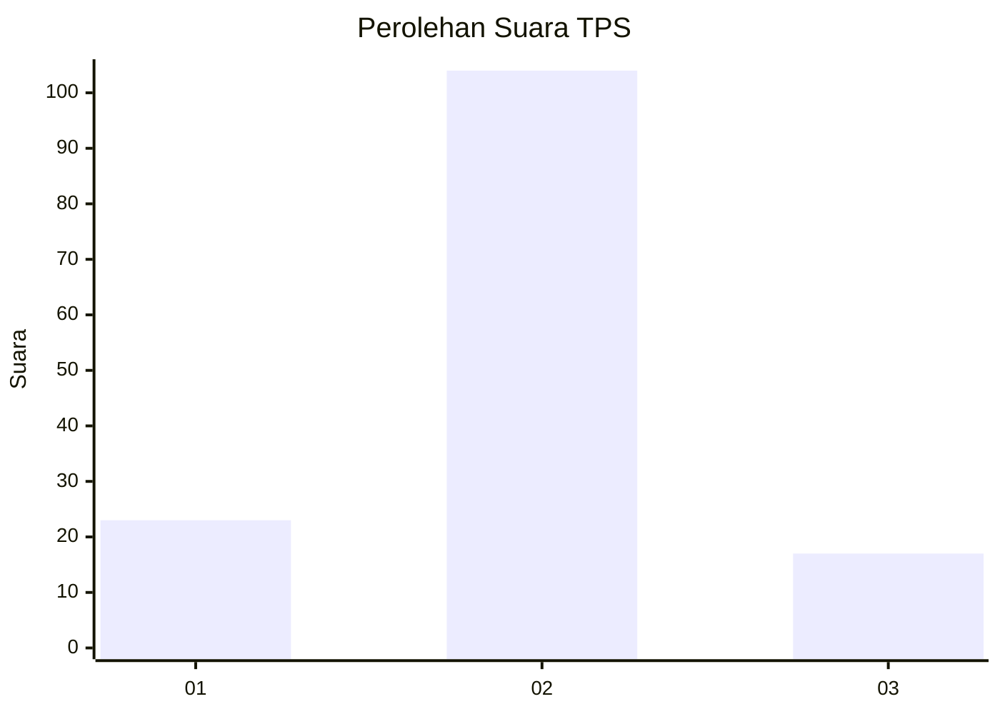
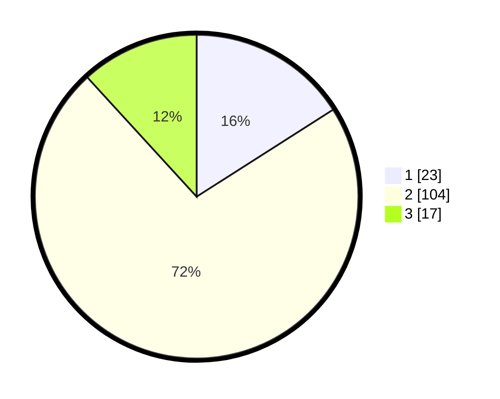

# Hasil

## Grafik

## Tabel

| No. | Nama Paslon    | Suara | Suara (raw) | Persentase |
|:--- |:-------------- | -----:| -----------:| ----------:|
| 1   | ANIES MUHAIMIN | 23    | [23][p-1]   | 15,97      |
| 2   | PRABOWO GIBRAN | 104   | [104][p-2]  | 72,22      |
| 3   | GANJAR MAHFUD  | 17    | [17][p-3]   | 11,81      |

[p-1]: https://github.com/gigit-pemilu/pemilu-2024-16-sumatera-selatan/blob/main/pilpres/hitung-suara/sub/16-sumatera-selatan/sub/08-ogan-komering-ulu-timur/sub/04-cempaka/sub/2016-cempaka/sub/012-tps/sub/paslon-1.txt
[p-2]: https://github.com/gigit-pemilu/pemilu-2024-16-sumatera-selatan/blob/main/pilpres/hitung-suara/sub/16-sumatera-selatan/sub/08-ogan-komering-ulu-timur/sub/04-cempaka/sub/2016-cempaka/sub/012-tps/sub/paslon-2.txt
[p-3]: https://github.com/gigit-pemilu/pemilu-2024-16-sumatera-selatan/blob/main/pilpres/hitung-suara/sub/16-sumatera-selatan/sub/08-ogan-komering-ulu-timur/sub/04-cempaka/sub/2016-cempaka/sub/012-tps/sub/paslon-3.txt

## Foto C Plano

https://sirekap-obj-formc.kpu.go.id/9991/pemilu/ppwp/16/08/04/20/16/1608042016012-20240214-193514--abc90b18-96bd-449d-99f0-c927bd597055.jpg

https://sirekap-obj-formc.kpu.go.id/9991/pemilu/ppwp/16/08/04/20/16/1608042016012-20240214-193737--2a97c162-fde8-4200-b1ae-2f3eb6c097f0.jpg

https://sirekap-obj-formc.kpu.go.id/9991/pemilu/ppwp/16/08/04/20/16/1608042016012-20240214-210156--d555283b-1399-4c5d-9f62-f00dc39588df.jpg

## Metadata

| Key        | Value               |
| ---------- | ------------------- |
| Time Stamp | 2024-02-25 12:00:00 |

