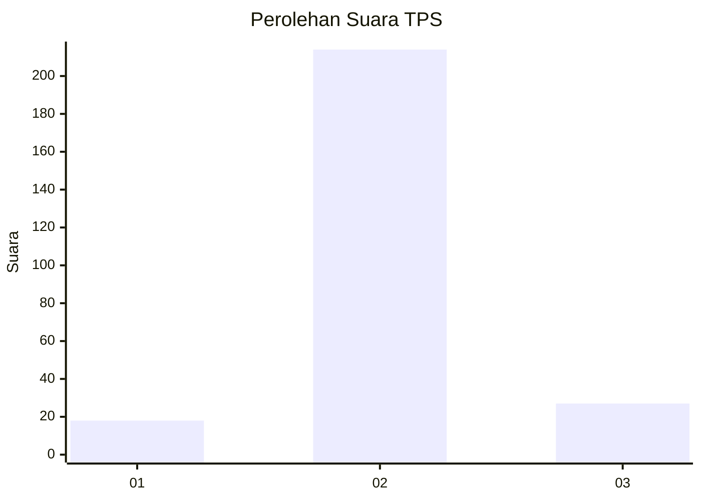
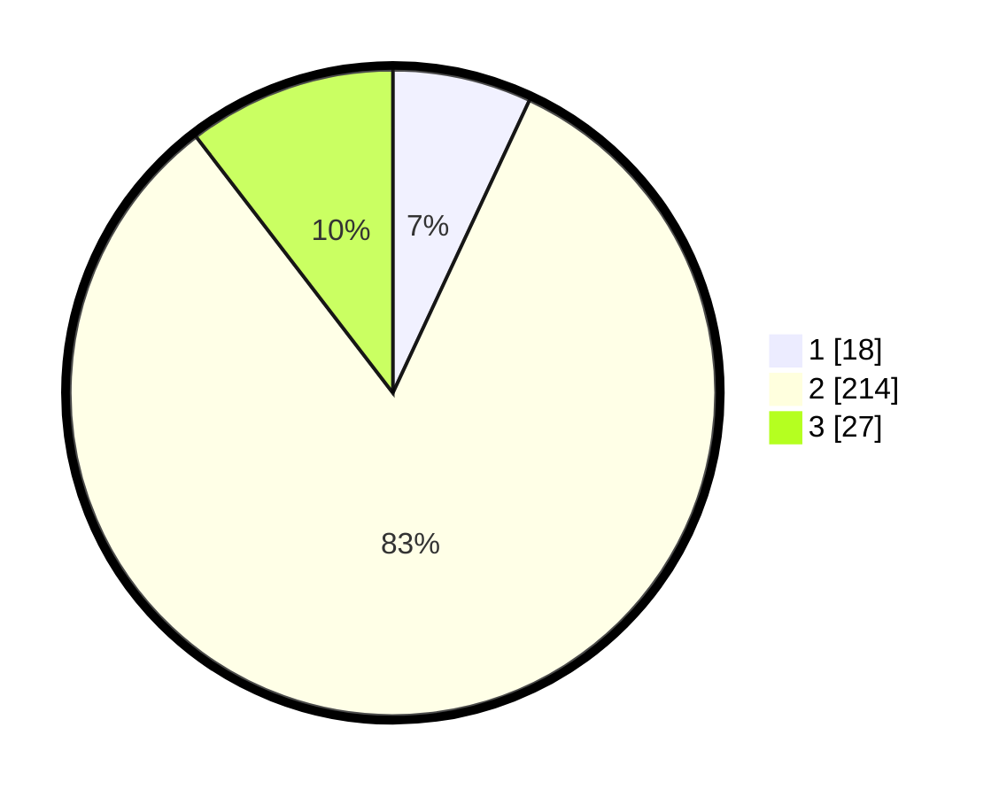

# Hasil

## Grafik

## Tabel

| No. | Nama Paslon    | Suara | Suara (raw) | Persentase |
|:--- |:-------------- | -----:| -----------:| ----------:|
| 1   | ANIES MUHAIMIN | 18    | [18][p-1]   | 6,95       |
| 2   | PRABOWO GIBRAN | 214   | [214][p-2]  | 82,63      |
| 3   | GANJAR MAHFUD  | 27    | [27][p-3]   | 10,42      |

[p-1]: https://github.com/gigit-pemilu/pemilu-2024-16-sumatera-selatan/blob/main/pilpres/hitung-suara/sub/16-sumatera-selatan/sub/08-ogan-komering-ulu-timur/sub/05-buay-pemuka-peliung/sub/2001-negeri-pakuan/sub/006-tps/sub/paslon-1.txt
[p-2]: https://github.com/gigit-pemilu/pemilu-2024-16-sumatera-selatan/blob/main/pilpres/hitung-suara/sub/16-sumatera-selatan/sub/08-ogan-komering-ulu-timur/sub/05-buay-pemuka-peliung/sub/2001-negeri-pakuan/sub/006-tps/sub/paslon-2.txt
[p-3]: https://github.com/gigit-pemilu/pemilu-2024-16-sumatera-selatan/blob/main/pilpres/hitung-suara/sub/16-sumatera-selatan/sub/08-ogan-komering-ulu-timur/sub/05-buay-pemuka-peliung/sub/2001-negeri-pakuan/sub/006-tps/sub/paslon-3.txt

## Foto C Plano

https://sirekap-obj-formc.kpu.go.id/8b14/pemilu/ppwp/16/08/05/20/01/1608052001006-20240216-231056--e8d46cd8-6ff9-42e4-adb9-2e4ee4f7251d.jpg

https://sirekap-obj-formc.kpu.go.id/8b14/pemilu/ppwp/16/08/05/20/01/1608052001006-20240216-223948--6fefb3af-6d03-4613-966b-df34272298b1.jpg

## Metadata

| Key        | Value               |
| ---------- | ------------------- |
| Time Stamp | 2024-02-19 21:00:00 |

