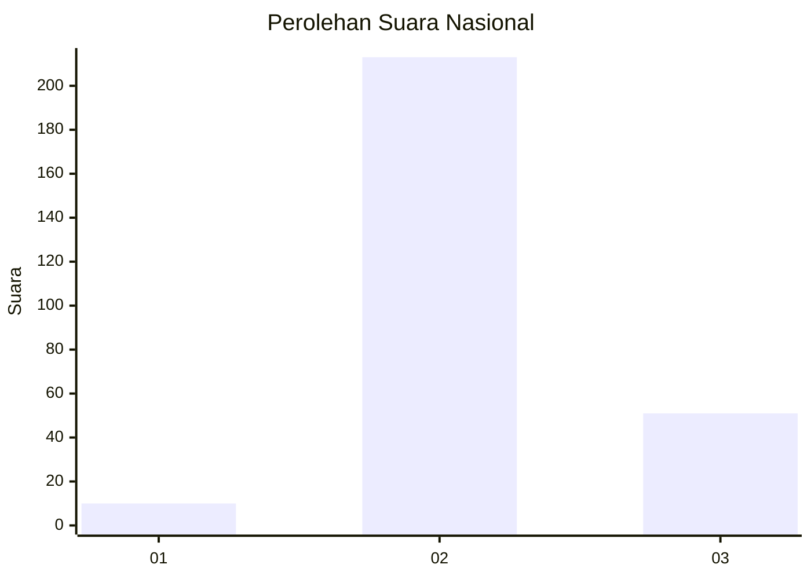
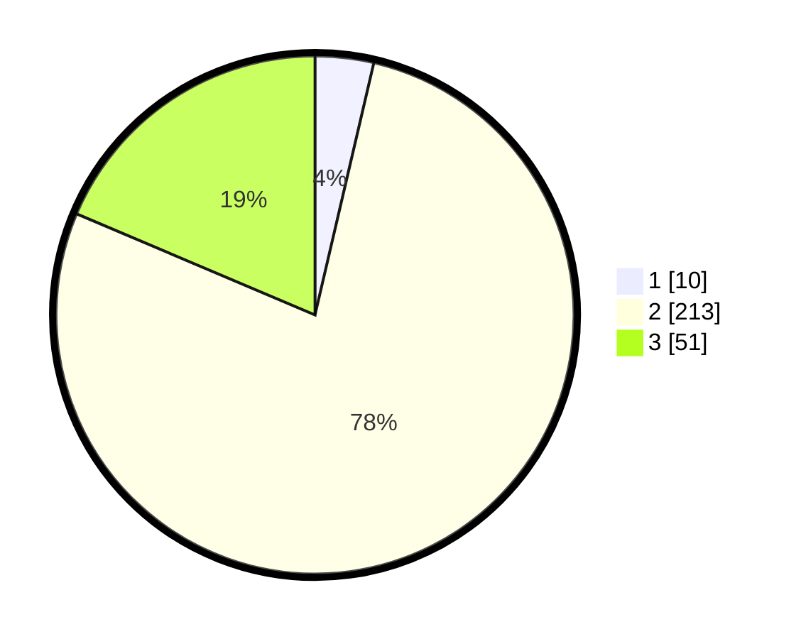

# Hasil

## Grafik

## Tabel

| No. | Nama Paslon    | Suara | Suara (raw) | Persentase |
|:--- |:-------------- | -----:| -----------:| ----------:|
| 1   | ANIES MUHAIMIN | 10    | [10][p-1]   | 3,65       |
| 2   | PRABOWO GIBRAN | 213   | [213][p-2]  | 77,74      |
| 3   | GANJAR MAHFUD  | 51    | [51][p-3]   | 18,61      |

[p-1]: https://github.com/gigit-pemilu/pemilu-2024/blob/main/pilpres/hitung-suara/sub/16-sumatera-selatan/sub/08-ogan-komering-ulu-timur/sub/05-buay-pemuka-peliung/sub/2002-negeri-agung/sub/007-tps/sub/paslon-1.txt
[p-2]: https://github.com/gigit-pemilu/pemilu-2024/blob/main/pilpres/hitung-suara/sub/16-sumatera-selatan/sub/08-ogan-komering-ulu-timur/sub/05-buay-pemuka-peliung/sub/2002-negeri-agung/sub/007-tps/sub/paslon-2.txt
[p-3]: https://github.com/gigit-pemilu/pemilu-2024/blob/main/pilpres/hitung-suara/sub/16-sumatera-selatan/sub/08-ogan-komering-ulu-timur/sub/05-buay-pemuka-peliung/sub/2002-negeri-agung/sub/007-tps/sub/paslon-3.txt

## Foto C Plano

https://sirekap-obj-formc.kpu.go.id/d385/pemilu/ppwp/16/08/05/20/02/1608052002007-20240215-130446--da050ced-8a0e-4f1c-9fc8-35903ff8861f.jpg

https://sirekap-obj-formc.kpu.go.id/d385/pemilu/ppwp/16/08/05/20/02/1608052002007-20240215-130822--c659db9b-a344-46b5-a786-d7bb31d3b474.jpg

https://sirekap-obj-formc.kpu.go.id/d385/pemilu/ppwp/16/08/05/20/02/1608052002007-20240215-131103--f0ac03b8-d95f-4bf4-b5f9-a122d5fabbda.jpg

## Metadata

| Key        | Value               |
| ---------- | ------------------- |
| Time Stamp | 2024-02-19 06:16:00 |

