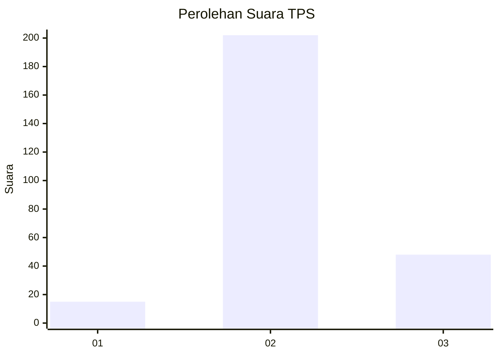

# Hasil

## Grafik

## Tabel

| No. | Nama Paslon    | Suara | Suara (raw) | Persentase |
|:--- |:-------------- | -----:| -----------:| ----------:|
| 1   | ANIES MUHAIMIN | 15    | [15][p-1]   | 5,66       |
| 2   | PRABOWO GIBRAN | 202   | [202][p-2]  | 76,23      |
| 3   | GANJAR MAHFUD  | 48    | [48][p-3]   | 18,11      |

[p-1]: https://github.com/gigit-pemilu/pemilu-2024-16-sumatera-selatan/blob/main/pilpres/hitung-suara/sub/16-sumatera-selatan/sub/08-ogan-komering-ulu-timur/sub/05-buay-pemuka-peliung/sub/2004-banu-ayu/sub/005-tps/sub/paslon-1.txt
[p-2]: https://github.com/gigit-pemilu/pemilu-2024-16-sumatera-selatan/blob/main/pilpres/hitung-suara/sub/16-sumatera-selatan/sub/08-ogan-komering-ulu-timur/sub/05-buay-pemuka-peliung/sub/2004-banu-ayu/sub/005-tps/sub/paslon-2.txt
[p-3]: https://github.com/gigit-pemilu/pemilu-2024-16-sumatera-selatan/blob/main/pilpres/hitung-suara/sub/16-sumatera-selatan/sub/08-ogan-komering-ulu-timur/sub/05-buay-pemuka-peliung/sub/2004-banu-ayu/sub/005-tps/sub/paslon-3.txt

## Foto C Plano

https://sirekap-obj-formc.kpu.go.id/8f63/pemilu/ppwp/16/08/05/20/04/1608052004005-20240215-023540--3a342d1c-9d88-429f-9ad8-e10a1fb0c702.jpg

https://sirekap-obj-formc.kpu.go.id/8f63/pemilu/ppwp/16/08/05/20/04/1608052004005-20240215-023841--7a1d270d-bbac-4920-8708-1a509949bb56.jpg

https://sirekap-obj-formc.kpu.go.id/8f63/pemilu/ppwp/16/08/05/20/04/1608052004005-20240215-023936--ec36340b-90f9-4131-a958-13b6d5b6a3e7.jpg

## Metadata

| Key        | Value               |
| ---------- | ------------------- |
| Time Stamp | 2024-02-25 15:00:00 |

