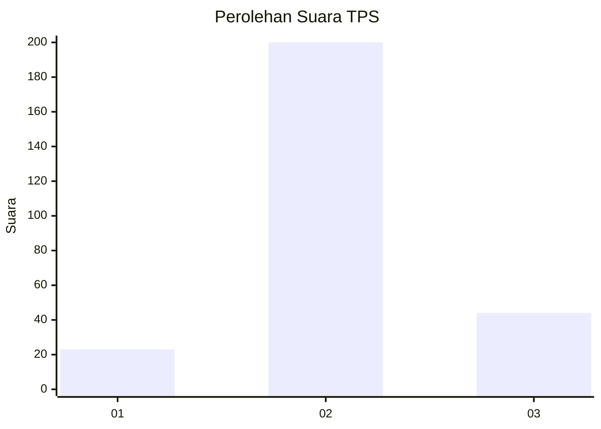
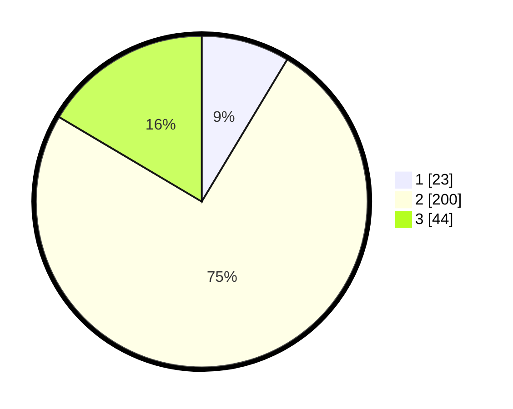

# Hasil

## Grafik

## Tabel

| No. | Nama Paslon    | Suara | Suara (raw) | Persentase |
|:--- |:-------------- | -----:| -----------:| ----------:|
| 1   | ANIES MUHAIMIN | 23    | [23][p-1]   | 8,61       |
| 2   | PRABOWO GIBRAN | 200   | [200][p-2]  | 74,91      |
| 3   | GANJAR MAHFUD  | 44    | [44][p-3]   | 16,48      |

[p-1]: https://github.com/gigit-pemilu/pemilu-2024-16-sumatera-selatan/blob/main/pilpres/hitung-suara/sub/16-sumatera-selatan/sub/08-ogan-komering-ulu-timur/sub/05-buay-pemuka-peliung/sub/2004-banu-ayu/sub/007-tps/sub/paslon-1.txt
[p-2]: https://github.com/gigit-pemilu/pemilu-2024-16-sumatera-selatan/blob/main/pilpres/hitung-suara/sub/16-sumatera-selatan/sub/08-ogan-komering-ulu-timur/sub/05-buay-pemuka-peliung/sub/2004-banu-ayu/sub/007-tps/sub/paslon-2.txt
[p-3]: https://github.com/gigit-pemilu/pemilu-2024-16-sumatera-selatan/blob/main/pilpres/hitung-suara/sub/16-sumatera-selatan/sub/08-ogan-komering-ulu-timur/sub/05-buay-pemuka-peliung/sub/2004-banu-ayu/sub/007-tps/sub/paslon-3.txt

## Foto C Plano

https://sirekap-obj-formc.kpu.go.id/8184/pemilu/ppwp/16/08/05/20/04/1608052004007-20240214-160152--bd086ade-beee-4f68-9fe5-c07790994154.jpg

https://sirekap-obj-formc.kpu.go.id/8184/pemilu/ppwp/16/08/05/20/04/1608052004007-20240214-155124--b6a81d41-f1ff-475f-bd30-2120a7c52a31.jpg

https://sirekap-obj-formc.kpu.go.id/8184/pemilu/ppwp/16/08/05/20/04/1608052004007-20240214-155347--15c8452f-133f-4502-8c22-46a73599cc45.jpg

## Metadata

| Key        | Value               |
| ---------- | ------------------- |
| Time Stamp | 2024-02-24 22:31:28 |

