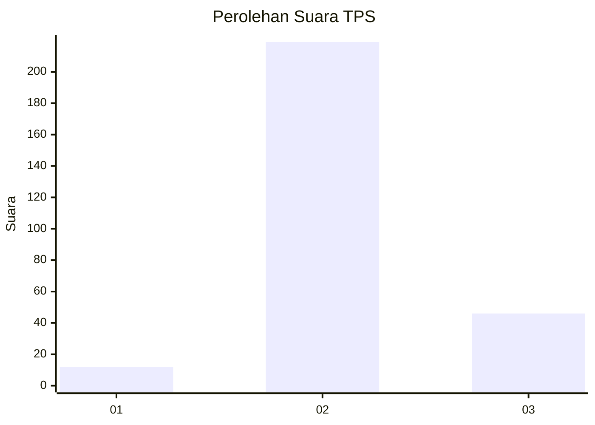
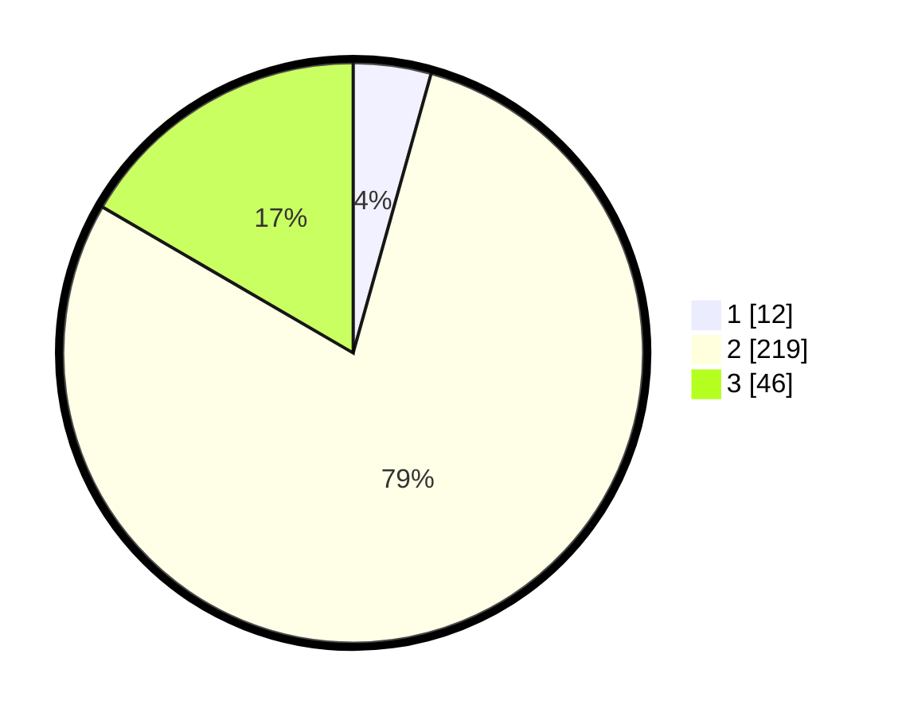

# Hasil

## Grafik

## Tabel

| No. | Nama Paslon    | Suara | Suara (raw) | Persentase |
|:--- |:-------------- | -----:| -----------:| ----------:|
| 1   | ANIES MUHAIMIN | 12    | [12][p-1]   | 4,33       |
| 2   | PRABOWO GIBRAN | 219   | [219][p-2]  | 79,06      |
| 3   | GANJAR MAHFUD  | 46    | [46][p-3]   | 16,61      |

[p-1]: https://github.com/gigit-pemilu/pemilu-2024-16-sumatera-selatan/blob/main/pilpres/hitung-suara/sub/16-sumatera-selatan/sub/08-ogan-komering-ulu-timur/sub/07-madang-suku-i/sub/2022-agung-jati/sub/015-tps/sub/paslon-1.txt
[p-2]: https://github.com/gigit-pemilu/pemilu-2024-16-sumatera-selatan/blob/main/pilpres/hitung-suara/sub/16-sumatera-selatan/sub/08-ogan-komering-ulu-timur/sub/07-madang-suku-i/sub/2022-agung-jati/sub/015-tps/sub/paslon-2.txt
[p-3]: https://github.com/gigit-pemilu/pemilu-2024-16-sumatera-selatan/blob/main/pilpres/hitung-suara/sub/16-sumatera-selatan/sub/08-ogan-komering-ulu-timur/sub/07-madang-suku-i/sub/2022-agung-jati/sub/015-tps/sub/paslon-3.txt

## Foto C Plano

https://sirekap-obj-formc.kpu.go.id/23f0/pemilu/ppwp/16/08/07/20/22/1608072022015-20240214-202219--15170093-ca29-4cdb-9d8c-3f7dc5ba5360.jpg

https://sirekap-obj-formc.kpu.go.id/23f0/pemilu/ppwp/16/08/07/20/22/1608072022015-20240214-202313--c45361c3-09c3-4129-85f9-c7631b6d22eb.jpg

https://sirekap-obj-formc.kpu.go.id/23f0/pemilu/ppwp/16/08/07/20/22/1608072022015-20240214-202820--868317f2-10ce-4d22-9ff7-0661fd88b5ac.jpg

## Metadata

| Key        | Value               |
| ---------- | ------------------- |
| Time Stamp | 2024-02-19 14:00:00 |

