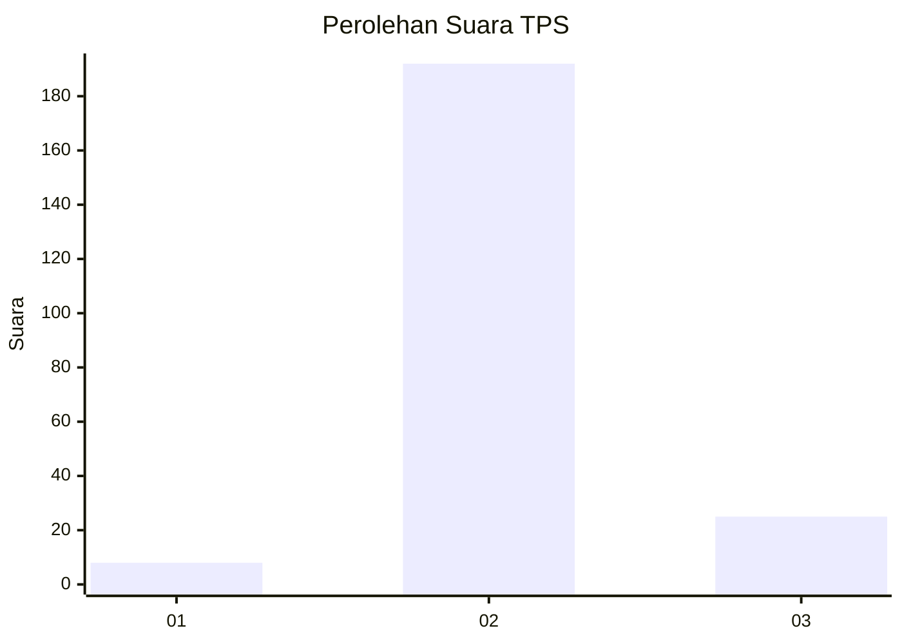
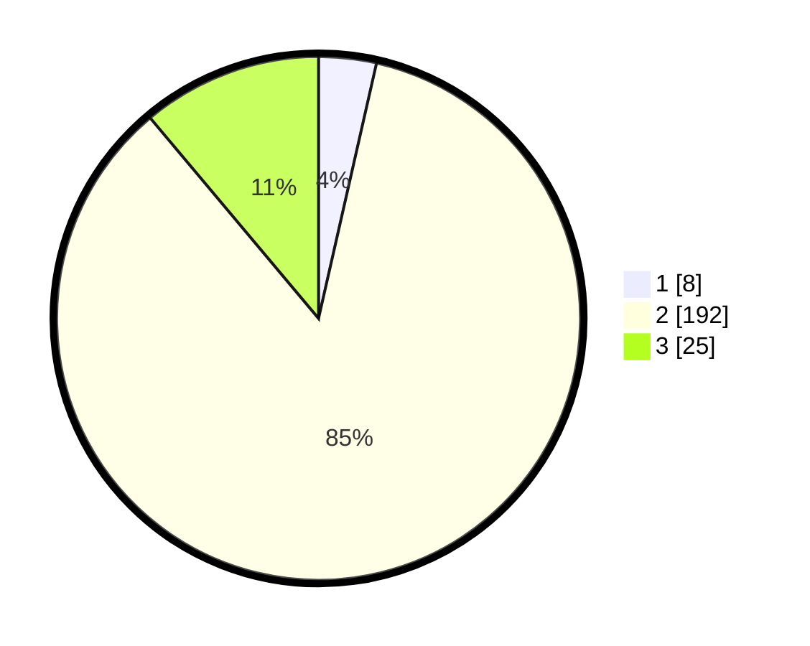

# Hasil

## Grafik

## Tabel

| No. | Nama Paslon    | Suara | Suara (raw) | Persentase |
|:--- |:-------------- | -----:| -----------:| ----------:|
| 1   | ANIES MUHAIMIN | 8     | [8][p-1]    | 3,56       |
| 2   | PRABOWO GIBRAN | 192   | [192][p-2]  | 85,33      |
| 3   | GANJAR MAHFUD  | 25    | [25][p-3]   | 11,11      |

[p-1]: https://github.com/gigit-pemilu/pemilu-2024-16-sumatera-selatan/blob/main/pilpres/hitung-suara/sub/16-sumatera-selatan/sub/08-ogan-komering-ulu-timur/sub/08-semendawai-suku-iii/sub/2002-jaya-mulya/sub/005-tps/sub/paslon-1.txt
[p-2]: https://github.com/gigit-pemilu/pemilu-2024-16-sumatera-selatan/blob/main/pilpres/hitung-suara/sub/16-sumatera-selatan/sub/08-ogan-komering-ulu-timur/sub/08-semendawai-suku-iii/sub/2002-jaya-mulya/sub/005-tps/sub/paslon-2.txt
[p-3]: https://github.com/gigit-pemilu/pemilu-2024-16-sumatera-selatan/blob/main/pilpres/hitung-suara/sub/16-sumatera-selatan/sub/08-ogan-komering-ulu-timur/sub/08-semendawai-suku-iii/sub/2002-jaya-mulya/sub/005-tps/sub/paslon-3.txt

## Foto C Plano

https://sirekap-obj-formc.kpu.go.id/6cbe/pemilu/ppwp/16/08/08/20/02/1608082002005-20240218-121923--2016a900-43e1-468a-aae4-7225f3cf792d.jpg

https://sirekap-obj-formc.kpu.go.id/6cbe/pemilu/ppwp/16/08/08/20/02/1608082002005-20240217-084307--77258b66-6948-43be-a2cb-87086386ec37.jpg

https://sirekap-obj-formc.kpu.go.id/6cbe/pemilu/ppwp/16/08/08/20/02/1608082002005-20240214-195218--3476b094-ee0b-498d-91be-1a2e5f03be07.jpg

## Metadata

| Key        | Value               |
| ---------- | ------------------- |
| Time Stamp | 2024-02-25 22:00:00 |

