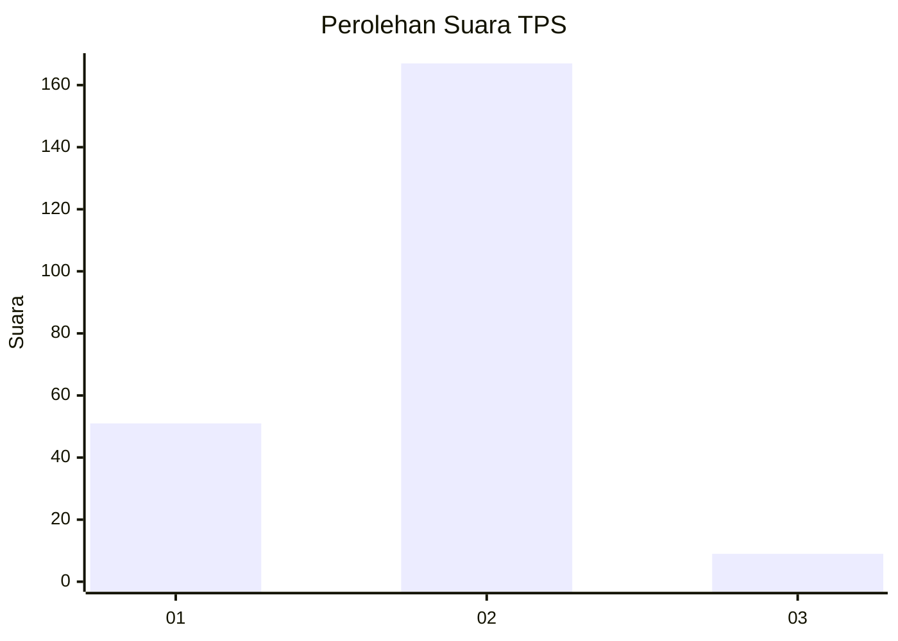

# Hasil

## Grafik

## Tabel

| No. | Nama Paslon    | Suara | Suara (raw) | Persentase |
|:--- |:-------------- | -----:| -----------:| ----------:|
| 1   | ANIES MUHAIMIN | 51    | [51][p-1]   | 22,47      |
| 2   | PRABOWO GIBRAN | 167   | [167][p-2]  | 73,57      |
| 3   | GANJAR MAHFUD  | 9     | [9][p-3]    | 3,96       |

[p-1]: https://github.com/gigit-pemilu/pemilu-2024-16-sumatera-selatan/blob/main/pilpres/hitung-suara/sub/16-sumatera-selatan/sub/08-ogan-komering-ulu-timur/sub/11-bunga-mayang/sub/2001-batu-raja-bungin/sub/001-tps/sub/paslon-1.txt
[p-2]: https://github.com/gigit-pemilu/pemilu-2024-16-sumatera-selatan/blob/main/pilpres/hitung-suara/sub/16-sumatera-selatan/sub/08-ogan-komering-ulu-timur/sub/11-bunga-mayang/sub/2001-batu-raja-bungin/sub/001-tps/sub/paslon-2.txt
[p-3]: https://github.com/gigit-pemilu/pemilu-2024-16-sumatera-selatan/blob/main/pilpres/hitung-suara/sub/16-sumatera-selatan/sub/08-ogan-komering-ulu-timur/sub/11-bunga-mayang/sub/2001-batu-raja-bungin/sub/001-tps/sub/paslon-3.txt

## Foto C Plano

https://sirekap-obj-formc.kpu.go.id/89fd/pemilu/ppwp/16/08/11/20/01/1608112001001-20240214-160057--dbff422a-67bd-4fe4-8274-ca81c941c2d0.jpg

https://sirekap-obj-formc.kpu.go.id/89fd/pemilu/ppwp/16/08/11/20/01/1608112001001-20240214-222335--09061880-de1c-4937-8373-21551f84990c.jpg

https://sirekap-obj-formc.kpu.go.id/89fd/pemilu/ppwp/16/08/11/20/01/1608112001001-20240214-155803--fc20fe37-0487-4415-abae-2ca691820d15.jpg

## Metadata

| Key        | Value               |
| ---------- | ------------------- |
| Time Stamp | 2024-02-25 12:00:00 |

