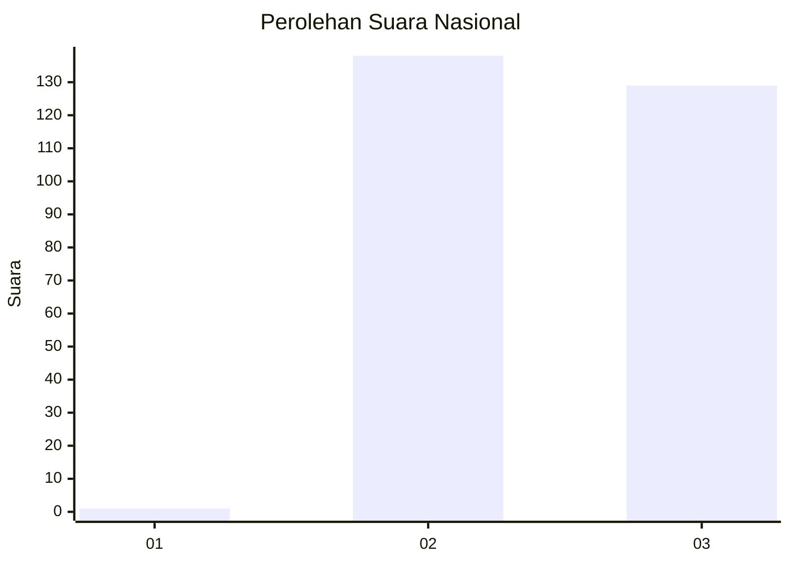
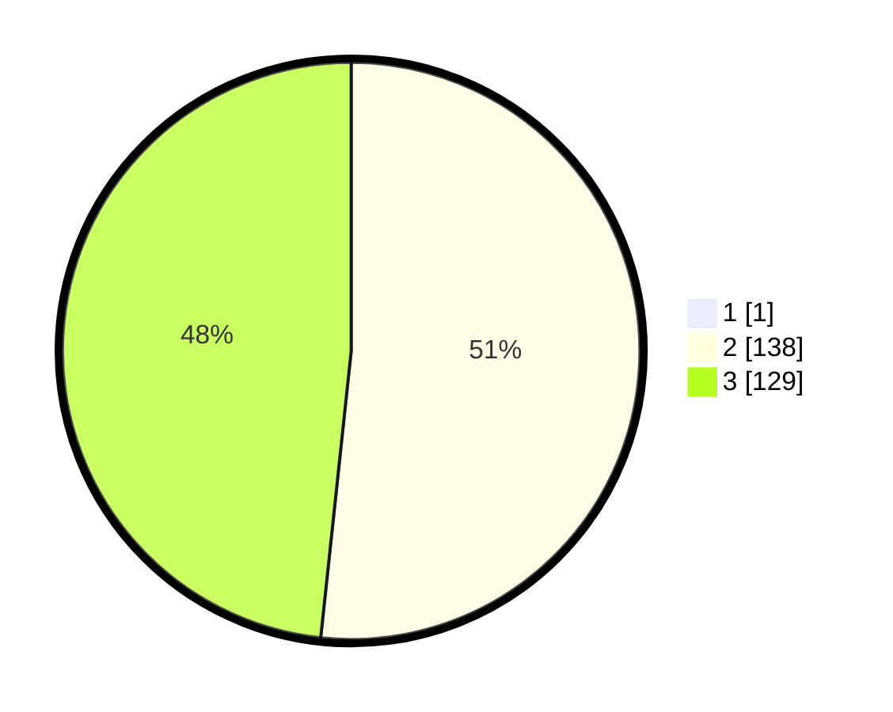

# Hasil

## Grafik

## Tabel

| No. | Nama Paslon    | Suara | Suara (raw) | Persentase |
|:--- |:-------------- | -----:| -----------:| ----------:|
| 1   | ANIES MUHAIMIN | 1     | [1][p-1]    | 0,37       |
| 2   | PRABOWO GIBRAN | 138   | [138][p-2]  | 51,49      |
| 3   | GANJAR MAHFUD  | 129   | [129][p-3]  | 48,13      |

[p-1]: https://github.com/gigit-pemilu/pemilu-2024/blob/main/pilpres/hitung-suara/sub/16-sumatera-selatan/sub/08-ogan-komering-ulu-timur/sub/13-madang-suku-iii/sub/2004-wana-bakti/sub/007-tps/sub/paslon-1.txt
[p-2]: https://github.com/gigit-pemilu/pemilu-2024/blob/main/pilpres/hitung-suara/sub/16-sumatera-selatan/sub/08-ogan-komering-ulu-timur/sub/13-madang-suku-iii/sub/2004-wana-bakti/sub/007-tps/sub/paslon-2.txt
[p-3]: https://github.com/gigit-pemilu/pemilu-2024/blob/main/pilpres/hitung-suara/sub/16-sumatera-selatan/sub/08-ogan-komering-ulu-timur/sub/13-madang-suku-iii/sub/2004-wana-bakti/sub/007-tps/sub/paslon-3.txt

## Foto C Plano

https://sirekap-obj-formc.kpu.go.id/7205/pemilu/ppwp/16/08/13/20/04/1608132004007-20240215-005904--1ac38252-0e46-4df8-8bb6-4c489b03e6c6.jpg

https://sirekap-obj-formc.kpu.go.id/7205/pemilu/ppwp/16/08/13/20/04/1608132004007-20240215-005937--728180ad-db61-4769-9443-cba13d5bf590.jpg

https://sirekap-obj-formc.kpu.go.id/7205/pemilu/ppwp/16/08/13/20/04/1608132004007-20240215-005943--3959ae43-273f-4991-96c6-11738f3e51c2.jpg

## Metadata

| Key        | Value               |
| ---------- | ------------------- |
| Time Stamp | 2024-02-25 21:00:00 |

