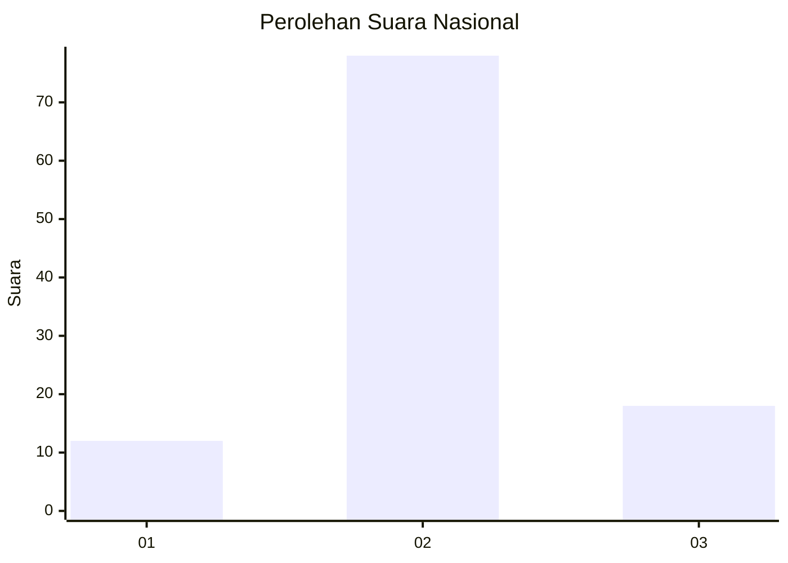
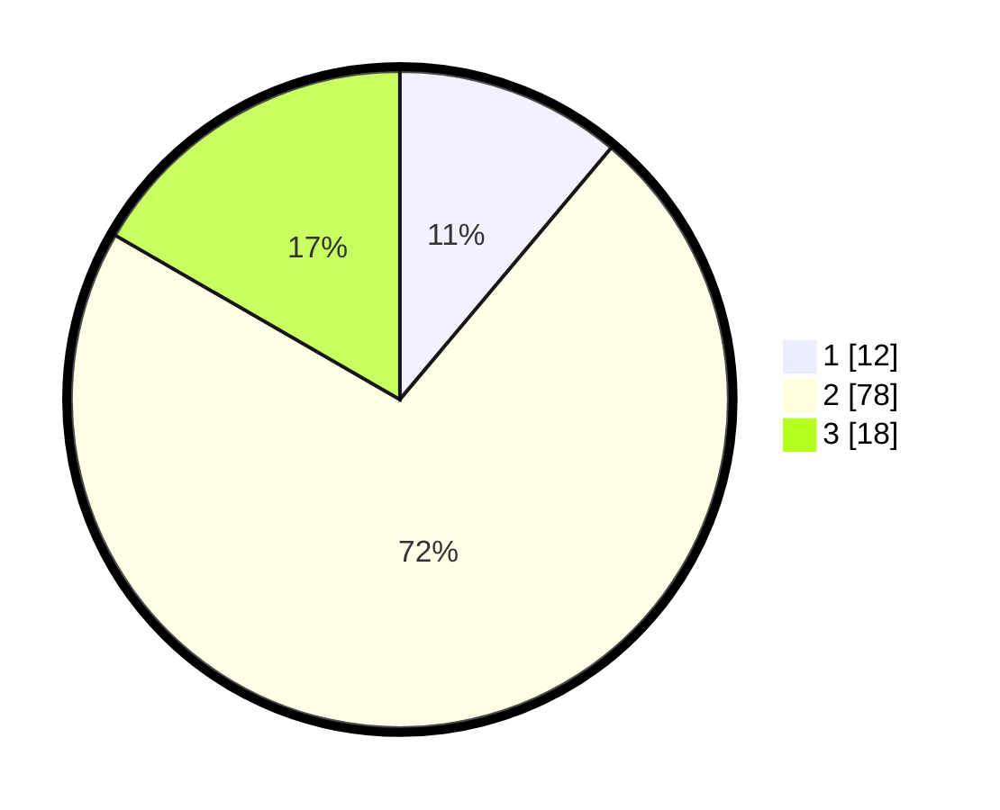

# Hasil

## Grafik

## Tabel

| No. | Nama Paslon    | Suara | Suara (raw) | Persentase |
|:--- |:-------------- | -----:| -----------:| ----------:|
| 1   | ANIES MUHAIMIN | 12    | [12][p-1]   | 11,11      |
| 2   | PRABOWO GIBRAN | 78    | [78][p-2]   | 72,22      |
| 3   | GANJAR MAHFUD  | 18    | [18][p-3]   | 16,67      |

[p-1]: https://github.com/gigit-pemilu/pemilu-2024/blob/main/pilpres/hitung-suara/sub/16-sumatera-selatan/sub/08-ogan-komering-ulu-timur/sub/13-madang-suku-iii/sub/2005-batu-marta-vi/sub/011-tps/sub/paslon-1.txt
[p-2]: https://github.com/gigit-pemilu/pemilu-2024/blob/main/pilpres/hitung-suara/sub/16-sumatera-selatan/sub/08-ogan-komering-ulu-timur/sub/13-madang-suku-iii/sub/2005-batu-marta-vi/sub/011-tps/sub/paslon-2.txt
[p-3]: https://github.com/gigit-pemilu/pemilu-2024/blob/main/pilpres/hitung-suara/sub/16-sumatera-selatan/sub/08-ogan-komering-ulu-timur/sub/13-madang-suku-iii/sub/2005-batu-marta-vi/sub/011-tps/sub/paslon-3.txt

## Foto C Plano

https://sirekap-obj-formc.kpu.go.id/c3fa/pemilu/ppwp/16/08/13/20/05/1608132005011-20240215-091016--3b126042-bdd1-4b42-9b44-4bd0994c6734.jpg

https://sirekap-obj-formc.kpu.go.id/c3fa/pemilu/ppwp/16/08/13/20/05/1608132005011-20240215-091042--287a6fc3-3536-47fe-9a8b-496015df4507.jpg

https://sirekap-obj-formc.kpu.go.id/c3fa/pemilu/ppwp/16/08/13/20/05/1608132005011-20240215-091047--ba8cc034-50b3-4dc7-ad77-caa45ae30672.jpg

## Metadata

| Key        | Value               |
| ---------- | ------------------- |
| Time Stamp | 2024-02-24 22:31:28 |

