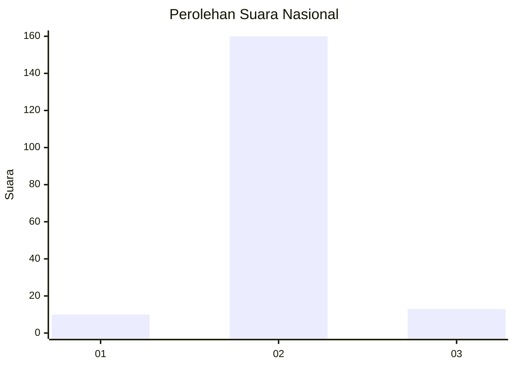
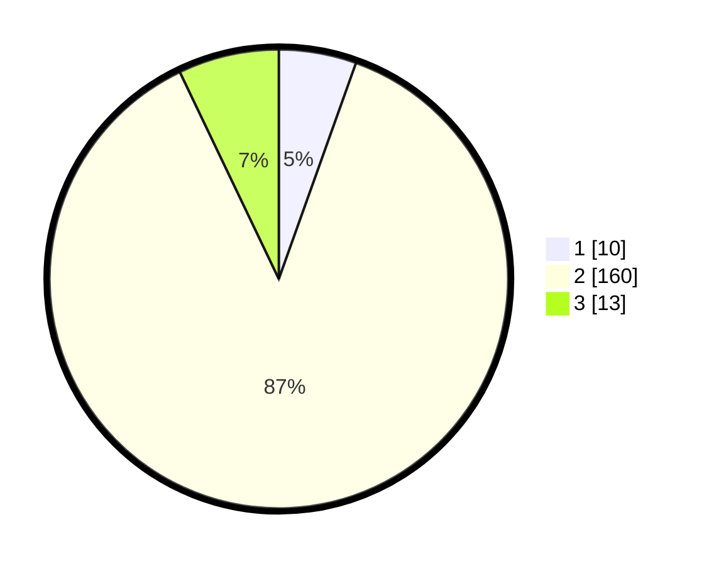

# Hasil

## Grafik

## Tabel

| No. | Nama Paslon    | Suara | Suara (raw) | Persentase |
|:--- |:-------------- | -----:| -----------:| ----------:|
| 1   | ANIES MUHAIMIN | 10    | [10][p-1]   | 5,46       |
| 2   | PRABOWO GIBRAN | 160   | [160][p-2]  | 87,43      |
| 3   | GANJAR MAHFUD  | 13    | [13][p-3]   | 7,10       |

[p-1]: https://github.com/gigit-pemilu/pemilu-2024/blob/main/pilpres/hitung-suara/sub/16-sumatera-selatan/sub/08-ogan-komering-ulu-timur/sub/17-belitang-jaya/sub/2005-marga-koyo/sub/003-tps/sub/paslon-1.txt
[p-2]: https://github.com/gigit-pemilu/pemilu-2024/blob/main/pilpres/hitung-suara/sub/16-sumatera-selatan/sub/08-ogan-komering-ulu-timur/sub/17-belitang-jaya/sub/2005-marga-koyo/sub/003-tps/sub/paslon-2.txt
[p-3]: https://github.com/gigit-pemilu/pemilu-2024/blob/main/pilpres/hitung-suara/sub/16-sumatera-selatan/sub/08-ogan-komering-ulu-timur/sub/17-belitang-jaya/sub/2005-marga-koyo/sub/003-tps/sub/paslon-3.txt

## Foto C Plano

https://sirekap-obj-formc.kpu.go.id/ceda/pemilu/ppwp/16/08/17/20/05/1608172005003-20240214-223313--bb524542-58e4-415e-a2f7-ff36adfb492d.jpg

https://sirekap-obj-formc.kpu.go.id/ceda/pemilu/ppwp/16/08/17/20/05/1608172005003-20240214-224519--84f816d2-8cfb-4f8c-8615-41cd0460b308.jpg

https://sirekap-obj-formc.kpu.go.id/ceda/pemilu/ppwp/16/08/17/20/05/1608172005003-20240214-223011--e757cd22-0dd5-4489-9522-ac9e98e30e79.jpg

## Metadata

| Key        | Value               |
| ---------- | ------------------- |
| Time Stamp | 2024-02-25 21:00:00 |

