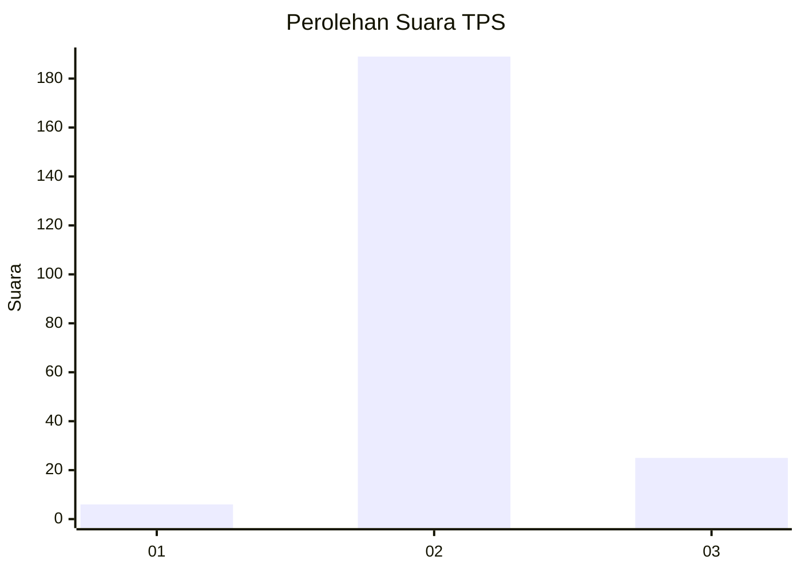
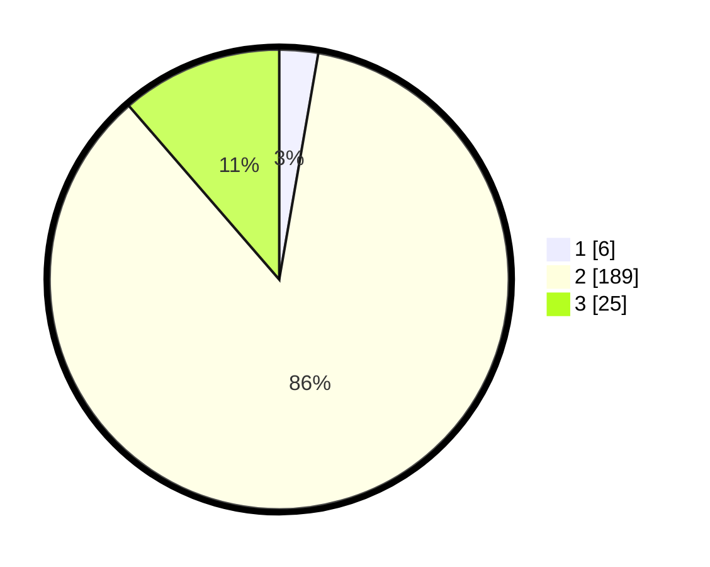

# Hasil

## Grafik

## Tabel

| No. | Nama Paslon    | Suara | Suara (raw) | Persentase |
|:--- |:-------------- | -----:| -----------:| ----------:|
| 1   | ANIES MUHAIMIN | 6     | [6][p-1]    | 2,73       |
| 2   | PRABOWO GIBRAN | 189   | [189][p-2]  | 85,91      |
| 3   | GANJAR MAHFUD  | 25    | [25][p-3]   | 11,36      |

[p-1]: https://github.com/gigit-pemilu/pemilu-2024-16-sumatera-selatan/blob/main/pilpres/hitung-suara/sub/16-sumatera-selatan/sub/08-ogan-komering-ulu-timur/sub/19-belitang-mulya/sub/2008-ulak-buntar/sub/006-tps/sub/paslon-1.txt
[p-2]: https://github.com/gigit-pemilu/pemilu-2024-16-sumatera-selatan/blob/main/pilpres/hitung-suara/sub/16-sumatera-selatan/sub/08-ogan-komering-ulu-timur/sub/19-belitang-mulya/sub/2008-ulak-buntar/sub/006-tps/sub/paslon-2.txt
[p-3]: https://github.com/gigit-pemilu/pemilu-2024-16-sumatera-selatan/blob/main/pilpres/hitung-suara/sub/16-sumatera-selatan/sub/08-ogan-komering-ulu-timur/sub/19-belitang-mulya/sub/2008-ulak-buntar/sub/006-tps/sub/paslon-3.txt

## Foto C Plano

https://sirekap-obj-formc.kpu.go.id/c100/pemilu/ppwp/16/08/19/20/08/1608192008006-20240218-184355--05b4b62a-3d5b-45e2-bee7-ef217265e237.jpg

https://sirekap-obj-formc.kpu.go.id/c100/pemilu/ppwp/16/08/19/20/08/1608192008006-20240218-184502--8cfec24d-defd-41df-9dbe-fd56d8bd2a91.jpg

https://sirekap-obj-formc.kpu.go.id/c100/pemilu/ppwp/16/08/19/20/08/1608192008006-20240218-184608--a9e16f76-8fba-4353-a0a7-ed8dbba6246d.jpg

## Metadata

| Key        | Value               |
| ---------- | ------------------- |
| Time Stamp | 2024-02-25 15:00:00 |

