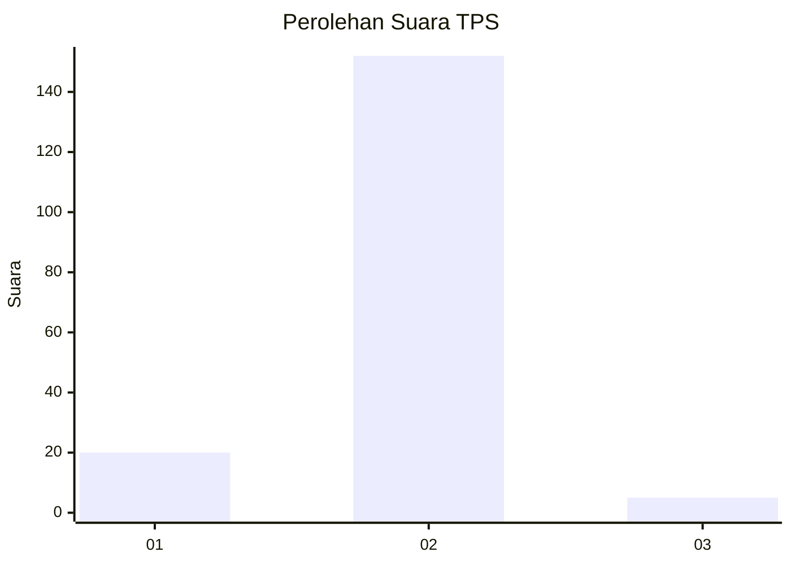
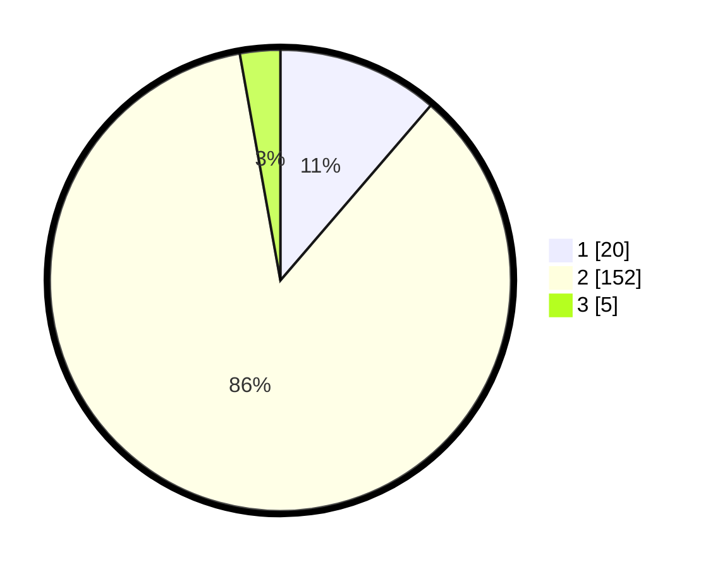

# Hasil

## Grafik

## Tabel

| No. | Nama Paslon    | Suara | Suara (raw) | Persentase |
|:--- |:-------------- | -----:| -----------:| ----------:|
| 1   | ANIES MUHAIMIN | 20    | [20][p-1]   | 11,30      |
| 2   | PRABOWO GIBRAN | 152   | [152][p-2]  | 85,88      |
| 3   | GANJAR MAHFUD  | 5     | [5][p-3]    | 2,82       |

[p-1]: https://github.com/gigit-pemilu/pemilu-2024-16-sumatera-selatan/blob/main/pilpres/hitung-suara/sub/16-sumatera-selatan/sub/08-ogan-komering-ulu-timur/sub/20-buay-pemuka-bangsa-raja/sub/2001-sri-bunga/sub/001-tps/sub/paslon-1.txt
[p-2]: https://github.com/gigit-pemilu/pemilu-2024-16-sumatera-selatan/blob/main/pilpres/hitung-suara/sub/16-sumatera-selatan/sub/08-ogan-komering-ulu-timur/sub/20-buay-pemuka-bangsa-raja/sub/2001-sri-bunga/sub/001-tps/sub/paslon-2.txt
[p-3]: https://github.com/gigit-pemilu/pemilu-2024-16-sumatera-selatan/blob/main/pilpres/hitung-suara/sub/16-sumatera-selatan/sub/08-ogan-komering-ulu-timur/sub/20-buay-pemuka-bangsa-raja/sub/2001-sri-bunga/sub/001-tps/sub/paslon-3.txt

## Foto C Plano

https://sirekap-obj-formc.kpu.go.id/5b07/pemilu/ppwp/16/08/20/20/01/1608202001001-20240214-230248--f536875c-e504-4b33-b1e5-8a09b82ac9ab.jpg

https://sirekap-obj-formc.kpu.go.id/5b07/pemilu/ppwp/16/08/20/20/01/1608202001001-20240214-230456--43e47a40-4358-4200-8f1f-f2f604f23a55.jpg

https://sirekap-obj-formc.kpu.go.id/5b07/pemilu/ppwp/16/08/20/20/01/1608202001001-20240214-230545--415f1d5b-78e6-41df-be14-afda0809c52e.jpg

## Metadata

| Key        | Value               |
| ---------- | ------------------- |
| Time Stamp | 2024-02-15 12:00:28 |

