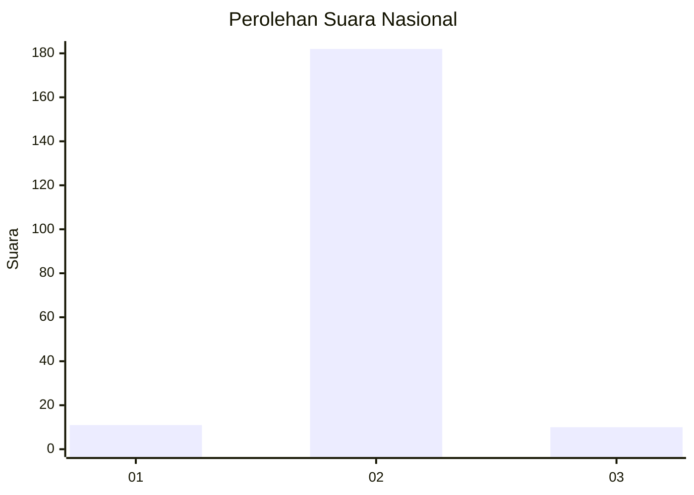
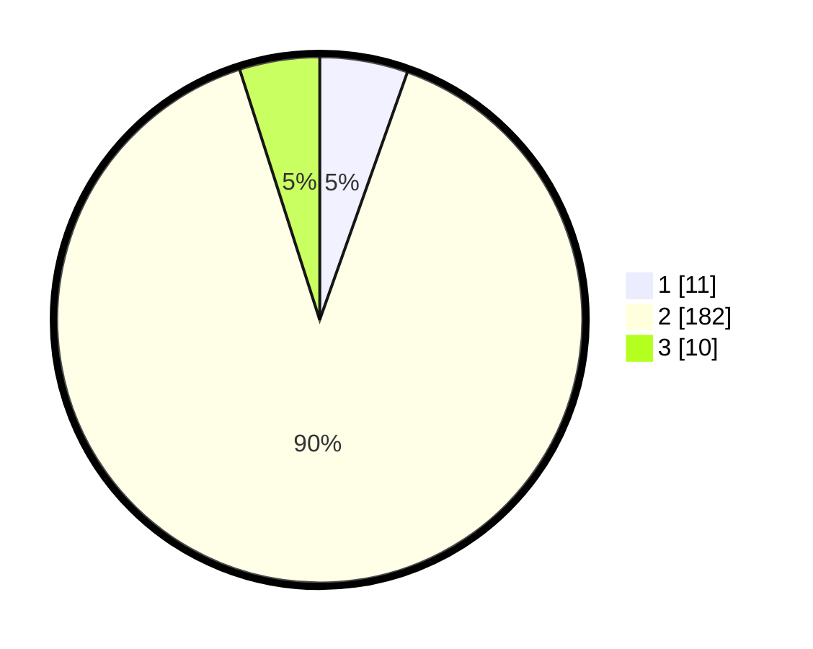

# Hasil

## Grafik

## Tabel

| No. | Nama Paslon    | Suara | Suara (raw) | Persentase |
|:--- |:-------------- | -----:| -----------:| ----------:|
| 1   | ANIES MUHAIMIN | 11    | [11][p-1]   | 5,42       |
| 2   | PRABOWO GIBRAN | 182   | [182][p-2]  | 89,66      |
| 3   | GANJAR MAHFUD  | 10    | [10][p-3]   | 4,93       |

[p-1]: https://github.com/gigit-pemilu/pemilu-2024/blob/main/pilpres/hitung-suara/sub/16-sumatera-selatan/sub/08-ogan-komering-ulu-timur/sub/20-buay-pemuka-bangsa-raja/sub/2001-sri-bunga/sub/002-tps/sub/paslon-1.txt
[p-2]: https://github.com/gigit-pemilu/pemilu-2024/blob/main/pilpres/hitung-suara/sub/16-sumatera-selatan/sub/08-ogan-komering-ulu-timur/sub/20-buay-pemuka-bangsa-raja/sub/2001-sri-bunga/sub/002-tps/sub/paslon-2.txt
[p-3]: https://github.com/gigit-pemilu/pemilu-2024/blob/main/pilpres/hitung-suara/sub/16-sumatera-selatan/sub/08-ogan-komering-ulu-timur/sub/20-buay-pemuka-bangsa-raja/sub/2001-sri-bunga/sub/002-tps/sub/paslon-3.txt

## Foto C Plano

https://sirekap-obj-formc.kpu.go.id/6cbe/pemilu/ppwp/16/08/20/20/01/1608202001002-20240218-172614--536f937b-de8a-41a4-86e2-ccd9e3162b08.jpg

https://sirekap-obj-formc.kpu.go.id/6cbe/pemilu/ppwp/16/08/20/20/01/1608202001002-20240218-172709--99f4399e-b937-41da-93ca-cd4b01ff8ba6.jpg

https://sirekap-obj-formc.kpu.go.id/6cbe/pemilu/ppwp/16/08/20/20/01/1608202001002-20240218-172737--8c39a957-3a09-4f42-8ba3-30a7b5646a1d.jpg

## Metadata

| Key        | Value               |
| ---------- | ------------------- |
| Time Stamp | 2024-02-25 13:00:00 |

