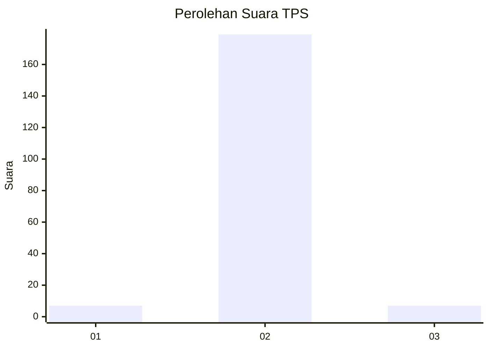
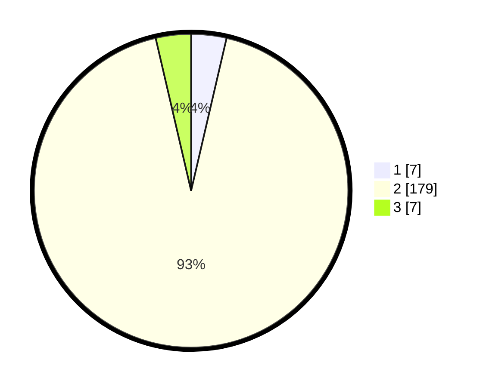

# Hasil

## Grafik

## Tabel

| No. | Nama Paslon    | Suara | Suara (raw) | Persentase |
|:--- |:-------------- | -----:| -----------:| ----------:|
| 1   | ANIES MUHAIMIN | 7     | [7][p-1]    | 3,63       |
| 2   | PRABOWO GIBRAN | 179   | [179][p-2]  | 92,75      |
| 3   | GANJAR MAHFUD  | 7     | [7][p-3]    | 3,63       |

[p-1]: https://github.com/gigit-pemilu/pemilu-2024-16-sumatera-selatan/blob/main/pilpres/hitung-suara/sub/16-sumatera-selatan/sub/08-ogan-komering-ulu-timur/sub/20-buay-pemuka-bangsa-raja/sub/2001-sri-bunga/sub/005-tps/sub/paslon-1.txt
[p-2]: https://github.com/gigit-pemilu/pemilu-2024-16-sumatera-selatan/blob/main/pilpres/hitung-suara/sub/16-sumatera-selatan/sub/08-ogan-komering-ulu-timur/sub/20-buay-pemuka-bangsa-raja/sub/2001-sri-bunga/sub/005-tps/sub/paslon-2.txt
[p-3]: https://github.com/gigit-pemilu/pemilu-2024-16-sumatera-selatan/blob/main/pilpres/hitung-suara/sub/16-sumatera-selatan/sub/08-ogan-komering-ulu-timur/sub/20-buay-pemuka-bangsa-raja/sub/2001-sri-bunga/sub/005-tps/sub/paslon-3.txt

## Foto C Plano

https://sirekap-obj-formc.kpu.go.id/1e1d/pemilu/ppwp/16/08/20/20/01/1608202001005-20240215-103459--fc37d331-e8dd-4f1f-850d-f0f5eb44ecab.jpg

https://sirekap-obj-formc.kpu.go.id/1e1d/pemilu/ppwp/16/08/20/20/01/1608202001005-20240214-214101--7a1c55a2-4fa1-4711-90b8-3c742df45a76.jpg

https://sirekap-obj-formc.kpu.go.id/1e1d/pemilu/ppwp/16/08/20/20/01/1608202001005-20240215-104805--70a7a742-e4f0-418f-9406-d90e8e373b74.jpg

## Metadata

| Key        | Value               |
| ---------- | ------------------- |
| Time Stamp | 2024-02-24 22:31:28 |

