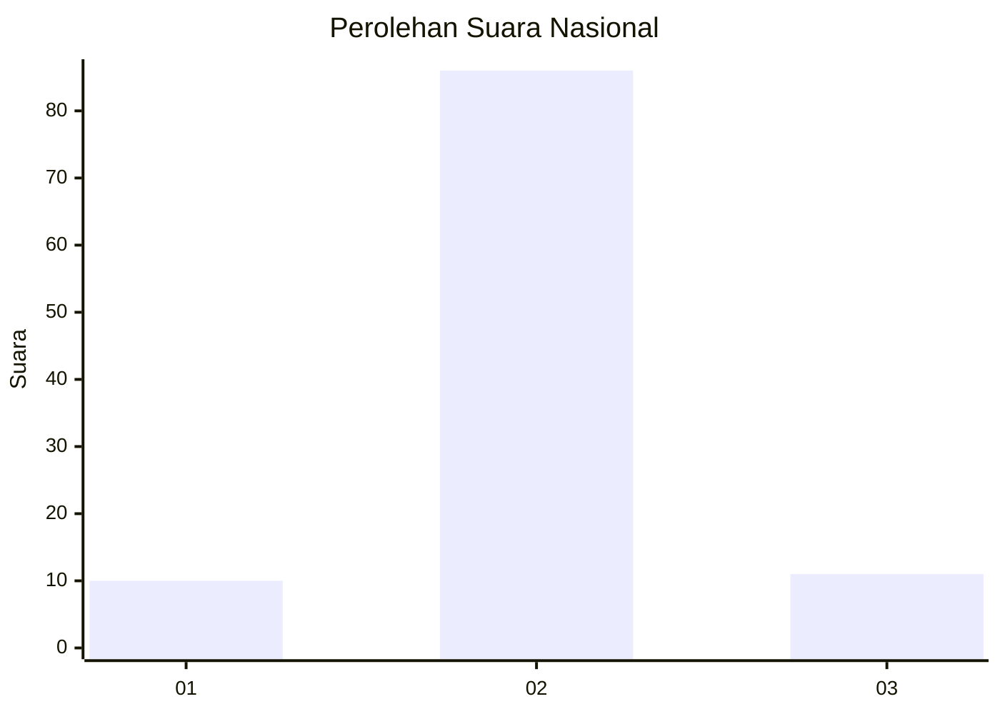
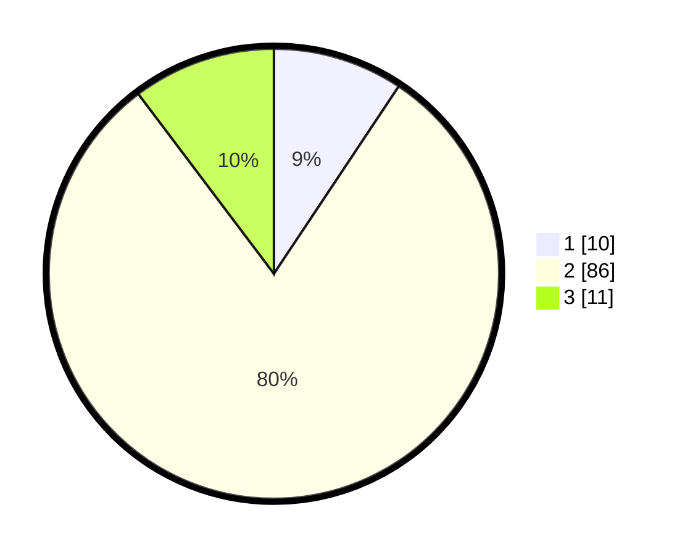

# Hasil

## Grafik

## Tabel

| No. | Nama Paslon    | Suara | Suara (raw) | Persentase |
|:--- |:-------------- | -----:| -----------:| ----------:|
| 1   | ANIES MUHAIMIN | 10    | [10][p-1]   | 9,35       |
| 2   | PRABOWO GIBRAN | 86    | [86][p-2]   | 80,37      |
| 3   | GANJAR MAHFUD  | 11    | [11][p-3]   | 10,28      |

[p-1]: https://github.com/gigit-pemilu/pemilu-2024/blob/main/pilpres/hitung-suara/sub/16-sumatera-selatan/sub/08-ogan-komering-ulu-timur/sub/20-buay-pemuka-bangsa-raja/sub/2002-anyar/sub/002-tps/sub/paslon-1.txt
[p-2]: https://github.com/gigit-pemilu/pemilu-2024/blob/main/pilpres/hitung-suara/sub/16-sumatera-selatan/sub/08-ogan-komering-ulu-timur/sub/20-buay-pemuka-bangsa-raja/sub/2002-anyar/sub/002-tps/sub/paslon-2.txt
[p-3]: https://github.com/gigit-pemilu/pemilu-2024/blob/main/pilpres/hitung-suara/sub/16-sumatera-selatan/sub/08-ogan-komering-ulu-timur/sub/20-buay-pemuka-bangsa-raja/sub/2002-anyar/sub/002-tps/sub/paslon-3.txt

## Foto C Plano

https://sirekap-obj-formc.kpu.go.id/9df3/pemilu/ppwp/16/08/20/20/02/1608202002002-20240215-112130--4b04c7e9-cd37-44fe-9eb2-dd73b97df452.jpg

https://sirekap-obj-formc.kpu.go.id/9df3/pemilu/ppwp/16/08/20/20/02/1608202002002-20240215-075823--eb8fb83d-08d5-4e0e-bac4-396c563f70a3.jpg

https://sirekap-obj-formc.kpu.go.id/9df3/pemilu/ppwp/16/08/20/20/02/1608202002002-20240215-032806--763c17a3-a0bc-456a-8ec8-dda37243a6b3.jpg

## Metadata

| Key        | Value               |
| ---------- | ------------------- |
| Time Stamp | 2024-02-15 20:30:46 |

