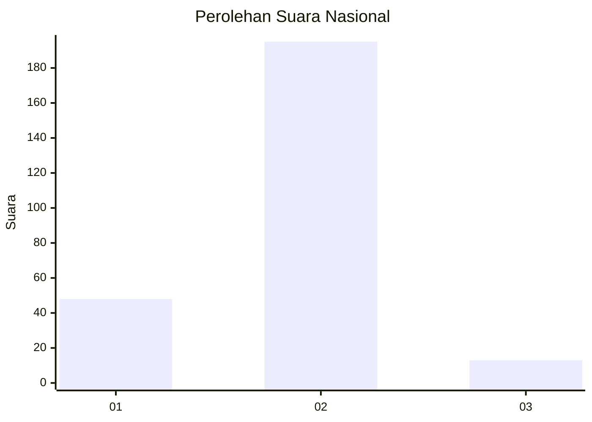
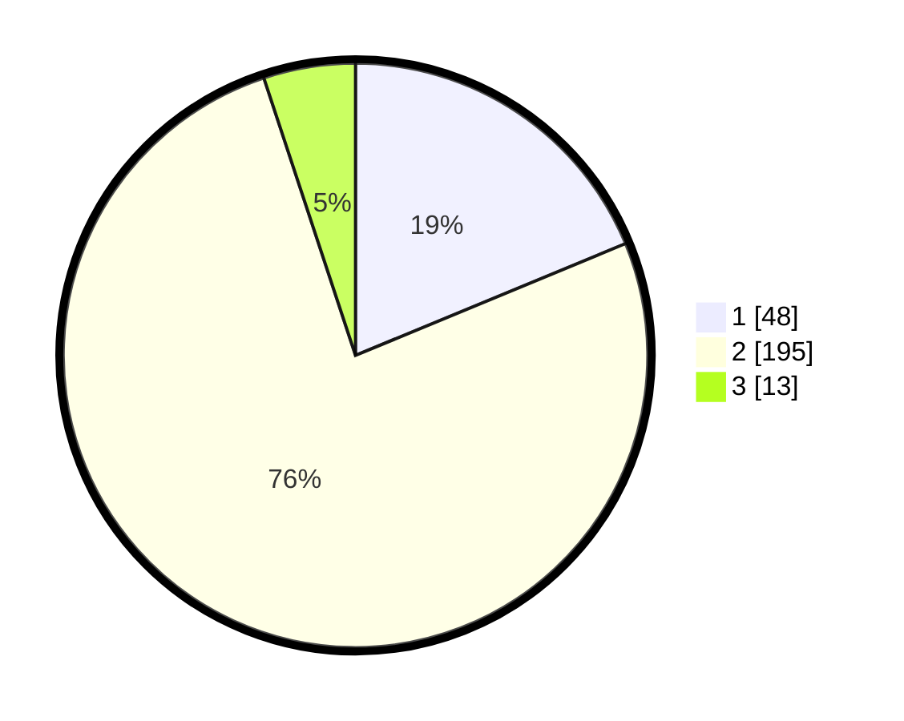

# Hasil

## Grafik

## Tabel

| No. | Nama Paslon    | Suara | Suara (raw) | Persentase |
|:--- |:-------------- | -----:| -----------:| ----------:|
| 1   | ANIES MUHAIMIN | 48    | [48][p-1]   | 18,75      |
| 2   | PRABOWO GIBRAN | 195   | [195][p-2]  | 76,17      |
| 3   | GANJAR MAHFUD  | 13    | [13][p-3]   | 5,08       |

[p-1]: https://github.com/gigit-pemilu/pemilu-2024/blob/main/pilpres/hitung-suara/sub/16-sumatera-selatan/sub/09-ogan-komering-ulu-selatan/sub/01-muara-dua/sub/1013-batu-belang-jaya/sub/001-tps/sub/paslon-1.txt
[p-2]: https://github.com/gigit-pemilu/pemilu-2024/blob/main/pilpres/hitung-suara/sub/16-sumatera-selatan/sub/09-ogan-komering-ulu-selatan/sub/01-muara-dua/sub/1013-batu-belang-jaya/sub/001-tps/sub/paslon-2.txt
[p-3]: https://github.com/gigit-pemilu/pemilu-2024/blob/main/pilpres/hitung-suara/sub/16-sumatera-selatan/sub/09-ogan-komering-ulu-selatan/sub/01-muara-dua/sub/1013-batu-belang-jaya/sub/001-tps/sub/paslon-3.txt

## Foto C Plano

https://sirekap-obj-formc.kpu.go.id/c627/pemilu/ppwp/16/09/01/10/13/1609011013001-20240214-203856--c781c8b6-85e4-4d89-83df-a49882f5ae4b.jpg

https://sirekap-obj-formc.kpu.go.id/c627/pemilu/ppwp/16/09/01/10/13/1609011013001-20240214-204116--63be92b0-a1a0-4b40-9d2d-83cfa264b2a7.jpg

https://sirekap-obj-formc.kpu.go.id/c627/pemilu/ppwp/16/09/01/10/13/1609011013001-20240214-204354--15b79f2d-da6d-496b-978f-5c5299ff0fe8.jpg

## Metadata

| Key        | Value               |
| ---------- | ------------------- |
| Time Stamp | 2024-02-15 00:41:44 |

## DATA PEMILIH TETAP

Jumlah pemilih dalam DPT: **284**.
 * L: **145**.
 * P: **139**.

## DATA PENGGUNA HAK PILIH

Jumlah pengguna hak pilih dalam DPT: **260**.
 * L: **132**.
 * P: **128**.

Jumlah pengguna hak pilih dalam DPTb: **0**.
 * L: **0**.
 * P: **0**.

Jumlah pengguna hak pilih dalam DPK: **0**.
 * L: **0**.
 * P: **0**.

Jumlah pengguna hak pilih: **260**.
 * L: **132**.
 * P: **128**.

## JUMLAH SUARA SAH DAN TIDAK SAH

JUMLAH SELURUH SUARA SAH: **256**.

JUMLAH SUARA TIDAK SAH: **4**.

JUMLAH SELURUH SUARA SAH DAN SUARA TIDAK SAH: **260**.

