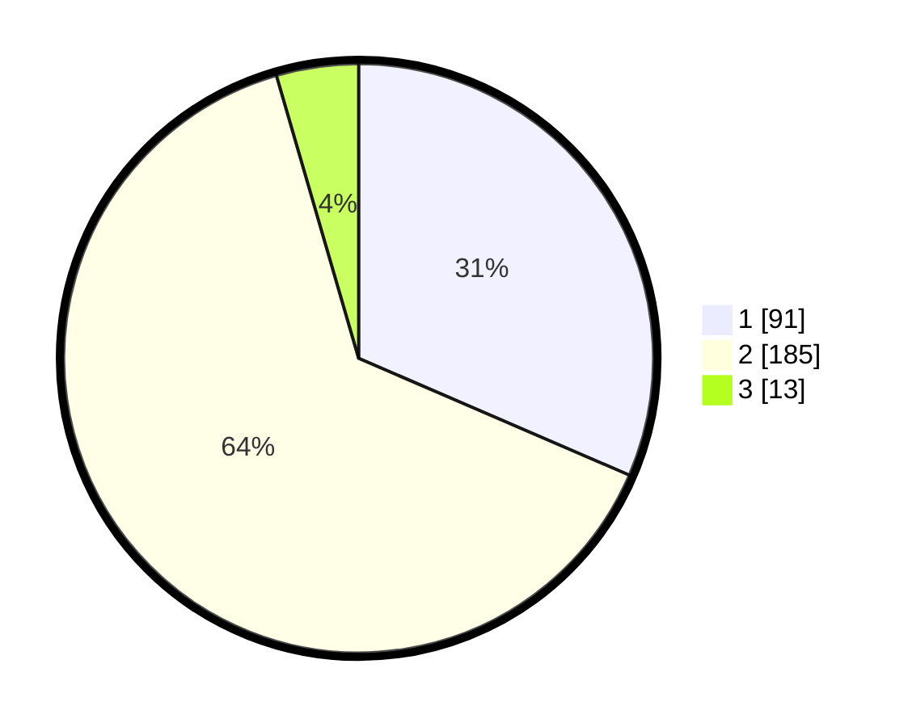

# Hasil

## Grafik

## Tabel

| No. | Nama Paslon    | Suara | Suara (raw) | Persentase |
|:--- |:-------------- | -----:| -----------:| ----------:|
| 1   | ANIES MUHAIMIN | 91    | [91][p-1]   | 31,49      |
| 2   | PRABOWO GIBRAN | 185   | [185][p-2]  | 64,01      |
| 3   | GANJAR MAHFUD  | 13    | [13][p-3]   | 4,50       |

[p-1]: https://github.com/gigit-pemilu/pemilu-2024-16-sumatera-selatan/blob/main/pilpres/hitung-suara/sub/16-sumatera-selatan/sub/09-ogan-komering-ulu-selatan/sub/01-muara-dua/sub/1013-batu-belang-jaya/sub/002-tps/sub/paslon-1.txt
[p-2]: https://github.com/gigit-pemilu/pemilu-2024-16-sumatera-selatan/blob/main/pilpres/hitung-suara/sub/16-sumatera-selatan/sub/09-ogan-komering-ulu-selatan/sub/01-muara-dua/sub/1013-batu-belang-jaya/sub/002-tps/sub/paslon-2.txt
[p-3]: https://github.com/gigit-pemilu/pemilu-2024-16-sumatera-selatan/blob/main/pilpres/hitung-suara/sub/16-sumatera-selatan/sub/09-ogan-komering-ulu-selatan/sub/01-muara-dua/sub/1013-batu-belang-jaya/sub/002-tps/sub/paslon-3.txt

## Foto C Plano

https://sirekap-obj-formc.kpu.go.id/9e60/pemilu/ppwp/16/09/01/10/13/1609011013002-20240214-193745--ac602640-d4e6-4baf-aa5e-26a43819f90e.jpg

https://sirekap-obj-formc.kpu.go.id/9e60/pemilu/ppwp/16/09/01/10/13/1609011013002-20240214-194240--35d7079d-a0ba-4138-bee6-3ec10132fdaa.jpg

https://sirekap-obj-formc.kpu.go.id/9e60/pemilu/ppwp/16/09/01/10/13/1609011013002-20240214-194631--b4f7b0e6-7eef-4bd3-a087-8b714102c490.jpg

## Metadata

| Key        | Value               |
| ---------- | ------------------- |
| Time Stamp | 2024-02-17 19:00:04 |

## DATA PEMILIH TETAP

Jumlah pemilih dalam DPT: **291**.
 * L: **147**.
 * P: **144**.

## DATA PENGGUNA HAK PILIH

Jumlah pengguna hak pilih dalam DPT: **290**.
 * L: **146**.
 * P: **144**.

Jumlah pengguna hak pilih dalam DPTb: **0**.
 * L: **0**.
 * P: **0**.

Jumlah pengguna hak pilih dalam DPK: **0**.
 * L: **0**.
 * P: **0**.

Jumlah pengguna hak pilih: **290**.
 * L: **146**.
 * P: **144**.

## JUMLAH SUARA SAH DAN TIDAK SAH

JUMLAH SELURUH SUARA SAH: **289**.

JUMLAH SUARA TIDAK SAH: **1**.

JUMLAH SELURUH SUARA SAH DAN SUARA TIDAK SAH: **290**.

