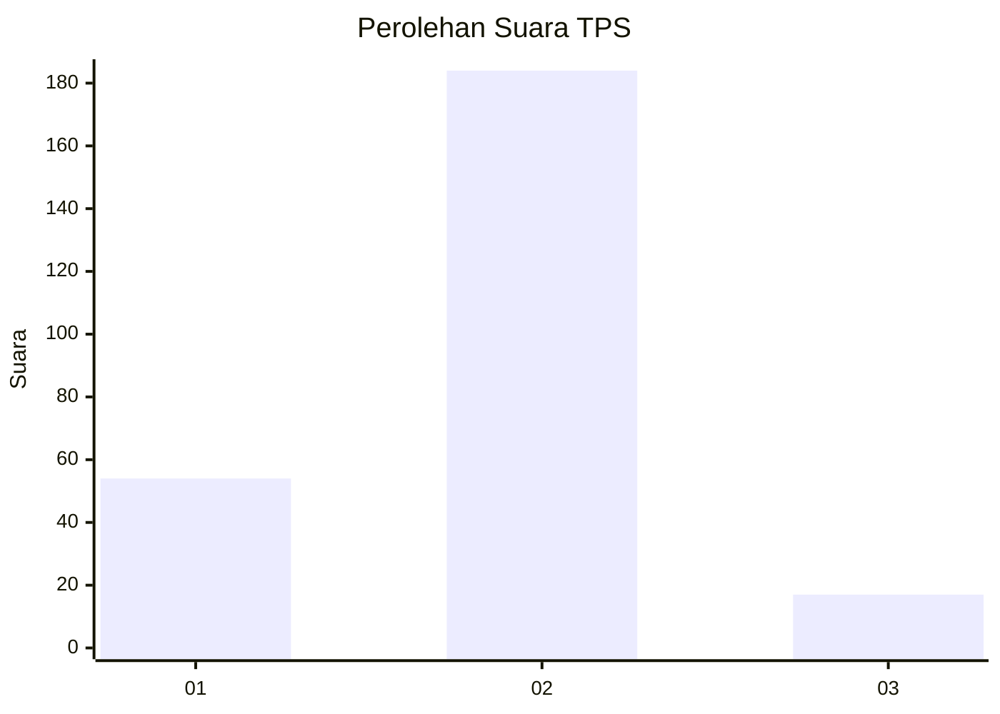

# Hasil

## Grafik

## Tabel

| No. | Nama Paslon    | Suara | Suara (raw) | Persentase |
|:--- |:-------------- | -----:| -----------:| ----------:|
| 1   | ANIES MUHAIMIN | 54    | [54][p-1]   | 21,18      |
| 2   | PRABOWO GIBRAN | 184   | [184][p-2]  | 72,16      |
| 3   | GANJAR MAHFUD  | 17    | [17][p-3]   | 6,67       |

[p-1]: https://github.com/gigit-pemilu/pemilu-2024-16-sumatera-selatan/blob/main/pilpres/hitung-suara/sub/16-sumatera-selatan/sub/09-ogan-komering-ulu-selatan/sub/01-muara-dua/sub/1013-batu-belang-jaya/sub/003-tps/sub/paslon-1.txt
[p-2]: https://github.com/gigit-pemilu/pemilu-2024-16-sumatera-selatan/blob/main/pilpres/hitung-suara/sub/16-sumatera-selatan/sub/09-ogan-komering-ulu-selatan/sub/01-muara-dua/sub/1013-batu-belang-jaya/sub/003-tps/sub/paslon-2.txt
[p-3]: https://github.com/gigit-pemilu/pemilu-2024-16-sumatera-selatan/blob/main/pilpres/hitung-suara/sub/16-sumatera-selatan/sub/09-ogan-komering-ulu-selatan/sub/01-muara-dua/sub/1013-batu-belang-jaya/sub/003-tps/sub/paslon-3.txt

## Foto C Plano

https://sirekap-obj-formc.kpu.go.id/e099/pemilu/ppwp/16/09/01/10/13/1609011013003-20240223-135610--5bcf10c3-8bf4-4c22-912f-1b175cb800c2.jpg

https://sirekap-obj-formc.kpu.go.id/e099/pemilu/ppwp/16/09/01/10/13/1609011013003-20240223-135725--831460a8-6f4c-427b-a795-9789a25c1b04.jpg

https://sirekap-obj-formc.kpu.go.id/e099/pemilu/ppwp/16/09/01/10/13/1609011013003-20240223-135835--710c4d52-96c9-4bda-928a-56b634d9274c.jpg

## Metadata

| Key        | Value               |
| ---------- | ------------------- |
| Time Stamp | 2024-02-26 14:00:00 |

