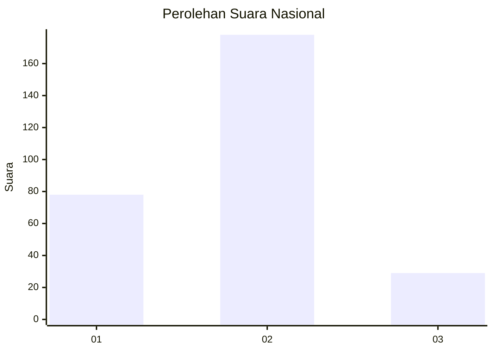
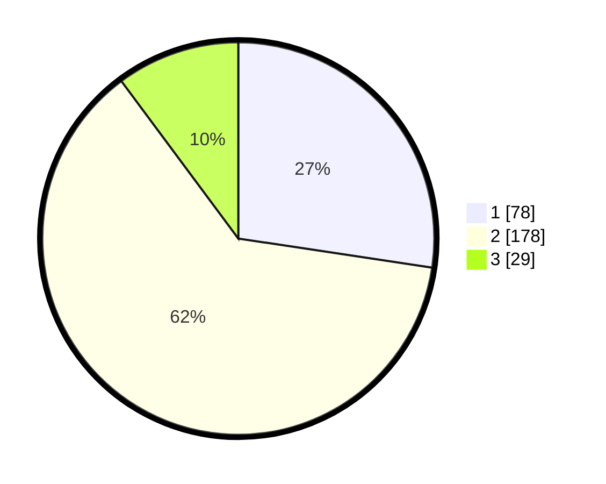

# Hasil

## Grafik

## Tabel

| No. | Nama Paslon    | Suara | Suara (raw) | Persentase |
|:--- |:-------------- | -----:| -----------:| ----------:|
| 1   | ANIES MUHAIMIN | 78    | [78][p-1]   | 27,37      |
| 2   | PRABOWO GIBRAN | 178   | [178][p-2]  | 62,46      |
| 3   | GANJAR MAHFUD  | 29    | [29][p-3]   | 10,18      |

[p-1]: https://github.com/gigit-pemilu/pemilu-2024/blob/main/pilpres/hitung-suara/sub/16-sumatera-selatan/sub/09-ogan-komering-ulu-selatan/sub/01-muara-dua/sub/1013-batu-belang-jaya/sub/004-tps/sub/paslon-1.txt
[p-2]: https://github.com/gigit-pemilu/pemilu-2024/blob/main/pilpres/hitung-suara/sub/16-sumatera-selatan/sub/09-ogan-komering-ulu-selatan/sub/01-muara-dua/sub/1013-batu-belang-jaya/sub/004-tps/sub/paslon-2.txt
[p-3]: https://github.com/gigit-pemilu/pemilu-2024/blob/main/pilpres/hitung-suara/sub/16-sumatera-selatan/sub/09-ogan-komering-ulu-selatan/sub/01-muara-dua/sub/1013-batu-belang-jaya/sub/004-tps/sub/paslon-3.txt

## Foto C Plano

https://sirekap-obj-formc.kpu.go.id/7041/pemilu/ppwp/16/09/01/10/13/1609011013004-20240223-154939--4f016251-32a0-4030-9e78-de0b1547de4a.jpg

https://sirekap-obj-formc.kpu.go.id/7041/pemilu/ppwp/16/09/01/10/13/1609011013004-20240223-155038--50b42bef-4fad-449d-91d1-6a128454d223.jpg

https://sirekap-obj-formc.kpu.go.id/7041/pemilu/ppwp/16/09/01/10/13/1609011013004-20240223-155137--2b535ee8-936e-4c74-a7b6-4e355e57e70b.jpg

## Metadata

| Key        | Value               |
| ---------- | ------------------- |
| Time Stamp | 2024-02-25 19:00:00 |

