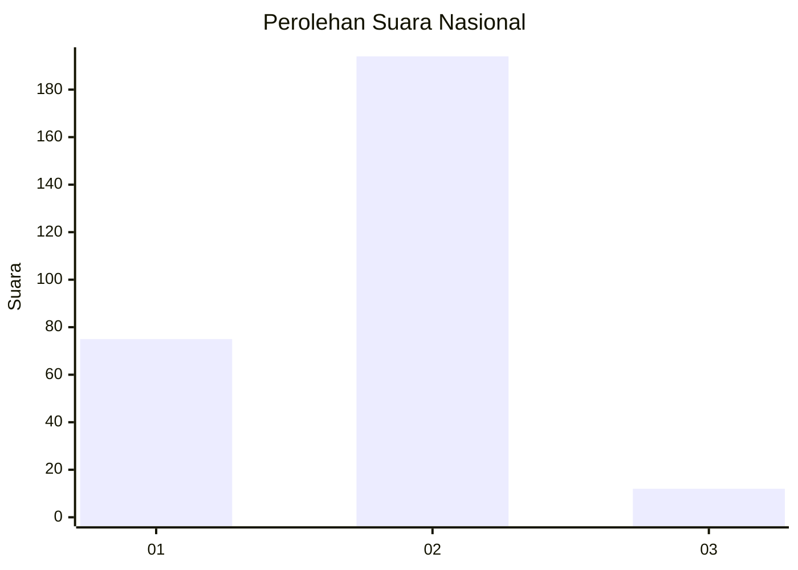
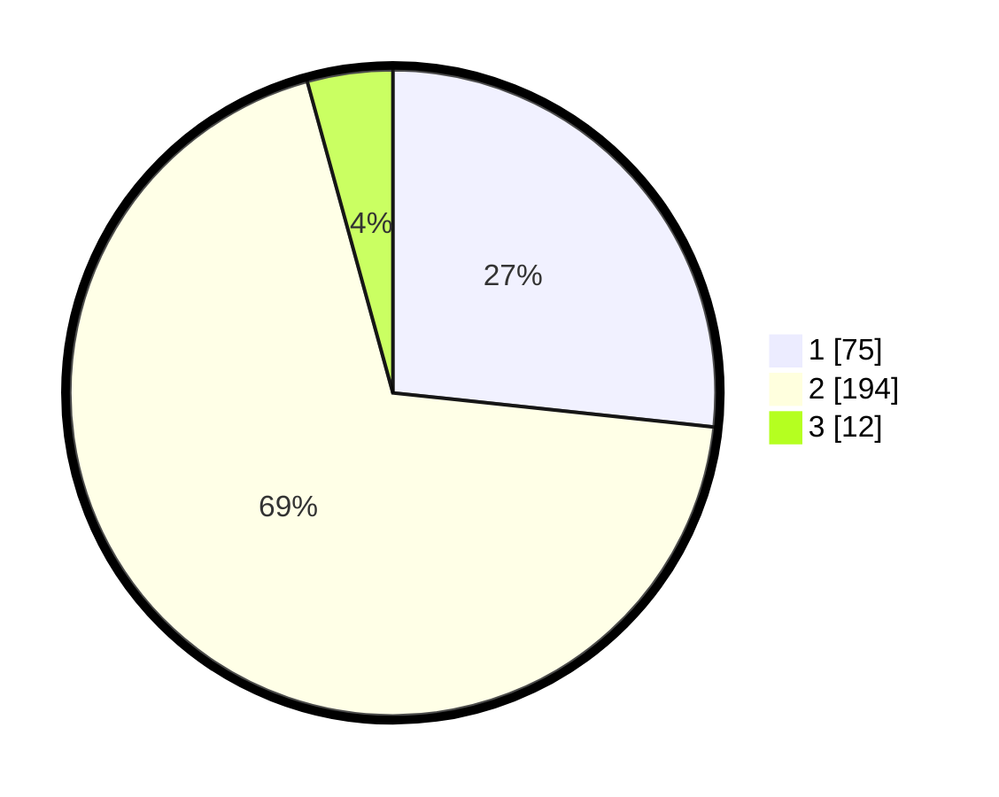

# Hasil

## Grafik

## Tabel

| No. | Nama Paslon    | Suara | Suara (raw) | Persentase |
|:--- |:-------------- | -----:| -----------:| ----------:|
| 1   | ANIES MUHAIMIN | 75    | [75][p-1]   | 26,69      |
| 2   | PRABOWO GIBRAN | 194   | [194][p-2]  | 69,04      |
| 3   | GANJAR MAHFUD  | 12    | [12][p-3]   | 4,27       |

[p-1]: https://github.com/gigit-pemilu/pemilu-2024/blob/main/pilpres/hitung-suara/sub/16-sumatera-selatan/sub/09-ogan-komering-ulu-selatan/sub/01-muara-dua/sub/1013-batu-belang-jaya/sub/005-tps/sub/paslon-1.txt
[p-2]: https://github.com/gigit-pemilu/pemilu-2024/blob/main/pilpres/hitung-suara/sub/16-sumatera-selatan/sub/09-ogan-komering-ulu-selatan/sub/01-muara-dua/sub/1013-batu-belang-jaya/sub/005-tps/sub/paslon-2.txt
[p-3]: https://github.com/gigit-pemilu/pemilu-2024/blob/main/pilpres/hitung-suara/sub/16-sumatera-selatan/sub/09-ogan-komering-ulu-selatan/sub/01-muara-dua/sub/1013-batu-belang-jaya/sub/005-tps/sub/paslon-3.txt

## Foto C Plano

https://sirekap-obj-formc.kpu.go.id/ef43/pemilu/ppwp/16/09/01/10/13/1609011013005-20240214-221940--1086197a-4bab-4ca2-81d1-44066efdad1a.jpg

https://sirekap-obj-formc.kpu.go.id/ef43/pemilu/ppwp/16/09/01/10/13/1609011013005-20240215-024212--b3a0db53-1fc2-44c2-a631-a1067b098a9f.jpg

https://sirekap-obj-formc.kpu.go.id/ef43/pemilu/ppwp/16/09/01/10/13/1609011013005-20240214-224213--5a92947f-e94b-4121-9c56-7688c1504df5.jpg

## Metadata

| Key        | Value               |
| ---------- | ------------------- |
| Time Stamp | 2024-02-17 19:30:00 |

## DATA PEMILIH TETAP

Jumlah pemilih dalam DPT: **284**.
 * L: **134**.
 * P: **150**.

## DATA PENGGUNA HAK PILIH

Jumlah pengguna hak pilih dalam DPT: **284**.
 * L: **134**.
 * P: **150**.

Jumlah pengguna hak pilih dalam DPTb: **0**.
 * L: **0**.
 * P: **3**.

Jumlah pengguna hak pilih dalam DPK: **0**.
 * L: **0**.
 * P: **0**.

Jumlah pengguna hak pilih: **287**.
 * L: **134**.
 * P: **153**.

## JUMLAH SUARA SAH DAN TIDAK SAH

JUMLAH SELURUH SUARA SAH: **281**.

JUMLAH SUARA TIDAK SAH: **6**.

JUMLAH SELURUH SUARA SAH DAN SUARA TIDAK SAH: **287**.

