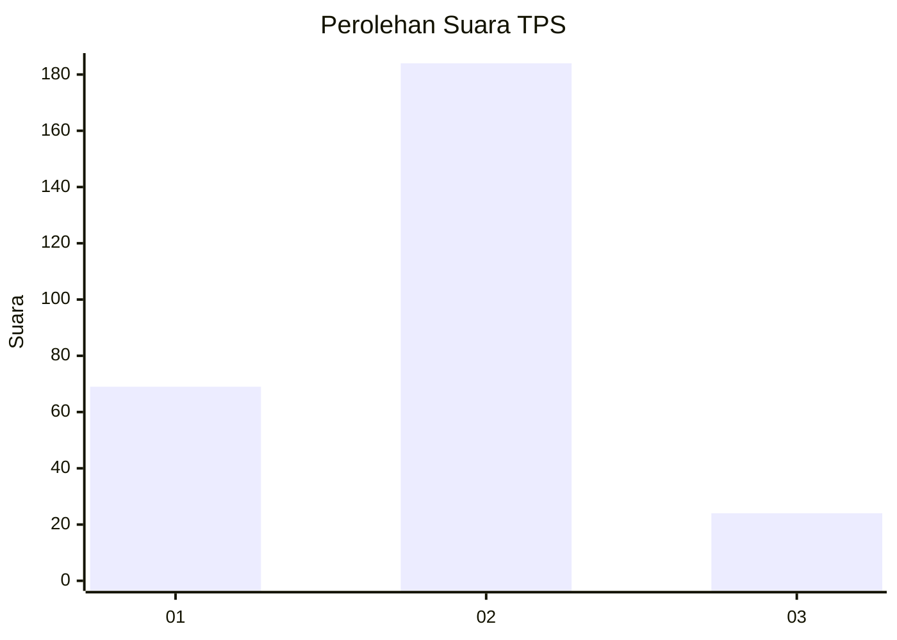
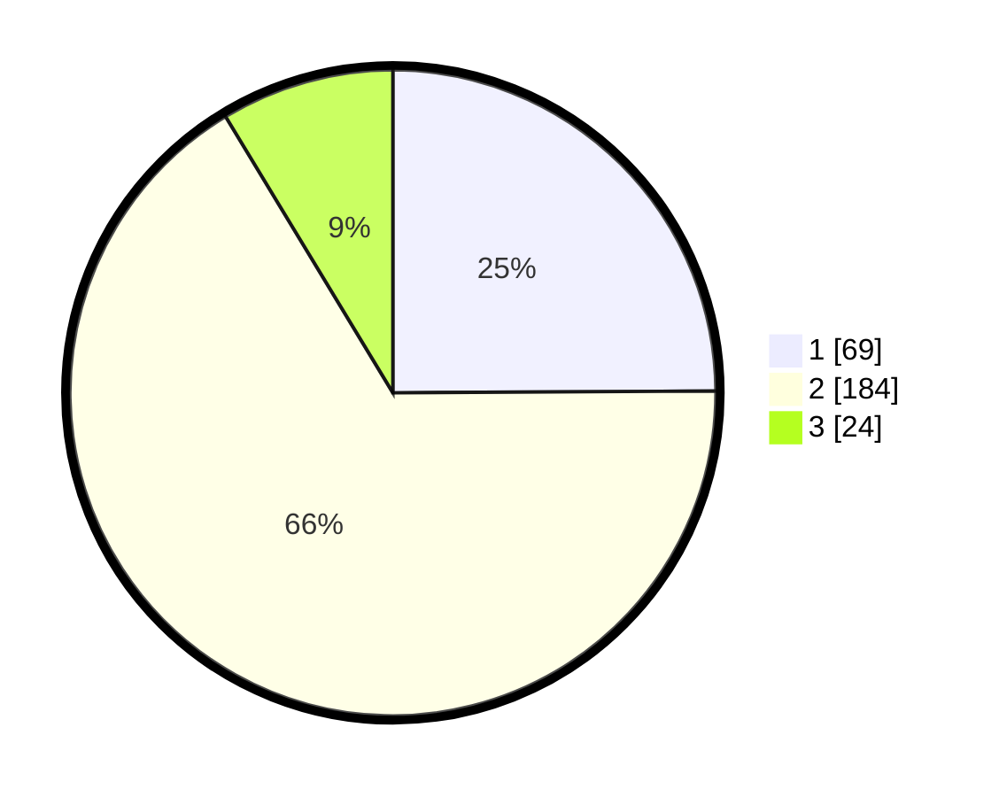

# Hasil

## Grafik

## Tabel

| No. | Nama Paslon    | Suara | Suara (raw) | Persentase |
|:--- |:-------------- | -----:| -----------:| ----------:|
| 1   | ANIES MUHAIMIN | 69    | [69][p-1]   | 24,91      |
| 2   | PRABOWO GIBRAN | 184   | [184][p-2]  | 66,43      |
| 3   | GANJAR MAHFUD  | 24    | [24][p-3]   | 8,66       |

[p-1]: https://github.com/gigit-pemilu/pemilu-2024-16-sumatera-selatan/blob/main/pilpres/hitung-suara/sub/16-sumatera-selatan/sub/09-ogan-komering-ulu-selatan/sub/01-muara-dua/sub/1013-batu-belang-jaya/sub/006-tps/sub/paslon-1.txt
[p-2]: https://github.com/gigit-pemilu/pemilu-2024-16-sumatera-selatan/blob/main/pilpres/hitung-suara/sub/16-sumatera-selatan/sub/09-ogan-komering-ulu-selatan/sub/01-muara-dua/sub/1013-batu-belang-jaya/sub/006-tps/sub/paslon-2.txt
[p-3]: https://github.com/gigit-pemilu/pemilu-2024-16-sumatera-selatan/blob/main/pilpres/hitung-suara/sub/16-sumatera-selatan/sub/09-ogan-komering-ulu-selatan/sub/01-muara-dua/sub/1013-batu-belang-jaya/sub/006-tps/sub/paslon-3.txt

## Foto C Plano

https://sirekap-obj-formc.kpu.go.id/7a95/pemilu/ppwp/16/09/01/10/13/1609011013006-20240223-143328--67f5dd22-7674-42a2-b6f1-da9b6235145d.jpg

https://sirekap-obj-formc.kpu.go.id/7a95/pemilu/ppwp/16/09/01/10/13/1609011013006-20240223-143426--4e822cb9-da73-4186-8b9b-3df1d0de2ef8.jpg

https://sirekap-obj-formc.kpu.go.id/7a95/pemilu/ppwp/16/09/01/10/13/1609011013006-20240223-143537--4608d461-c719-4973-ad72-8b7a8f9392cb.jpg

## Metadata

| Key        | Value               |
| ---------- | ------------------- |
| Time Stamp | 2024-02-25 20:00:00 |

