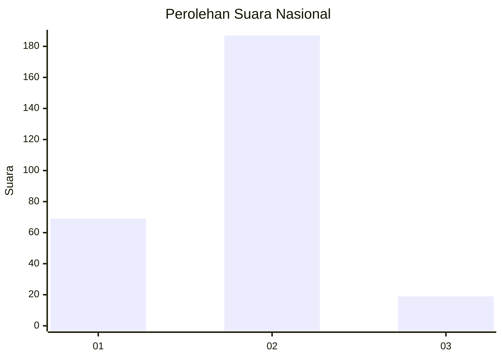
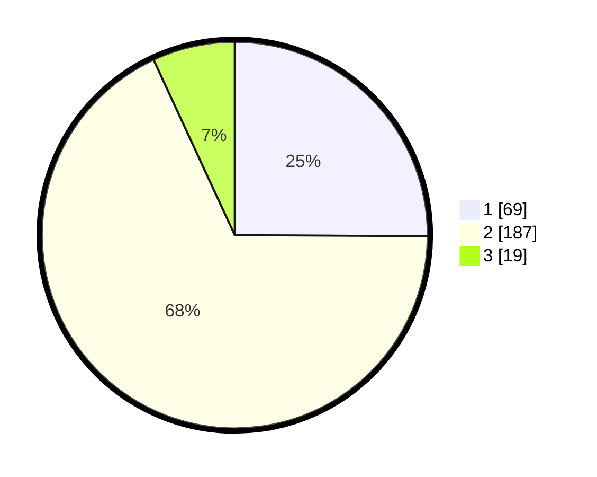

# Hasil

## Grafik

## Tabel

| No. | Nama Paslon    | Suara | Suara (raw) | Persentase |
|:--- |:-------------- | -----:| -----------:| ----------:|
| 1   | ANIES MUHAIMIN | 69    | [69][p-1]   | 25,09      |
| 2   | PRABOWO GIBRAN | 187   | [187][p-2]  | 68,00      |
| 3   | GANJAR MAHFUD  | 19    | [19][p-3]   | 6,91       |

[p-1]: https://github.com/gigit-pemilu/pemilu-2024/blob/main/pilpres/hitung-suara/sub/16-sumatera-selatan/sub/09-ogan-komering-ulu-selatan/sub/01-muara-dua/sub/1013-batu-belang-jaya/sub/007-tps/sub/paslon-1.txt
[p-2]: https://github.com/gigit-pemilu/pemilu-2024/blob/main/pilpres/hitung-suara/sub/16-sumatera-selatan/sub/09-ogan-komering-ulu-selatan/sub/01-muara-dua/sub/1013-batu-belang-jaya/sub/007-tps/sub/paslon-2.txt
[p-3]: https://github.com/gigit-pemilu/pemilu-2024/blob/main/pilpres/hitung-suara/sub/16-sumatera-selatan/sub/09-ogan-komering-ulu-selatan/sub/01-muara-dua/sub/1013-batu-belang-jaya/sub/007-tps/sub/paslon-3.txt

## Foto C Plano

https://sirekap-obj-formc.kpu.go.id/6a07/pemilu/ppwp/16/09/01/10/13/1609011013007-20240223-143727--45b915e3-4b08-42c1-bb59-b4cd1ad22fa6.jpg

https://sirekap-obj-formc.kpu.go.id/6a07/pemilu/ppwp/16/09/01/10/13/1609011013007-20240223-143822--5e575fa8-cdf6-4959-9ee2-0b6bee78156a.jpg

https://sirekap-obj-formc.kpu.go.id/6a07/pemilu/ppwp/16/09/01/10/13/1609011013007-20240223-143928--511fcee8-0021-4841-90bd-169ab278867c.jpg

## Metadata

| Key        | Value               |
| ---------- | ------------------- |
| Time Stamp | 2024-02-25 21:00:00 |

