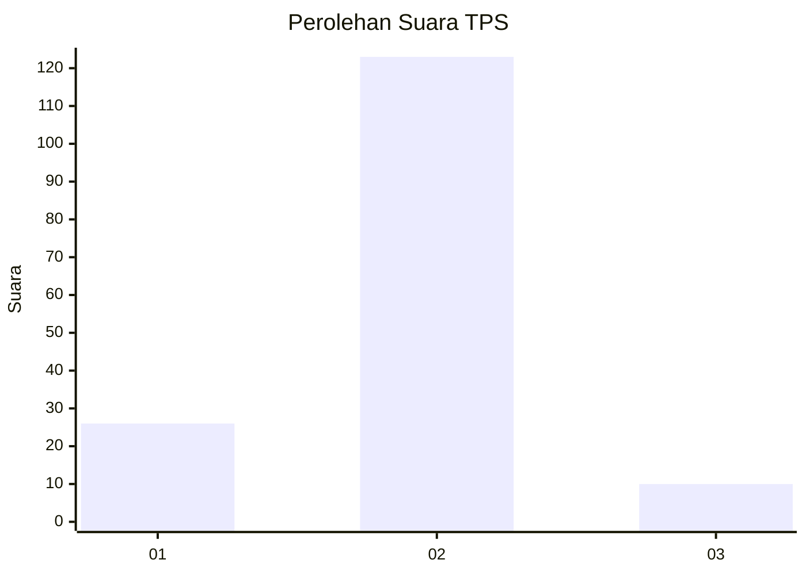
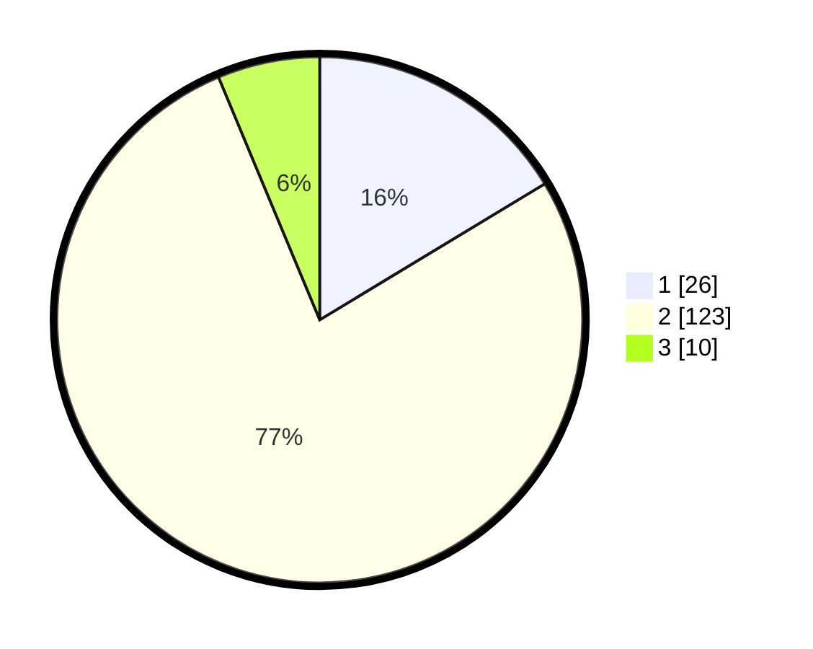

# Hasil

## Grafik

## Tabel

| No. | Nama Paslon    | Suara | Suara (raw) | Persentase |
|:--- |:-------------- | -----:| -----------:| ----------:|
| 1   | ANIES MUHAIMIN | 26    | [26][p-1]   | 16,35      |
| 2   | PRABOWO GIBRAN | 123   | [123][p-2]  | 77,36      |
| 3   | GANJAR MAHFUD  | 10    | [10][p-3]   | 6,29       |

[p-1]: https://github.com/gigit-pemilu/pemilu-2024-16-sumatera-selatan/blob/main/pilpres/hitung-suara/sub/16-sumatera-selatan/sub/09-ogan-komering-ulu-selatan/sub/01-muara-dua/sub/1015-pancur-pungah/sub/012-tps/sub/paslon-1.txt
[p-2]: https://github.com/gigit-pemilu/pemilu-2024-16-sumatera-selatan/blob/main/pilpres/hitung-suara/sub/16-sumatera-selatan/sub/09-ogan-komering-ulu-selatan/sub/01-muara-dua/sub/1015-pancur-pungah/sub/012-tps/sub/paslon-2.txt
[p-3]: https://github.com/gigit-pemilu/pemilu-2024-16-sumatera-selatan/blob/main/pilpres/hitung-suara/sub/16-sumatera-selatan/sub/09-ogan-komering-ulu-selatan/sub/01-muara-dua/sub/1015-pancur-pungah/sub/012-tps/sub/paslon-3.txt

## Foto C Plano

https://sirekap-obj-formc.kpu.go.id/a056/pemilu/ppwp/16/09/01/10/15/1609011015012-20240214-235917--f852bae7-30d2-4ee7-af1c-6685445aaef8.jpg

https://sirekap-obj-formc.kpu.go.id/a056/pemilu/ppwp/16/09/01/10/15/1609011015012-20240215-000201--850f8bab-6f06-4a9f-8e0b-d5c929b0c816.jpg

https://sirekap-obj-formc.kpu.go.id/a056/pemilu/ppwp/16/09/01/10/15/1609011015012-20240215-000324--86fd86b8-5f27-42d2-84d0-9e5ae8270074.jpg

## Metadata

| Key        | Value               |
| ---------- | ------------------- |
| Time Stamp | 2024-02-16 03:00:26 |

