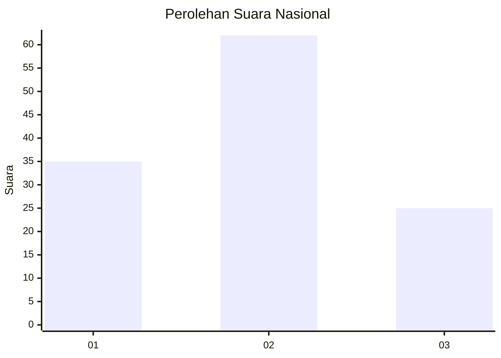
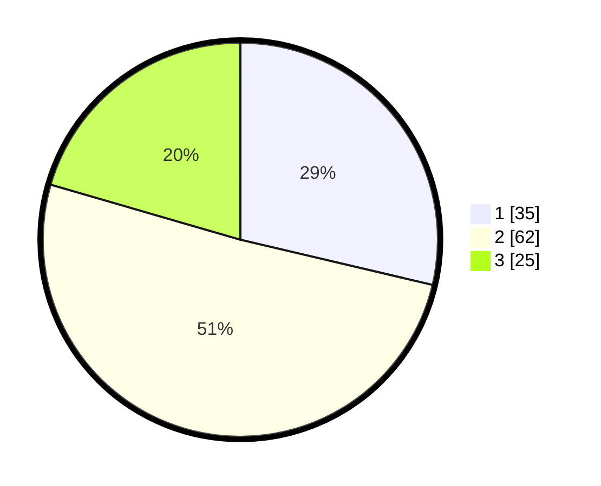

# Hasil

## Grafik

## Tabel

| No. | Nama Paslon    | Suara | Suara (raw) | Persentase |
|:--- |:-------------- | -----:| -----------:| ----------:|
| 1   | ANIES MUHAIMIN | 35    | [35][p-1]   | 28,69      |
| 2   | PRABOWO GIBRAN | 62    | [62][p-2]   | 50,82      |
| 3   | GANJAR MAHFUD  | 25    | [25][p-3]   | 20,49      |

[p-1]: https://github.com/gigit-pemilu/pemilu-2024/blob/main/pilpres/hitung-suara/sub/16-sumatera-selatan/sub/09-ogan-komering-ulu-selatan/sub/01-muara-dua/sub/1019-pasar-muaradua/sub/022-tps/sub/paslon-1.txt
[p-2]: https://github.com/gigit-pemilu/pemilu-2024/blob/main/pilpres/hitung-suara/sub/16-sumatera-selatan/sub/09-ogan-komering-ulu-selatan/sub/01-muara-dua/sub/1019-pasar-muaradua/sub/022-tps/sub/paslon-2.txt
[p-3]: https://github.com/gigit-pemilu/pemilu-2024/blob/main/pilpres/hitung-suara/sub/16-sumatera-selatan/sub/09-ogan-komering-ulu-selatan/sub/01-muara-dua/sub/1019-pasar-muaradua/sub/022-tps/sub/paslon-3.txt

## Foto C Plano

https://sirekap-obj-formc.kpu.go.id/9a12/pemilu/ppwp/16/09/01/10/19/1609011019022-20240214-231552--5bc052c6-3cef-43fe-be8c-a87f1290ff58.jpg

https://sirekap-obj-formc.kpu.go.id/9a12/pemilu/ppwp/16/09/01/10/19/1609011019022-20240214-205526--22d3d02d-4793-438c-a24b-bc77e4a0823e.jpg

https://sirekap-obj-formc.kpu.go.id/9a12/pemilu/ppwp/16/09/01/10/19/1609011019022-20240214-205539--3b357428-ba95-42af-ae4d-df5bcd953df0.jpg

## Metadata

| Key        | Value               |
| ---------- | ------------------- |
| Time Stamp | 2024-02-16 14:00:34 |

