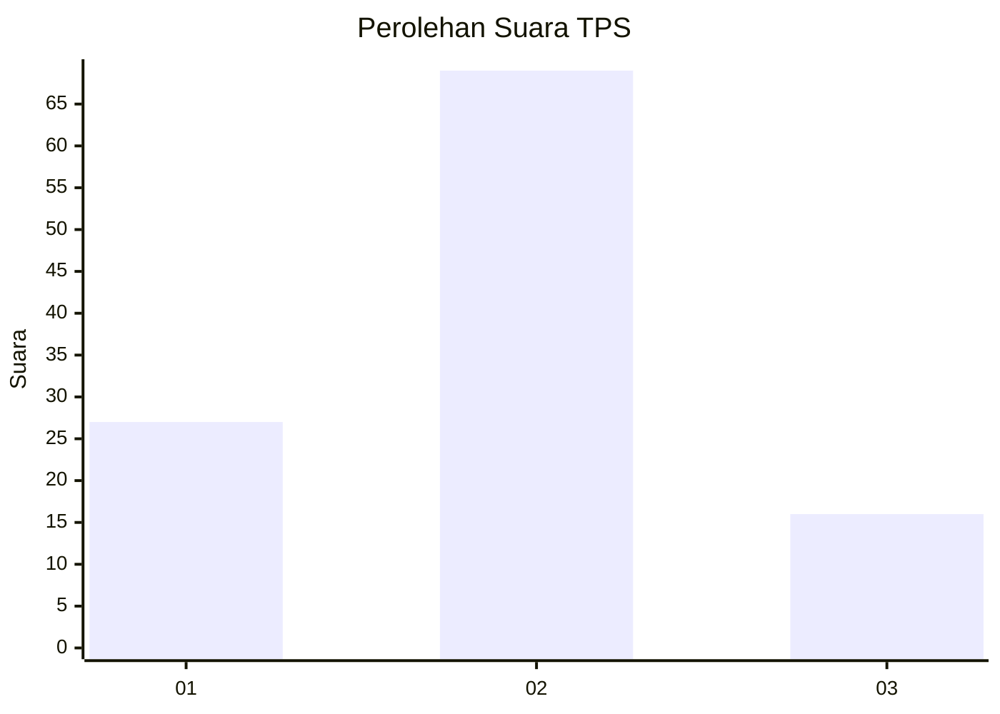
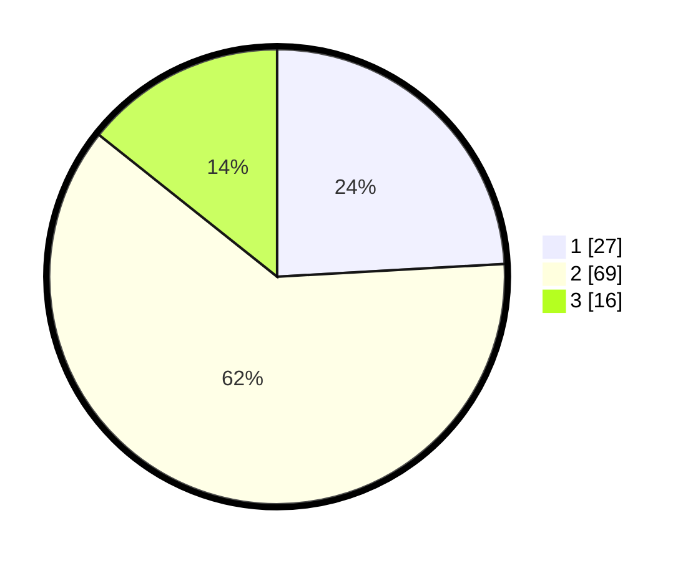

# Hasil

## Grafik

## Tabel

| No. | Nama Paslon    | Suara | Suara (raw) | Persentase |
|:--- |:-------------- | -----:| -----------:| ----------:|
| 1   | ANIES MUHAIMIN | 27    | [27][p-1]   | 24,11      |
| 2   | PRABOWO GIBRAN | 69    | [69][p-2]   | 61,61      |
| 3   | GANJAR MAHFUD  | 16    | [16][p-3]   | 14,29      |

[p-1]: https://github.com/gigit-pemilu/pemilu-2024-16-sumatera-selatan/blob/main/pilpres/hitung-suara/sub/16-sumatera-selatan/sub/09-ogan-komering-ulu-selatan/sub/01-muara-dua/sub/1019-pasar-muaradua/sub/024-tps/sub/paslon-1.txt
[p-2]: https://github.com/gigit-pemilu/pemilu-2024-16-sumatera-selatan/blob/main/pilpres/hitung-suara/sub/16-sumatera-selatan/sub/09-ogan-komering-ulu-selatan/sub/01-muara-dua/sub/1019-pasar-muaradua/sub/024-tps/sub/paslon-2.txt
[p-3]: https://github.com/gigit-pemilu/pemilu-2024-16-sumatera-selatan/blob/main/pilpres/hitung-suara/sub/16-sumatera-selatan/sub/09-ogan-komering-ulu-selatan/sub/01-muara-dua/sub/1019-pasar-muaradua/sub/024-tps/sub/paslon-3.txt

## Foto C Plano

https://sirekap-obj-formc.kpu.go.id/2d1c/pemilu/ppwp/16/09/01/10/19/1609011019024-20240214-223147--4ef25f59-4c8b-45db-90a2-535f15b47403.jpg

https://sirekap-obj-formc.kpu.go.id/2d1c/pemilu/ppwp/16/09/01/10/19/1609011019024-20240214-223356--b5e1151e-18cb-40dc-b8e3-fa86b96d34c9.jpg

https://sirekap-obj-formc.kpu.go.id/2d1c/pemilu/ppwp/16/09/01/10/19/1609011019024-20240214-223438--4c5c3c93-1f39-4f72-9943-564a665ad333.jpg

## Metadata

| Key        | Value               |
| ---------- | ------------------- |
| Time Stamp | 2024-02-16 03:00:26 |

