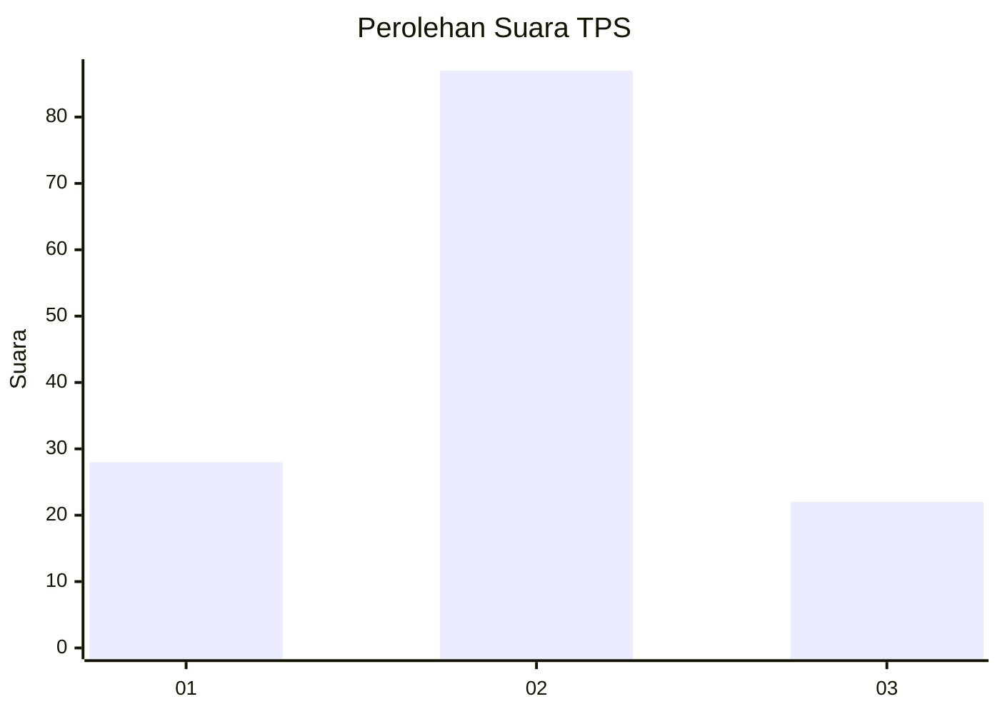
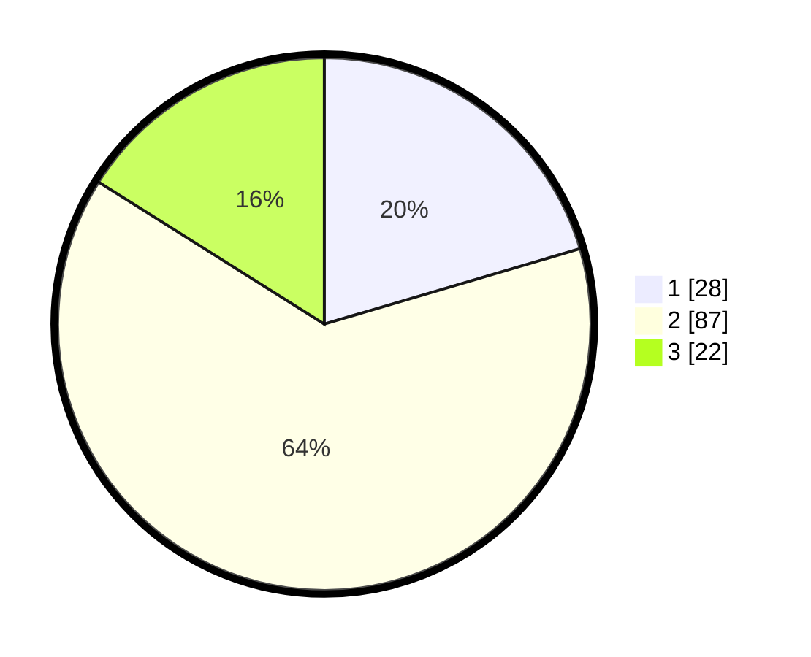

# Hasil

## Grafik

## Tabel

| No. | Nama Paslon    | Suara | Suara (raw) | Persentase |
|:--- |:-------------- | -----:| -----------:| ----------:|
| 1   | ANIES MUHAIMIN | 28    | [28][p-1]   | 20,44      |
| 2   | PRABOWO GIBRAN | 87    | [87][p-2]   | 63,50      |
| 3   | GANJAR MAHFUD  | 22    | [22][p-3]   | 16,06      |

[p-1]: https://github.com/gigit-pemilu/pemilu-2024-16-sumatera-selatan/blob/main/pilpres/hitung-suara/sub/16-sumatera-selatan/sub/09-ogan-komering-ulu-selatan/sub/01-muara-dua/sub/1019-pasar-muaradua/sub/026-tps/sub/paslon-1.txt
[p-2]: https://github.com/gigit-pemilu/pemilu-2024-16-sumatera-selatan/blob/main/pilpres/hitung-suara/sub/16-sumatera-selatan/sub/09-ogan-komering-ulu-selatan/sub/01-muara-dua/sub/1019-pasar-muaradua/sub/026-tps/sub/paslon-2.txt
[p-3]: https://github.com/gigit-pemilu/pemilu-2024-16-sumatera-selatan/blob/main/pilpres/hitung-suara/sub/16-sumatera-selatan/sub/09-ogan-komering-ulu-selatan/sub/01-muara-dua/sub/1019-pasar-muaradua/sub/026-tps/sub/paslon-3.txt

## Foto C Plano

https://sirekap-obj-formc.kpu.go.id/1329/pemilu/ppwp/16/09/01/10/19/1609011019026-20240215-024626--1abbffe4-a107-4fce-99d0-5f54f4bd8c78.jpg

https://sirekap-obj-formc.kpu.go.id/1329/pemilu/ppwp/16/09/01/10/19/1609011019026-20240215-013659--2cdaa650-a150-46f9-a2f0-ab178d60dc8a.jpg

https://sirekap-obj-formc.kpu.go.id/1329/pemilu/ppwp/16/09/01/10/19/1609011019026-20240215-013811--63303629-f52e-4f1a-a909-2c7faf79107b.jpg

## Metadata

| Key        | Value               |
| ---------- | ------------------- |
| Time Stamp | 2024-02-16 14:00:34 |

