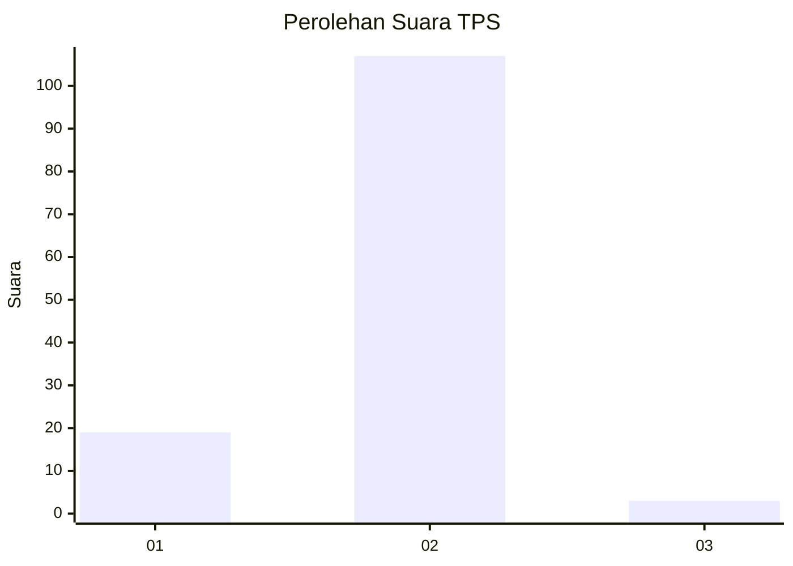
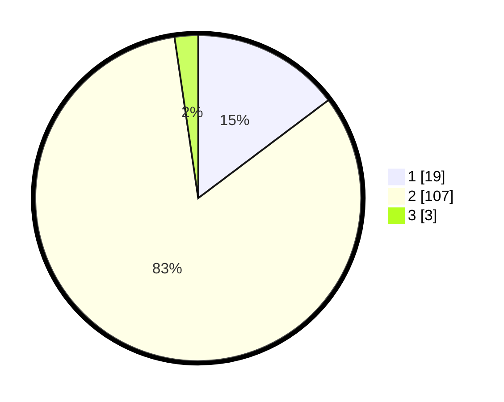

# Hasil

## Grafik

## Tabel

| No. | Nama Paslon    | Suara | Suara (raw) | Persentase |
|:--- |:-------------- | -----:| -----------:| ----------:|
| 1   | ANIES MUHAIMIN | 19    | [19][p-1]   | 14,73      |
| 2   | PRABOWO GIBRAN | 107   | [107][p-2]  | 82,95      |
| 3   | GANJAR MAHFUD  | 3     | [3][p-3]    | 2,33       |

[p-1]: https://github.com/gigit-pemilu/pemilu-2024-16-sumatera-selatan/blob/main/pilpres/hitung-suara/sub/16-sumatera-selatan/sub/09-ogan-komering-ulu-selatan/sub/01-muara-dua/sub/1019-pasar-muaradua/sub/041-tps/sub/paslon-1.txt
[p-2]: https://github.com/gigit-pemilu/pemilu-2024-16-sumatera-selatan/blob/main/pilpres/hitung-suara/sub/16-sumatera-selatan/sub/09-ogan-komering-ulu-selatan/sub/01-muara-dua/sub/1019-pasar-muaradua/sub/041-tps/sub/paslon-2.txt
[p-3]: https://github.com/gigit-pemilu/pemilu-2024-16-sumatera-selatan/blob/main/pilpres/hitung-suara/sub/16-sumatera-selatan/sub/09-ogan-komering-ulu-selatan/sub/01-muara-dua/sub/1019-pasar-muaradua/sub/041-tps/sub/paslon-3.txt

## Foto C Plano

https://sirekap-obj-formc.kpu.go.id/bd1c/pemilu/ppwp/16/09/01/10/19/1609011019041-20240214-234201--880be28b-c079-46a4-ae9a-8899287dea2d.jpg

https://sirekap-obj-formc.kpu.go.id/bd1c/pemilu/ppwp/16/09/01/10/19/1609011019041-20240214-234315--d9bb66d8-38b7-4e03-a0b0-4c78481e1e12.jpg

https://sirekap-obj-formc.kpu.go.id/bd1c/pemilu/ppwp/16/09/01/10/19/1609011019041-20240214-234420--e2f50b4c-cebd-4935-9320-6c98c6187aa8.jpg

## Metadata

| Key        | Value               |
| ---------- | ------------------- |
| Time Stamp | 2024-02-16 03:00:26 |

