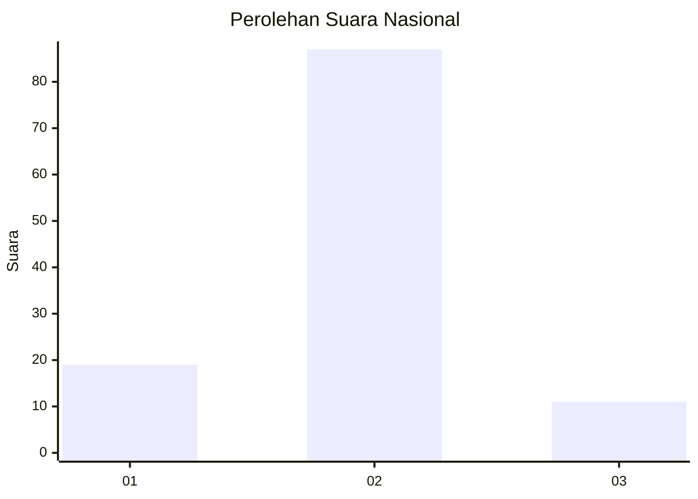
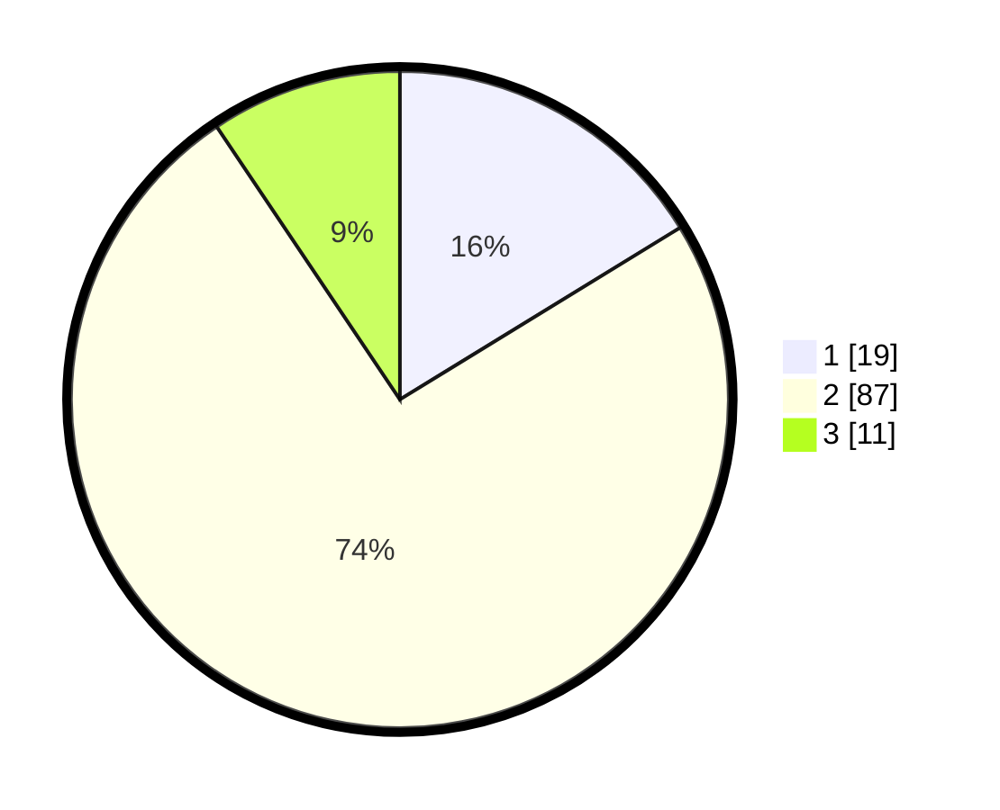

# Hasil

## Grafik

## Tabel

| No. | Nama Paslon    | Suara | Suara (raw) | Persentase |
|:--- |:-------------- | -----:| -----------:| ----------:|
| 1   | ANIES MUHAIMIN | 19    | [19][p-1]   | 16,24      |
| 2   | PRABOWO GIBRAN | 87    | [87][p-2]   | 74,36      |
| 3   | GANJAR MAHFUD  | 11    | [11][p-3]   | 9,40       |

[p-1]: https://github.com/gigit-pemilu/pemilu-2024/blob/main/pilpres/hitung-suara/sub/16-sumatera-selatan/sub/09-ogan-komering-ulu-selatan/sub/01-muara-dua/sub/2003-gunung-tiga/sub/007-tps/sub/paslon-1.txt
[p-2]: https://github.com/gigit-pemilu/pemilu-2024/blob/main/pilpres/hitung-suara/sub/16-sumatera-selatan/sub/09-ogan-komering-ulu-selatan/sub/01-muara-dua/sub/2003-gunung-tiga/sub/007-tps/sub/paslon-2.txt
[p-3]: https://github.com/gigit-pemilu/pemilu-2024/blob/main/pilpres/hitung-suara/sub/16-sumatera-selatan/sub/09-ogan-komering-ulu-selatan/sub/01-muara-dua/sub/2003-gunung-tiga/sub/007-tps/sub/paslon-3.txt

## Foto C Plano

https://sirekap-obj-formc.kpu.go.id/6c6e/pemilu/ppwp/16/09/01/20/03/1609012003007-20240214-210556--9713c34f-99a5-4a3a-84c3-d04210222dea.jpg

https://sirekap-obj-formc.kpu.go.id/6c6e/pemilu/ppwp/16/09/01/20/03/1609012003007-20240214-211647--05f318c4-3254-4da6-aa52-3fe20ec56a13.jpg

https://sirekap-obj-formc.kpu.go.id/6c6e/pemilu/ppwp/16/09/01/20/03/1609012003007-20240214-204918--7ea4c07c-676d-40ab-81c0-c148c266960c.jpg

## Metadata

| Key        | Value               |
| ---------- | ------------------- |
| Time Stamp | 2024-02-15 12:00:28 |

