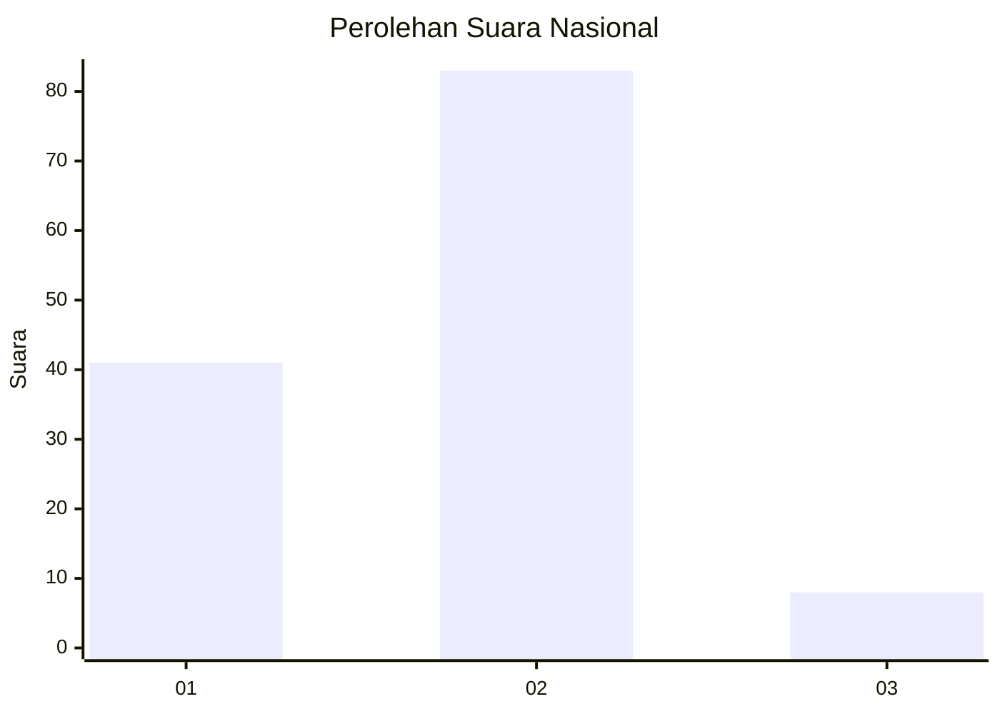
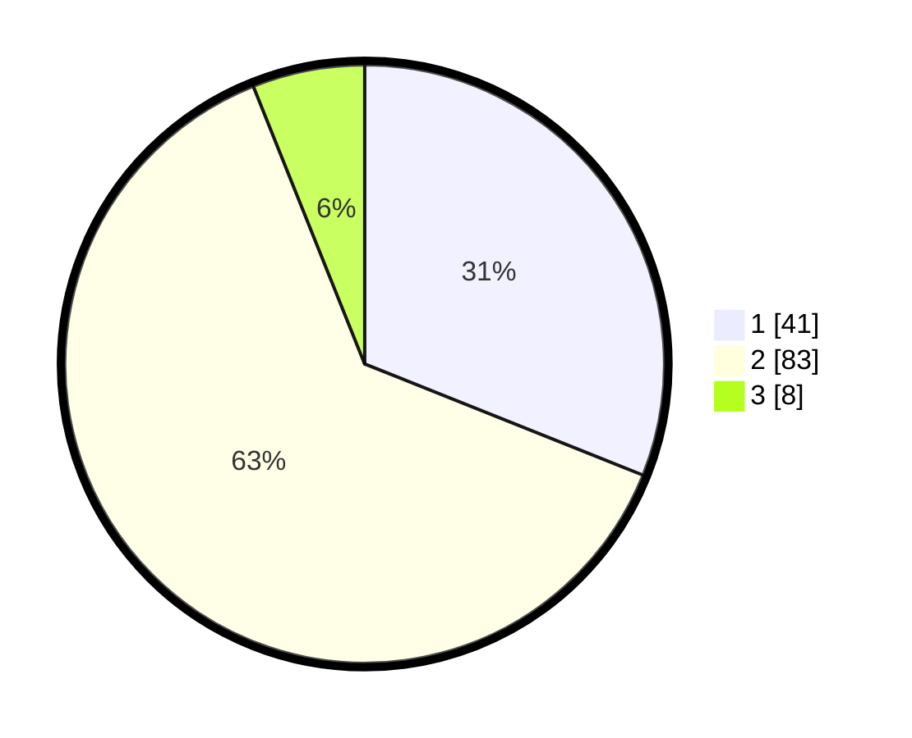

# Hasil

## Grafik

## Tabel

| No. | Nama Paslon    | Suara | Suara (raw) | Persentase |
|:--- |:-------------- | -----:| -----------:| ----------:|
| 1   | ANIES MUHAIMIN | 41    | [41][p-1]   | 31,06      |
| 2   | PRABOWO GIBRAN | 83    | [83][p-2]   | 62,88      |
| 3   | GANJAR MAHFUD  | 8     | [8][p-3]    | 6,06       |

[p-1]: https://github.com/gigit-pemilu/pemilu-2024/blob/main/pilpres/hitung-suara/sub/16-sumatera-selatan/sub/09-ogan-komering-ulu-selatan/sub/02-pulau-beringin/sub/2013-pulau-beringin/sub/014-tps/sub/paslon-1.txt
[p-2]: https://github.com/gigit-pemilu/pemilu-2024/blob/main/pilpres/hitung-suara/sub/16-sumatera-selatan/sub/09-ogan-komering-ulu-selatan/sub/02-pulau-beringin/sub/2013-pulau-beringin/sub/014-tps/sub/paslon-2.txt
[p-3]: https://github.com/gigit-pemilu/pemilu-2024/blob/main/pilpres/hitung-suara/sub/16-sumatera-selatan/sub/09-ogan-komering-ulu-selatan/sub/02-pulau-beringin/sub/2013-pulau-beringin/sub/014-tps/sub/paslon-3.txt

## Foto C Plano

https://sirekap-obj-formc.kpu.go.id/ea6e/pemilu/ppwp/16/09/02/20/13/1609022013014-20240214-235003--39171233-226f-487d-b14f-c7eb29d6cf1f.jpg

https://sirekap-obj-formc.kpu.go.id/ea6e/pemilu/ppwp/16/09/02/20/13/1609022013014-20240215-020231--0718e8ad-49fb-4eea-9b5a-58adf17201e6.jpg

https://sirekap-obj-formc.kpu.go.id/ea6e/pemilu/ppwp/16/09/02/20/13/1609022013014-20240215-020409--6edf579c-5ba3-4b2f-b067-54e2e03e117c.jpg

## Metadata

| Key        | Value               |
| ---------- | ------------------- |
| Time Stamp | 2024-02-15 20:00:44 |

