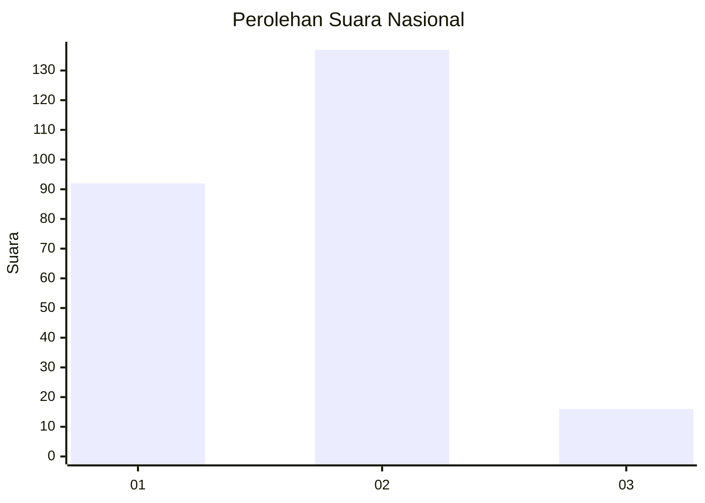
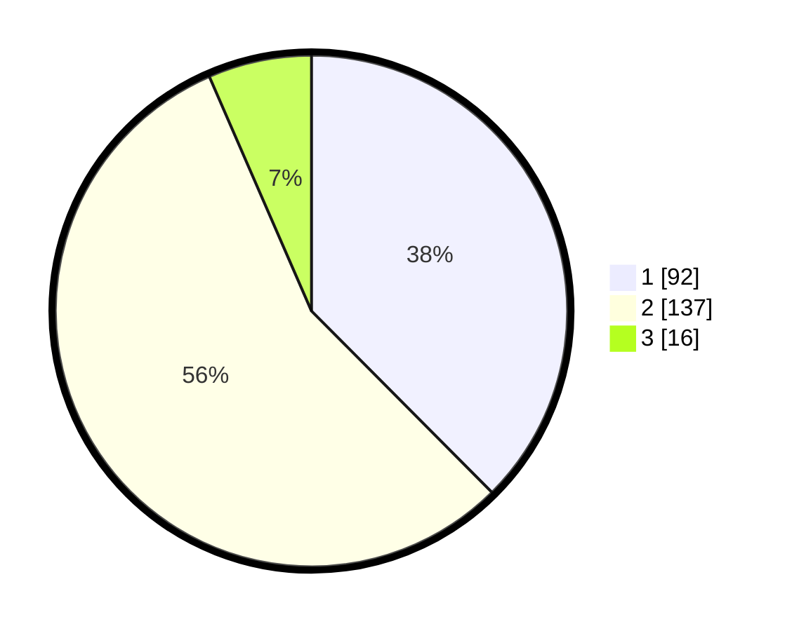

# Hasil

## Grafik

## Tabel

| No. | Nama Paslon    | Suara | Suara (raw) | Persentase |
|:--- |:-------------- | -----:| -----------:| ----------:|
| 1   | ANIES MUHAIMIN | 92    | [92][p-1]   | 37,55      |
| 2   | PRABOWO GIBRAN | 137   | [137][p-2]  | 55,92      |
| 3   | GANJAR MAHFUD  | 16    | [16][p-3]   | 6,53       |

[p-1]: https://github.com/gigit-pemilu/pemilu-2024/blob/main/pilpres/hitung-suara/sub/16-sumatera-selatan/sub/09-ogan-komering-ulu-selatan/sub/02-pulau-beringin/sub/2019-kemu/sub/010-tps/sub/paslon-1.txt
[p-2]: https://github.com/gigit-pemilu/pemilu-2024/blob/main/pilpres/hitung-suara/sub/16-sumatera-selatan/sub/09-ogan-komering-ulu-selatan/sub/02-pulau-beringin/sub/2019-kemu/sub/010-tps/sub/paslon-2.txt
[p-3]: https://github.com/gigit-pemilu/pemilu-2024/blob/main/pilpres/hitung-suara/sub/16-sumatera-selatan/sub/09-ogan-komering-ulu-selatan/sub/02-pulau-beringin/sub/2019-kemu/sub/010-tps/sub/paslon-3.txt

## Foto C Plano

https://sirekap-obj-formc.kpu.go.id/acc6/pemilu/ppwp/16/09/02/20/19/1609022019010-20240215-024319--a323efba-bf04-41c3-af74-3cc61df41248.jpg

https://sirekap-obj-formc.kpu.go.id/acc6/pemilu/ppwp/16/09/02/20/19/1609022019010-20240215-024344--5b3239d9-d4b7-4fb5-8ac5-af582d7b38b3.jpg

https://sirekap-obj-formc.kpu.go.id/acc6/pemilu/ppwp/16/09/02/20/19/1609022019010-20240215-024410--a7112817-37d5-434f-8867-ef3d0b825d21.jpg

## Metadata

| Key        | Value               |
| ---------- | ------------------- |
| Time Stamp | 2024-02-16 11:00:29 |

