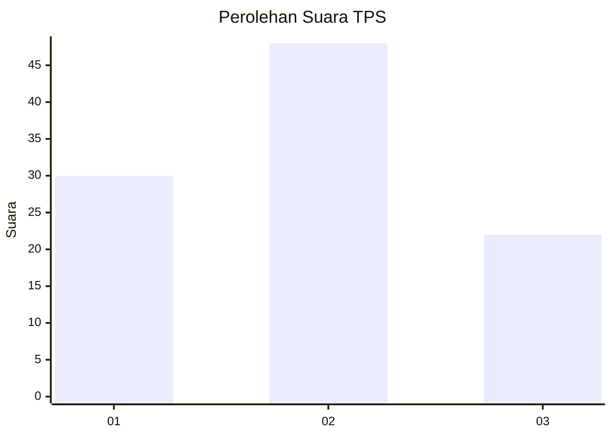
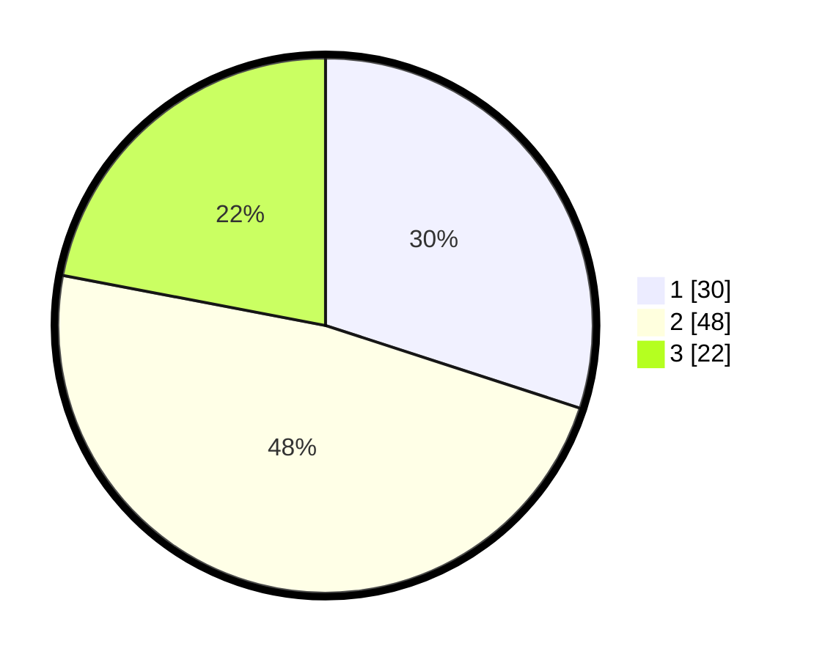

# Hasil

## Grafik

## Tabel

| No. | Nama Paslon    | Suara | Suara (raw) | Persentase |
|:--- |:-------------- | -----:| -----------:| ----------:|
| 1   | ANIES MUHAIMIN | 30    | [30][p-1]   | 30,00      |
| 2   | PRABOWO GIBRAN | 48    | [48][p-2]   | 48,00      |
| 3   | GANJAR MAHFUD  | 22    | [22][p-3]   | 22,00      |

[p-1]: https://github.com/gigit-pemilu/pemilu-2024-16-sumatera-selatan/blob/main/pilpres/hitung-suara/sub/16-sumatera-selatan/sub/09-ogan-komering-ulu-selatan/sub/03-banding-agung/sub/1023-bandar-agung-ranau/sub/002-tps/sub/paslon-1.txt
[p-2]: https://github.com/gigit-pemilu/pemilu-2024-16-sumatera-selatan/blob/main/pilpres/hitung-suara/sub/16-sumatera-selatan/sub/09-ogan-komering-ulu-selatan/sub/03-banding-agung/sub/1023-bandar-agung-ranau/sub/002-tps/sub/paslon-2.txt
[p-3]: https://github.com/gigit-pemilu/pemilu-2024-16-sumatera-selatan/blob/main/pilpres/hitung-suara/sub/16-sumatera-selatan/sub/09-ogan-komering-ulu-selatan/sub/03-banding-agung/sub/1023-bandar-agung-ranau/sub/002-tps/sub/paslon-3.txt

## Foto C Plano

https://sirekap-obj-formc.kpu.go.id/2cf0/pemilu/ppwp/16/09/03/10/23/1609031023002-20240217-103524--8eb4ed64-468c-45c4-bbf0-5b703cdd1e81.jpg

https://sirekap-obj-formc.kpu.go.id/2cf0/pemilu/ppwp/16/09/03/10/23/1609031023002-20240217-103525--149ef0cf-20a8-43e0-9d49-78d755eab9d7.jpg

https://sirekap-obj-formc.kpu.go.id/2cf0/pemilu/ppwp/16/09/03/10/23/1609031023002-20240217-103524--27392d30-9fee-4c80-a132-4e806d020ba8.jpg

## Metadata

| Key        | Value               |
| ---------- | ------------------- |
| Time Stamp | 2024-02-17 16:36:25 |

## DATA PEMILIH TETAP

Jumlah pemilih dalam DPT: **100**.
 * L: **52**.
 * P: **48**.

## DATA PENGGUNA HAK PILIH

Jumlah pengguna hak pilih dalam DPT: **100**.
 * L: **52**.
 * P: **48**.

Jumlah pengguna hak pilih dalam DPTb: **0**.
 * L: **0**.
 * P: **0**.

Jumlah pengguna hak pilih dalam DPK: **0**.
 * L: **0**.
 * P: **0**.

Jumlah pengguna hak pilih: **100**.
 * L: **52**.
 * P: **48**.

## JUMLAH SUARA SAH DAN TIDAK SAH

JUMLAH SELURUH SUARA SAH: **100**.

JUMLAH SUARA TIDAK SAH: **0**.

JUMLAH SELURUH SUARA SAH DAN SUARA TIDAK SAH: **100**.

