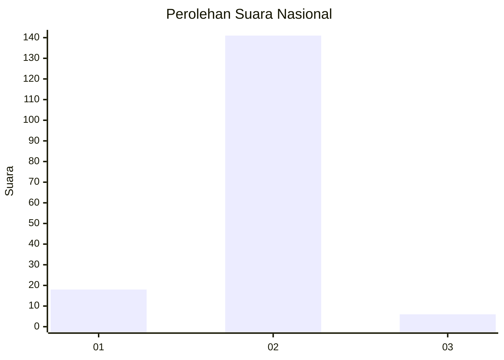
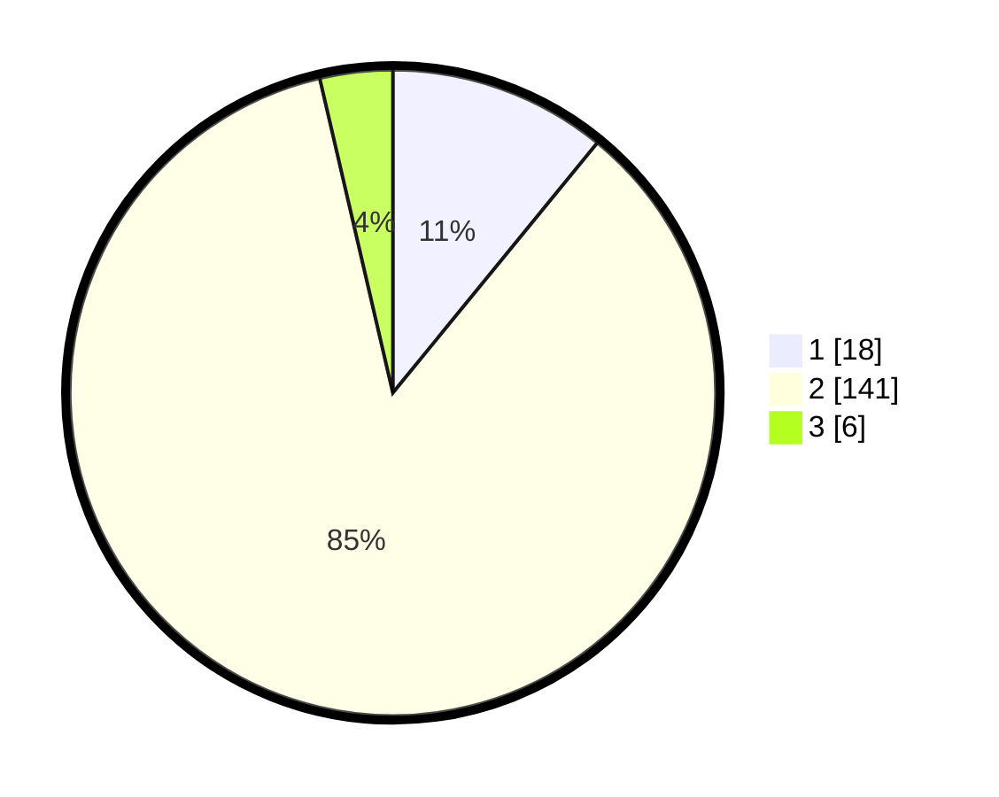

# Hasil

## Grafik

## Tabel

| No. | Nama Paslon    | Suara | Suara (raw) | Persentase |
|:--- |:-------------- | -----:| -----------:| ----------:|
| 1   | ANIES MUHAIMIN | 18    | [18][p-1]   | 10,91      |
| 2   | PRABOWO GIBRAN | 141   | [141][p-2]  | 85,45      |
| 3   | GANJAR MAHFUD  | 6     | [6][p-3]    | 3,64       |

[p-1]: https://github.com/gigit-pemilu/pemilu-2024/blob/main/pilpres/hitung-suara/sub/16-sumatera-selatan/sub/09-ogan-komering-ulu-selatan/sub/06-buay-sandang-aji/sub/2013-negeri-cahya/sub/001-tps/sub/paslon-1.txt
[p-2]: https://github.com/gigit-pemilu/pemilu-2024/blob/main/pilpres/hitung-suara/sub/16-sumatera-selatan/sub/09-ogan-komering-ulu-selatan/sub/06-buay-sandang-aji/sub/2013-negeri-cahya/sub/001-tps/sub/paslon-2.txt
[p-3]: https://github.com/gigit-pemilu/pemilu-2024/blob/main/pilpres/hitung-suara/sub/16-sumatera-selatan/sub/09-ogan-komering-ulu-selatan/sub/06-buay-sandang-aji/sub/2013-negeri-cahya/sub/001-tps/sub/paslon-3.txt

## Foto C Plano

https://sirekap-obj-formc.kpu.go.id/69af/pemilu/ppwp/16/09/06/20/13/1609062013001-20240218-212336--202bf9cc-250f-4e84-892a-318c8211a227.jpg

https://sirekap-obj-formc.kpu.go.id/69af/pemilu/ppwp/16/09/06/20/13/1609062013001-20240218-212038--0388faa5-0505-4a87-9834-360b9fad89e5.jpg

https://sirekap-obj-formc.kpu.go.id/69af/pemilu/ppwp/16/09/06/20/13/1609062013001-20240218-212512--261e4c5e-dbea-42aa-b8c1-cbd25fd071d6.jpg

## Metadata

| Key        | Value               |
| ---------- | ------------------- |
| Time Stamp | 2024-02-19 23:00:00 |

