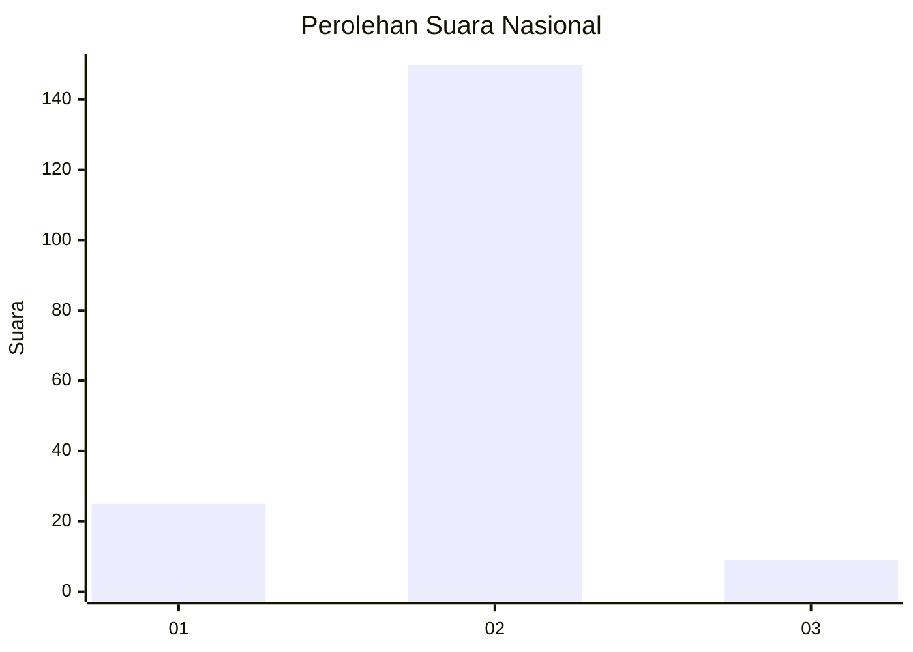
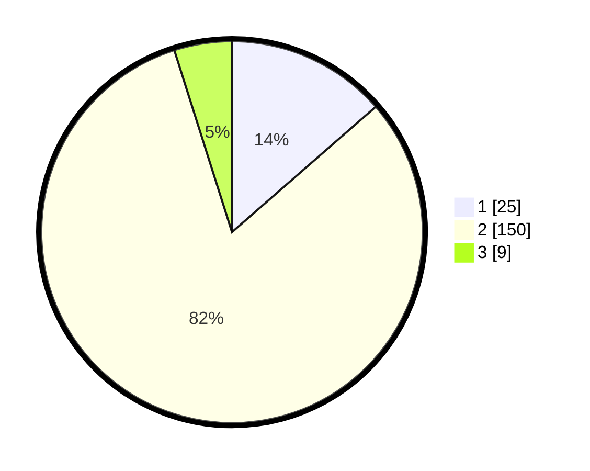

# Hasil

## Grafik

## Tabel

| No. | Nama Paslon    | Suara | Suara (raw) | Persentase |
|:--- |:-------------- | -----:| -----------:| ----------:|
| 1   | ANIES MUHAIMIN | 25    | [25][p-1]   | 13,59      |
| 2   | PRABOWO GIBRAN | 150   | [150][p-2]  | 81,52      |
| 3   | GANJAR MAHFUD  | 9     | [9][p-3]    | 4,89       |

[p-1]: https://github.com/gigit-pemilu/pemilu-2024/blob/main/pilpres/hitung-suara/sub/16-sumatera-selatan/sub/09-ogan-komering-ulu-selatan/sub/06-buay-sandang-aji/sub/2013-negeri-cahya/sub/004-tps/sub/paslon-1.txt
[p-2]: https://github.com/gigit-pemilu/pemilu-2024/blob/main/pilpres/hitung-suara/sub/16-sumatera-selatan/sub/09-ogan-komering-ulu-selatan/sub/06-buay-sandang-aji/sub/2013-negeri-cahya/sub/004-tps/sub/paslon-2.txt
[p-3]: https://github.com/gigit-pemilu/pemilu-2024/blob/main/pilpres/hitung-suara/sub/16-sumatera-selatan/sub/09-ogan-komering-ulu-selatan/sub/06-buay-sandang-aji/sub/2013-negeri-cahya/sub/004-tps/sub/paslon-3.txt

## Foto C Plano

https://sirekap-obj-formc.kpu.go.id/9c8b/pemilu/ppwp/16/09/06/20/13/1609062013004-20240218-213108--ffdf1493-c6b2-40cb-a1f6-4312698ed32f.jpg

https://sirekap-obj-formc.kpu.go.id/9c8b/pemilu/ppwp/16/09/06/20/13/1609062013004-20240218-213356--581d4fad-0112-47c3-84d9-d609724058a8.jpg

https://sirekap-obj-formc.kpu.go.id/9c8b/pemilu/ppwp/16/09/06/20/13/1609062013004-20240218-213328--1cac0e36-2402-418d-b197-c8aaaa5cbc42.jpg

## Metadata

| Key        | Value               |
| ---------- | ------------------- |
| Time Stamp | 2024-02-19 23:00:00 |

