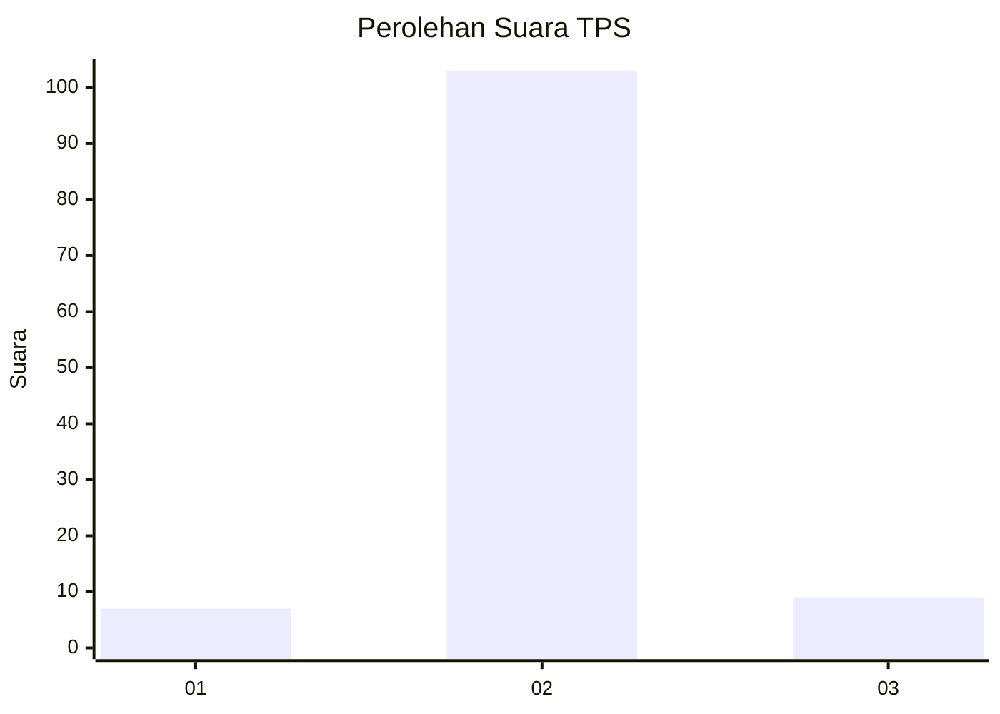
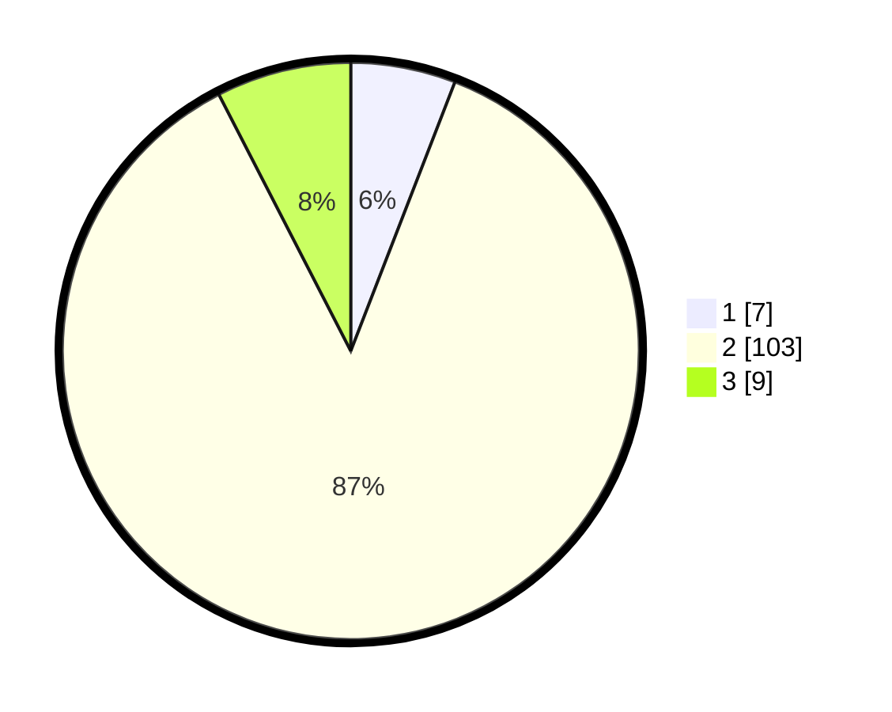

# Hasil

## Grafik

## Tabel

| No. | Nama Paslon    | Suara | Suara (raw) | Persentase |
|:--- |:-------------- | -----:| -----------:| ----------:|
| 1   | ANIES MUHAIMIN | 7     | [7][p-1]    | 5,88       |
| 2   | PRABOWO GIBRAN | 103   | [103][p-2]  | 86,55      |
| 3   | GANJAR MAHFUD  | 9     | [9][p-3]    | 7,56       |

[p-1]: https://github.com/gigit-pemilu/pemilu-2024-16-sumatera-selatan/blob/main/pilpres/hitung-suara/sub/16-sumatera-selatan/sub/09-ogan-komering-ulu-selatan/sub/09-buay-pemaca/sub/2001-tanjung-durian/sub/001-tps/sub/paslon-1.txt
[p-2]: https://github.com/gigit-pemilu/pemilu-2024-16-sumatera-selatan/blob/main/pilpres/hitung-suara/sub/16-sumatera-selatan/sub/09-ogan-komering-ulu-selatan/sub/09-buay-pemaca/sub/2001-tanjung-durian/sub/001-tps/sub/paslon-2.txt
[p-3]: https://github.com/gigit-pemilu/pemilu-2024-16-sumatera-selatan/blob/main/pilpres/hitung-suara/sub/16-sumatera-selatan/sub/09-ogan-komering-ulu-selatan/sub/09-buay-pemaca/sub/2001-tanjung-durian/sub/001-tps/sub/paslon-3.txt

## Foto C Plano

https://sirekap-obj-formc.kpu.go.id/0b99/pemilu/ppwp/16/09/09/20/01/1609092001001-20240214-155609--4117e4e8-53f3-4440-9c6b-5f32a7ff619c.jpg

https://sirekap-obj-formc.kpu.go.id/0b99/pemilu/ppwp/16/09/09/20/01/1609092001001-20240214-155751--c03997be-8aa1-4fec-8bbb-3a2c28919612.jpg

https://sirekap-obj-formc.kpu.go.id/0b99/pemilu/ppwp/16/09/09/20/01/1609092001001-20240214-160115--0fbc3691-bad8-4f83-bf8b-f682fa2ccd98.jpg

## Metadata

| Key        | Value               |
| ---------- | ------------------- |
| Time Stamp | 2024-02-15 12:00:28 |

## DATA PEMILIH TETAP

Jumlah pemilih dalam DPT: **264**.
 * L: **145**.
 * P: **119**.

## DATA PENGGUNA HAK PILIH

Jumlah pengguna hak pilih dalam DPT: **259**.
 * L: **145**.
 * P: **114**.

Jumlah pengguna hak pilih dalam DPTb: **0**.
 * L: **0**.
 * P: **0**.

Jumlah pengguna hak pilih dalam DPK: **0**.
 * L: **0**.
 * P: **0**.

Jumlah pengguna hak pilih: **259**.
 * L: **145**.
 * P: **114**.

## JUMLAH SUARA SAH DAN TIDAK SAH

JUMLAH SELURUH SUARA SAH: **119**.

JUMLAH SUARA TIDAK SAH: **140**.

JUMLAH SELURUH SUARA SAH DAN SUARA TIDAK SAH: **259**.

