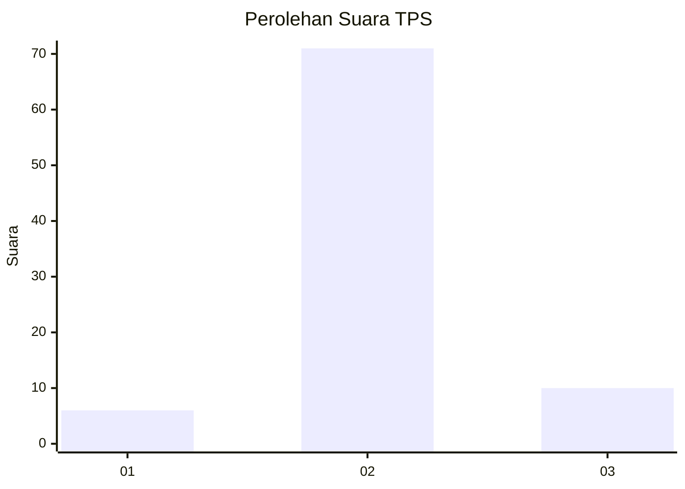
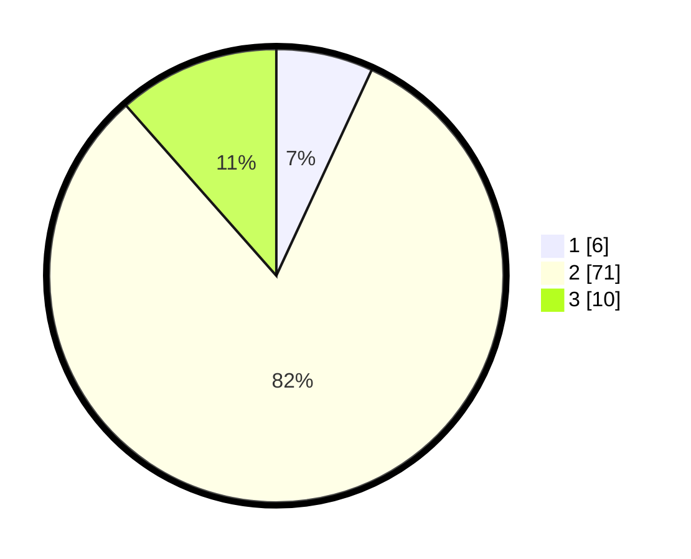

# Hasil

## Grafik

## Tabel

| No. | Nama Paslon    | Suara | Suara (raw) | Persentase |
|:--- |:-------------- | -----:| -----------:| ----------:|
| 1   | ANIES MUHAIMIN | 6     | [6][p-1]    | 6,90       |
| 2   | PRABOWO GIBRAN | 71    | [71][p-2]   | 81,61      |
| 3   | GANJAR MAHFUD  | 10    | [10][p-3]   | 11,49      |

[p-1]: https://github.com/gigit-pemilu/pemilu-2024-16-sumatera-selatan/blob/main/pilpres/hitung-suara/sub/16-sumatera-selatan/sub/09-ogan-komering-ulu-selatan/sub/09-buay-pemaca/sub/2003-kota-way/sub/001-tps/sub/paslon-1.txt
[p-2]: https://github.com/gigit-pemilu/pemilu-2024-16-sumatera-selatan/blob/main/pilpres/hitung-suara/sub/16-sumatera-selatan/sub/09-ogan-komering-ulu-selatan/sub/09-buay-pemaca/sub/2003-kota-way/sub/001-tps/sub/paslon-2.txt
[p-3]: https://github.com/gigit-pemilu/pemilu-2024-16-sumatera-selatan/blob/main/pilpres/hitung-suara/sub/16-sumatera-selatan/sub/09-ogan-komering-ulu-selatan/sub/09-buay-pemaca/sub/2003-kota-way/sub/001-tps/sub/paslon-3.txt

## Foto C Plano

https://sirekap-obj-formc.kpu.go.id/9936/pemilu/ppwp/16/09/09/20/03/1609092003001-20240215-053133--7ea0b081-9977-4721-9585-77a73e9ec1c2.jpg

https://sirekap-obj-formc.kpu.go.id/9936/pemilu/ppwp/16/09/09/20/03/1609092003001-20240214-212223--5f65574f-9c0d-482f-81da-15214e2b43e0.jpg

https://sirekap-obj-formc.kpu.go.id/9936/pemilu/ppwp/16/09/09/20/03/1609092003001-20240214-212348--d7c45200-8d90-4728-bb25-fe59d797afb0.jpg

## Metadata

| Key        | Value               |
| ---------- | ------------------- |
| Time Stamp | 2024-02-15 06:00:23 |

