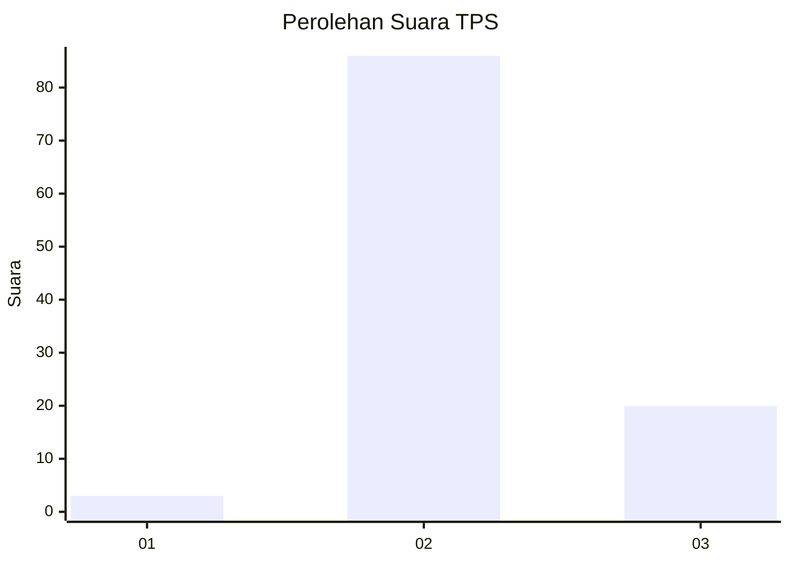
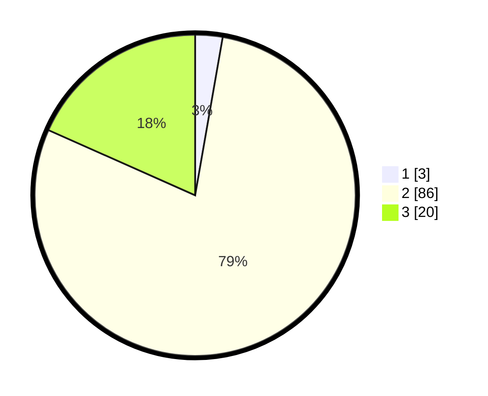

# Hasil

## Grafik

## Tabel

| No. | Nama Paslon    | Suara | Suara (raw) | Persentase |
|:--- |:-------------- | -----:| -----------:| ----------:|
| 1   | ANIES MUHAIMIN | 3     | [3][p-1]    | 2,75       |
| 2   | PRABOWO GIBRAN | 86    | [86][p-2]   | 78,90      |
| 3   | GANJAR MAHFUD  | 20    | [20][p-3]   | 18,35      |

[p-1]: https://github.com/gigit-pemilu/pemilu-2024-16-sumatera-selatan/blob/main/pilpres/hitung-suara/sub/16-sumatera-selatan/sub/09-ogan-komering-ulu-selatan/sub/09-buay-pemaca/sub/2007-karet-jaya/sub/008-tps/sub/paslon-1.txt
[p-2]: https://github.com/gigit-pemilu/pemilu-2024-16-sumatera-selatan/blob/main/pilpres/hitung-suara/sub/16-sumatera-selatan/sub/09-ogan-komering-ulu-selatan/sub/09-buay-pemaca/sub/2007-karet-jaya/sub/008-tps/sub/paslon-2.txt
[p-3]: https://github.com/gigit-pemilu/pemilu-2024-16-sumatera-selatan/blob/main/pilpres/hitung-suara/sub/16-sumatera-selatan/sub/09-ogan-komering-ulu-selatan/sub/09-buay-pemaca/sub/2007-karet-jaya/sub/008-tps/sub/paslon-3.txt

## Foto C Plano

https://sirekap-obj-formc.kpu.go.id/eb5e/pemilu/ppwp/16/09/09/20/07/1609092007008-20240214-231605--6c0a2ab0-0128-4716-b036-cb0bb4f33e3e.jpg

https://sirekap-obj-formc.kpu.go.id/eb5e/pemilu/ppwp/16/09/09/20/07/1609092007008-20240214-232354--653475a1-048d-4d09-be13-a80d1235fc48.jpg

https://sirekap-obj-formc.kpu.go.id/eb5e/pemilu/ppwp/16/09/09/20/07/1609092007008-20240214-232813--d076f863-f20b-46c3-bfd6-3a362c3890c4.jpg

## Metadata

| Key        | Value               |
| ---------- | ------------------- |
| Time Stamp | 2024-02-19 06:16:00 |

