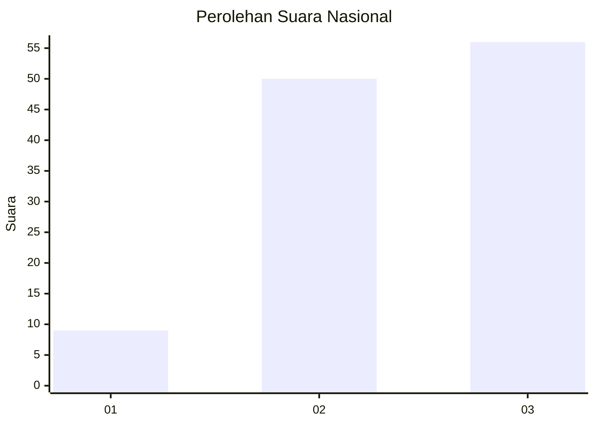
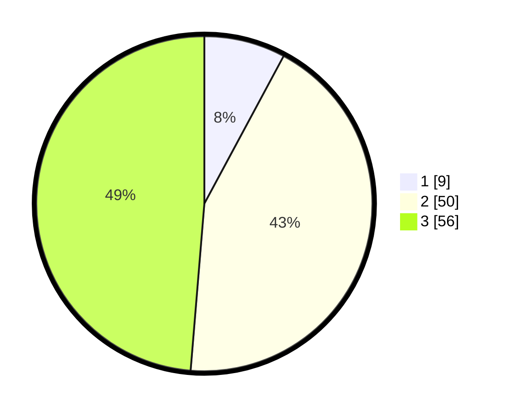

# Hasil

## Grafik

## Tabel

| No. | Nama Paslon    | Suara | Suara (raw) | Persentase |
|:--- |:-------------- | -----:| -----------:| ----------:|
| 1   | ANIES MUHAIMIN | 9     | [9][p-1]    | 7,83       |
| 2   | PRABOWO GIBRAN | 50    | [50][p-2]   | 43,48      |
| 3   | GANJAR MAHFUD  | 56    | [56][p-3]   | 48,70      |

[p-1]: https://github.com/gigit-pemilu/pemilu-2024/blob/main/pilpres/hitung-suara/sub/16-sumatera-selatan/sub/09-ogan-komering-ulu-selatan/sub/09-buay-pemaca/sub/2011-sido-rahayu/sub/007-tps/sub/paslon-1.txt
[p-2]: https://github.com/gigit-pemilu/pemilu-2024/blob/main/pilpres/hitung-suara/sub/16-sumatera-selatan/sub/09-ogan-komering-ulu-selatan/sub/09-buay-pemaca/sub/2011-sido-rahayu/sub/007-tps/sub/paslon-2.txt
[p-3]: https://github.com/gigit-pemilu/pemilu-2024/blob/main/pilpres/hitung-suara/sub/16-sumatera-selatan/sub/09-ogan-komering-ulu-selatan/sub/09-buay-pemaca/sub/2011-sido-rahayu/sub/007-tps/sub/paslon-3.txt

## Foto C Plano

https://sirekap-obj-formc.kpu.go.id/c0f8/pemilu/ppwp/16/09/09/20/11/1609092011007-20240224-170607--69ef1426-6a47-4ebf-8002-4eaf8bd01f52.jpg

https://sirekap-obj-formc.kpu.go.id/c0f8/pemilu/ppwp/16/09/09/20/11/1609092011007-20240224-170807--ec96ca3c-32e6-4a6e-a366-9ca64836183b.jpg

https://sirekap-obj-formc.kpu.go.id/c0f8/pemilu/ppwp/16/09/09/20/11/1609092011007-20240224-170837--ec469938-3fc8-4494-bd47-10c50889ab89.jpg

## Metadata

| Key        | Value               |
| ---------- | ------------------- |
| Time Stamp | 2024-02-26 12:00:00 |

## DATA PEMILIH TETAP

Jumlah pemilih dalam DPT: **879**.
 * L: **100**.
 * P: **874**.

## DATA PENGGUNA HAK PILIH

Jumlah pengguna hak pilih dalam DPT: **115**.
 * L: **471**.
 * P: **844**.

Jumlah pengguna hak pilih dalam DPTb: **808**.
 * L: **888**.
 * P: **808**.

Jumlah pengguna hak pilih dalam DPK: **888**.
 * L: **888**.
 * P: **888**.

Jumlah pengguna hak pilih: **715**.
 * L: **879**.
 * P: **844**.

## JUMLAH SUARA SAH DAN TIDAK SAH

JUMLAH SELURUH SUARA SAH: **115**.

JUMLAH SUARA TIDAK SAH: **0**.

JUMLAH SELURUH SUARA SAH DAN SUARA TIDAK SAH: **115**.

