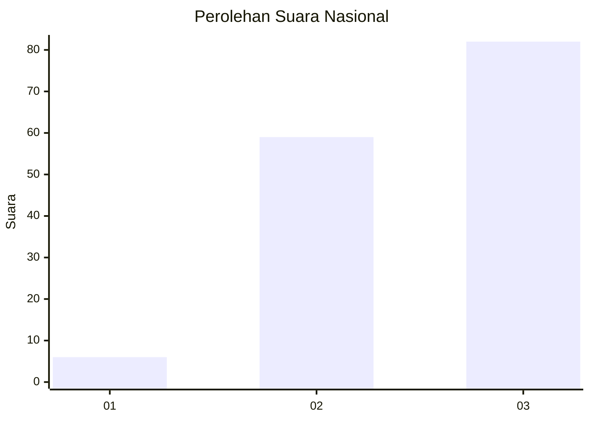
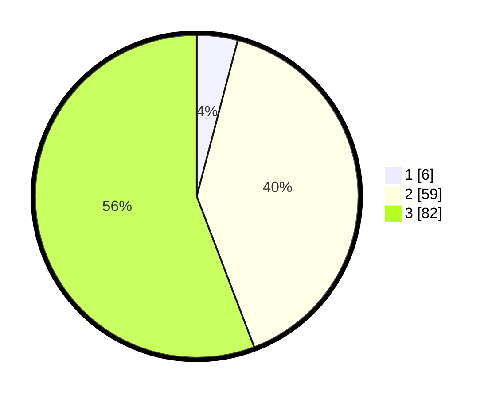

# Hasil

## Grafik

## Tabel

| No. | Nama Paslon    | Suara | Suara (raw) | Persentase |
|:--- |:-------------- | -----:| -----------:| ----------:|
| 1   | ANIES MUHAIMIN | 6     | [6][p-1]    | 4,08       |
| 2   | PRABOWO GIBRAN | 59    | [59][p-2]   | 40,14      |
| 3   | GANJAR MAHFUD  | 82    | [82][p-3]   | 55,78      |

[p-1]: https://github.com/gigit-pemilu/pemilu-2024/blob/main/pilpres/hitung-suara/sub/16-sumatera-selatan/sub/09-ogan-komering-ulu-selatan/sub/09-buay-pemaca/sub/2011-sido-rahayu/sub/012-tps/sub/paslon-1.txt
[p-2]: https://github.com/gigit-pemilu/pemilu-2024/blob/main/pilpres/hitung-suara/sub/16-sumatera-selatan/sub/09-ogan-komering-ulu-selatan/sub/09-buay-pemaca/sub/2011-sido-rahayu/sub/012-tps/sub/paslon-2.txt
[p-3]: https://github.com/gigit-pemilu/pemilu-2024/blob/main/pilpres/hitung-suara/sub/16-sumatera-selatan/sub/09-ogan-komering-ulu-selatan/sub/09-buay-pemaca/sub/2011-sido-rahayu/sub/012-tps/sub/paslon-3.txt

## Foto C Plano

https://sirekap-obj-formc.kpu.go.id/6975/pemilu/ppwp/16/09/09/20/11/1609092011012-20240224-172330--7ce254a5-4a2a-46a8-9d3c-600ddf785a96.jpg

https://sirekap-obj-formc.kpu.go.id/6975/pemilu/ppwp/16/09/09/20/11/1609092011012-20240224-172410--53334f86-42cd-4c60-922d-1598754132c5.jpg

https://sirekap-obj-formc.kpu.go.id/6975/pemilu/ppwp/16/09/09/20/11/1609092011012-20240224-172438--cbf37ec4-81cc-4004-9a13-307175e61fad.jpg

## Metadata

| Key        | Value               |
| ---------- | ------------------- |
| Time Stamp | 2024-02-24 22:31:28 |

## DATA PEMILIH TETAP

Jumlah pemilih dalam DPT: **163**.
 * L: **32**.
 * P: **76**.

## DATA PENGGUNA HAK PILIH

Jumlah pengguna hak pilih dalam DPT: **154**.
 * L: **84**.
 * P: **74**.

Jumlah pengguna hak pilih dalam DPTb: **283**.
 * L: **88**.
 * P: **700**.

Jumlah pengguna hak pilih dalam DPK: **808**.
 * L: **880**.
 * P: **800**.

Jumlah pengguna hak pilih: **154**.
 * L: **20**.
 * P: **74**.

## JUMLAH SUARA SAH DAN TIDAK SAH

JUMLAH SELURUH SUARA SAH: **143**.

JUMLAH SUARA TIDAK SAH: **7**.

JUMLAH SELURUH SUARA SAH DAN SUARA TIDAK SAH: **154**.

