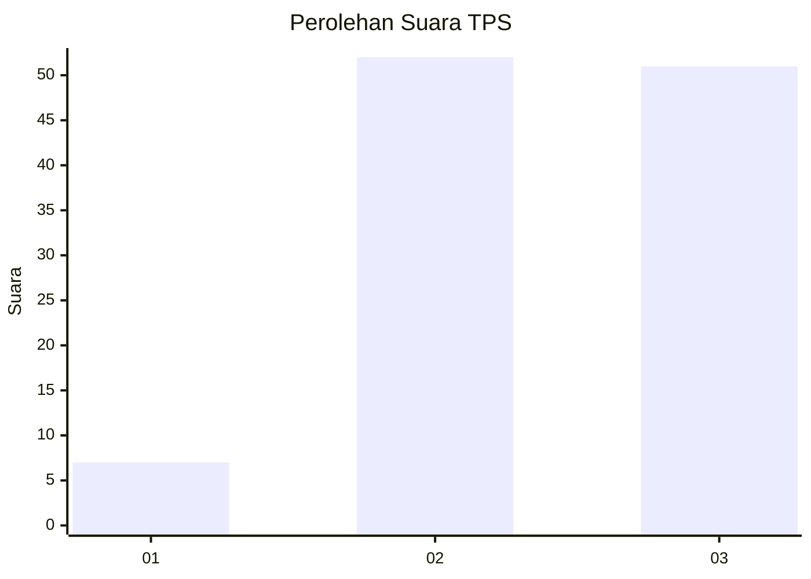
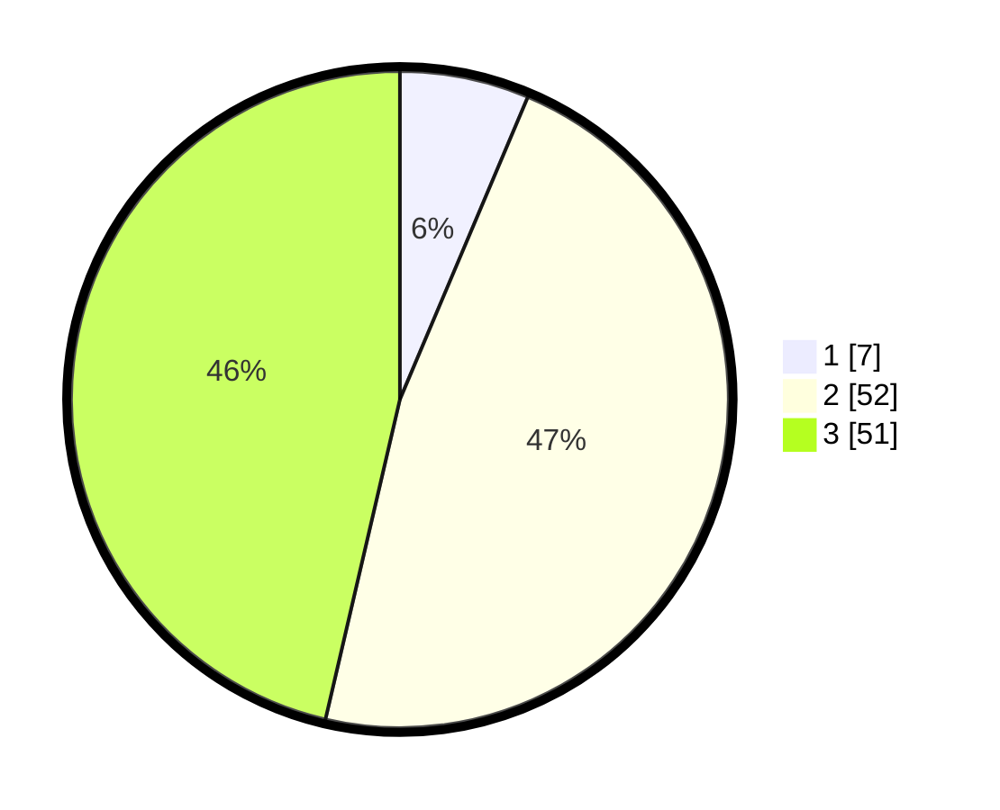

# Hasil

## Grafik

## Tabel

| No. | Nama Paslon    | Suara | Suara (raw) | Persentase |
|:--- |:-------------- | -----:| -----------:| ----------:|
| 1   | ANIES MUHAIMIN | 7     | [7][p-1]    | 6,36       |
| 2   | PRABOWO GIBRAN | 52    | [52][p-2]   | 47,27      |
| 3   | GANJAR MAHFUD  | 51    | [51][p-3]   | 46,36      |

[p-1]: https://github.com/gigit-pemilu/pemilu-2024-16-sumatera-selatan/blob/main/pilpres/hitung-suara/sub/16-sumatera-selatan/sub/09-ogan-komering-ulu-selatan/sub/09-buay-pemaca/sub/2011-sido-rahayu/sub/014-tps/sub/paslon-1.txt
[p-2]: https://github.com/gigit-pemilu/pemilu-2024-16-sumatera-selatan/blob/main/pilpres/hitung-suara/sub/16-sumatera-selatan/sub/09-ogan-komering-ulu-selatan/sub/09-buay-pemaca/sub/2011-sido-rahayu/sub/014-tps/sub/paslon-2.txt
[p-3]: https://github.com/gigit-pemilu/pemilu-2024-16-sumatera-selatan/blob/main/pilpres/hitung-suara/sub/16-sumatera-selatan/sub/09-ogan-komering-ulu-selatan/sub/09-buay-pemaca/sub/2011-sido-rahayu/sub/014-tps/sub/paslon-3.txt

## Foto C Plano

https://sirekap-obj-formc.kpu.go.id/80b2/pemilu/ppwp/16/09/09/20/11/1609092011014-20240224-172101--7a8c8977-923a-451e-8492-a06f210cf074.jpg

https://sirekap-obj-formc.kpu.go.id/80b2/pemilu/ppwp/16/09/09/20/11/1609092011014-20240224-172130--b3f260ad-19f7-475b-8182-5ad37664d461.jpg

https://sirekap-obj-formc.kpu.go.id/80b2/pemilu/ppwp/16/09/09/20/11/1609092011014-20240224-172209--ba739608-e2ca-4600-beeb-ca0bd6b7f421.jpg

## Metadata

| Key        | Value               |
| ---------- | ------------------- |
| Time Stamp | 2024-02-24 22:31:28 |

## DATA PEMILIH TETAP

Jumlah pemilih dalam DPT: **208**.
 * L: **108**.
 * P: **100**.

## DATA PENGGUNA HAK PILIH

Jumlah pengguna hak pilih dalam DPT: **111**.
 * L: **63**.
 * P: **48**.

Jumlah pengguna hak pilih dalam DPTb: **80**.
 * L: **80**.
 * P: **8**.

Jumlah pengguna hak pilih dalam DPK: **0**.
 * L: **2**.
 * P: **72**.

Jumlah pengguna hak pilih: **111**.
 * L: **263**.
 * P: **45**.

## JUMLAH SUARA SAH DAN TIDAK SAH

JUMLAH SELURUH SUARA SAH: **110**.

JUMLAH SUARA TIDAK SAH: **1**.

JUMLAH SELURUH SUARA SAH DAN SUARA TIDAK SAH: **111**.

