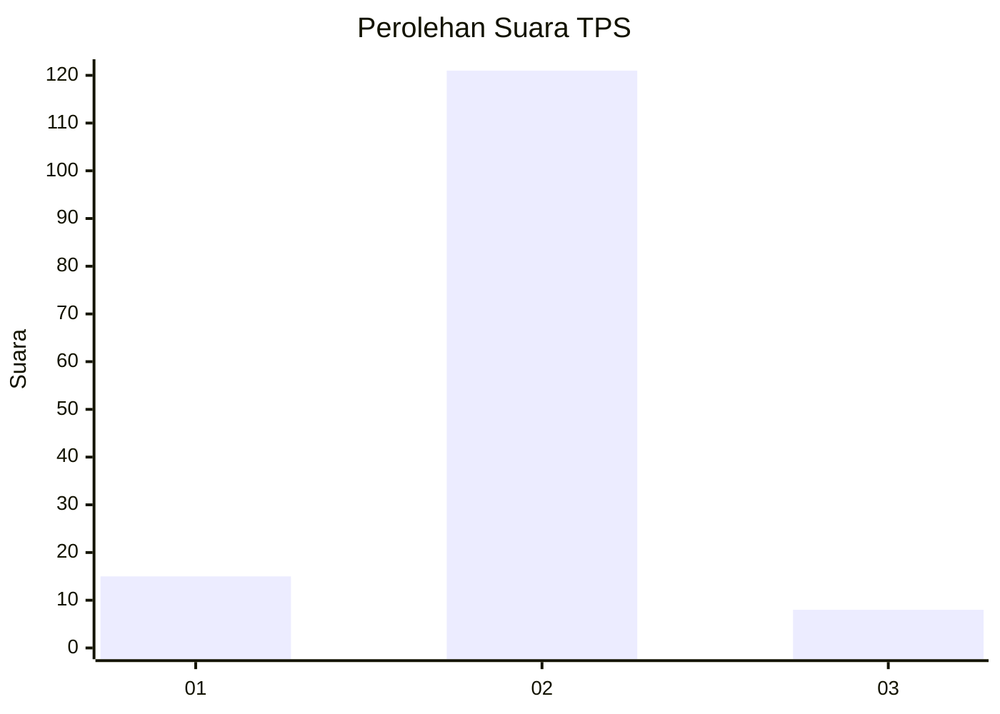
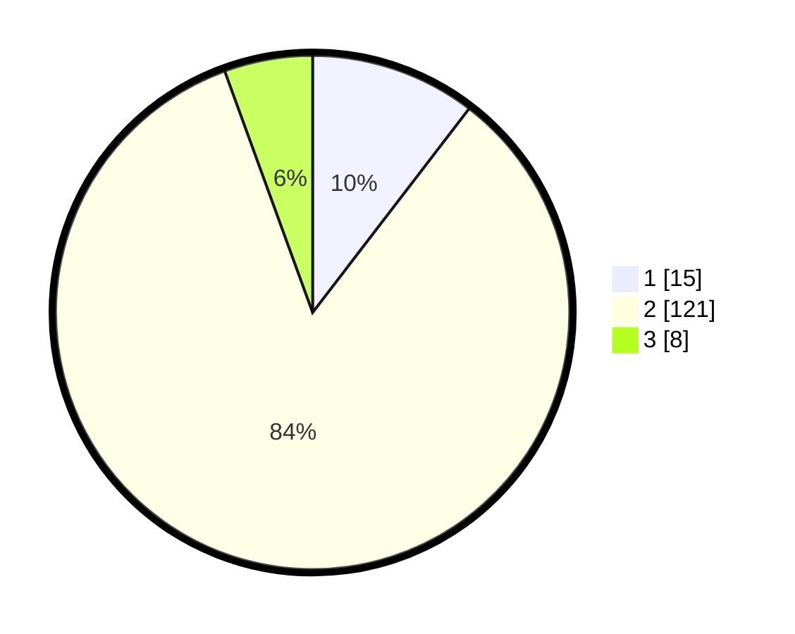

# Hasil

## Grafik

## Tabel

| No. | Nama Paslon    | Suara | Suara (raw) | Persentase |
|:--- |:-------------- | -----:| -----------:| ----------:|
| 1   | ANIES MUHAIMIN | 15    | [15][p-1]   | 10,42      |
| 2   | PRABOWO GIBRAN | 121   | [121][p-2]  | 84,03      |
| 3   | GANJAR MAHFUD  | 8     | [8][p-3]    | 5,56       |

[p-1]: https://github.com/gigit-pemilu/pemilu-2024-16-sumatera-selatan/blob/main/pilpres/hitung-suara/sub/16-sumatera-selatan/sub/09-ogan-komering-ulu-selatan/sub/09-buay-pemaca/sub/2014-sumber-raya/sub/001-tps/sub/paslon-1.txt
[p-2]: https://github.com/gigit-pemilu/pemilu-2024-16-sumatera-selatan/blob/main/pilpres/hitung-suara/sub/16-sumatera-selatan/sub/09-ogan-komering-ulu-selatan/sub/09-buay-pemaca/sub/2014-sumber-raya/sub/001-tps/sub/paslon-2.txt
[p-3]: https://github.com/gigit-pemilu/pemilu-2024-16-sumatera-selatan/blob/main/pilpres/hitung-suara/sub/16-sumatera-selatan/sub/09-ogan-komering-ulu-selatan/sub/09-buay-pemaca/sub/2014-sumber-raya/sub/001-tps/sub/paslon-3.txt

## Foto C Plano

https://sirekap-obj-formc.kpu.go.id/4779/pemilu/ppwp/16/09/09/20/14/1609092014001-20240220-172841--5df6ed41-281e-4f46-9072-faa9fa034559.jpg

https://sirekap-obj-formc.kpu.go.id/4779/pemilu/ppwp/16/09/09/20/14/1609092014001-20240220-172921--50fece81-8c86-4659-ba3a-6461baf216a5.jpg

https://sirekap-obj-formc.kpu.go.id/4779/pemilu/ppwp/16/09/09/20/14/1609092014001-20240220-172953--efc14351-7e61-4f83-925a-ea168841de2d.jpg

## Metadata

| Key        | Value               |
| ---------- | ------------------- |
| Time Stamp | 2024-02-22 20:00:00 |

