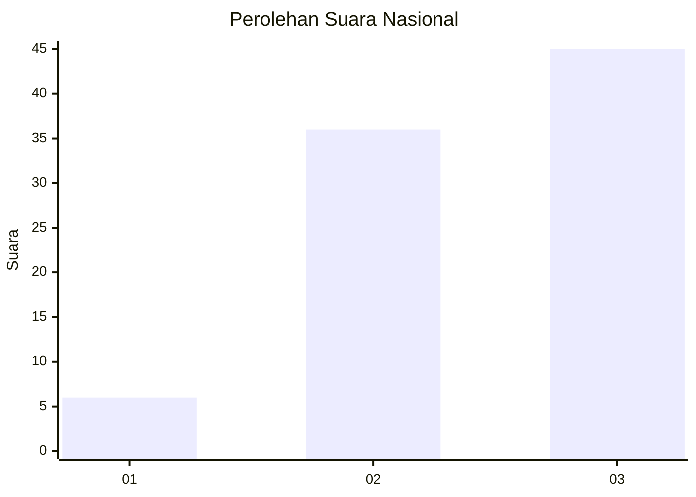
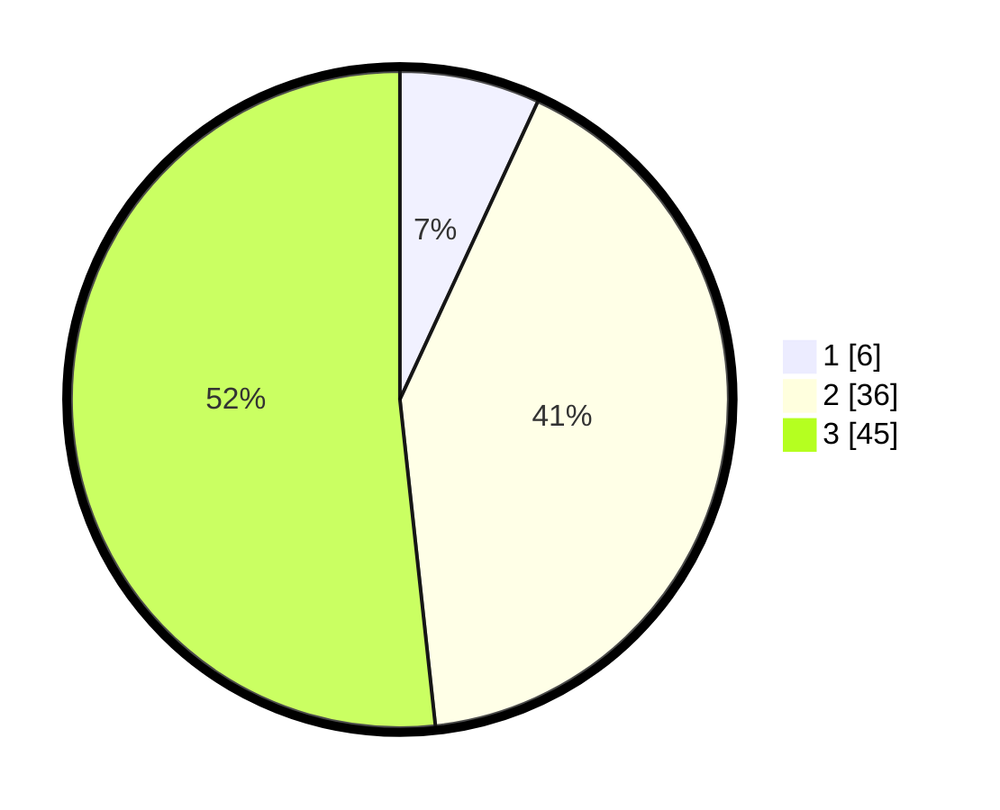

# Hasil

## Grafik

## Tabel

| No. | Nama Paslon    | Suara | Suara (raw) | Persentase |
|:--- |:-------------- | -----:| -----------:| ----------:|
| 1   | ANIES MUHAIMIN | 6     | [6][p-1]    | 6,90       |
| 2   | PRABOWO GIBRAN | 36    | [36][p-2]   | 41,38      |
| 3   | GANJAR MAHFUD  | 45    | [45][p-3]   | 51,72      |

[p-1]: https://github.com/gigit-pemilu/pemilu-2024/blob/main/pilpres/hitung-suara/sub/16-sumatera-selatan/sub/09-ogan-komering-ulu-selatan/sub/09-buay-pemaca/sub/2015-sinar-napalan/sub/007-tps/sub/paslon-1.txt
[p-2]: https://github.com/gigit-pemilu/pemilu-2024/blob/main/pilpres/hitung-suara/sub/16-sumatera-selatan/sub/09-ogan-komering-ulu-selatan/sub/09-buay-pemaca/sub/2015-sinar-napalan/sub/007-tps/sub/paslon-2.txt
[p-3]: https://github.com/gigit-pemilu/pemilu-2024/blob/main/pilpres/hitung-suara/sub/16-sumatera-selatan/sub/09-ogan-komering-ulu-selatan/sub/09-buay-pemaca/sub/2015-sinar-napalan/sub/007-tps/sub/paslon-3.txt

## Foto C Plano

https://sirekap-obj-formc.kpu.go.id/5d0a/pemilu/ppwp/16/09/09/20/15/1609092015007-20240224-180611--8373ae3f-1590-4d6f-8ecd-f0f35b9534ca.jpg

https://sirekap-obj-formc.kpu.go.id/5d0a/pemilu/ppwp/16/09/09/20/15/1609092015007-20240224-180712--4329952d-aa3b-49af-8696-dc8be7fd5b9d.jpg

https://sirekap-obj-formc.kpu.go.id/5d0a/pemilu/ppwp/16/09/09/20/15/1609092015007-20240224-180519--7ec78fb3-3e06-489b-ac6b-2c70acc997e1.jpg

## Metadata

| Key        | Value               |
| ---------- | ------------------- |
| Time Stamp | 2024-02-24 22:31:28 |

