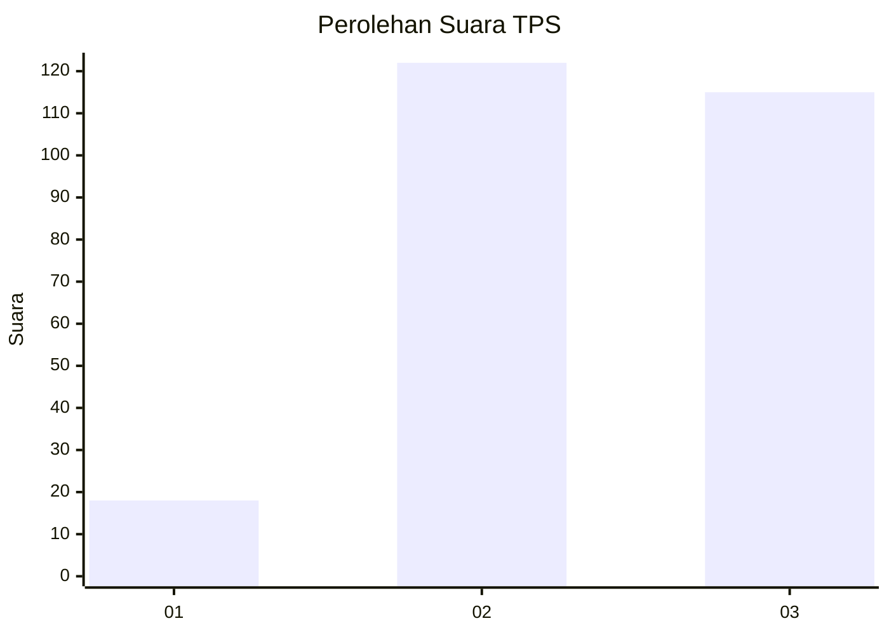
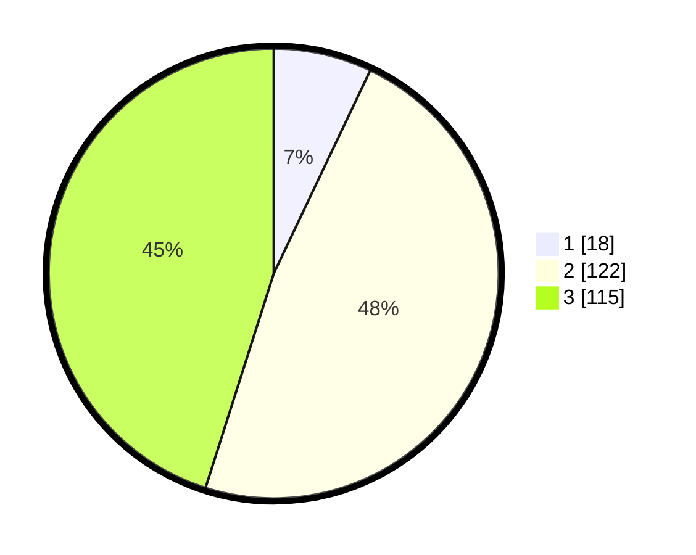

# Hasil

## Grafik

## Tabel

| No. | Nama Paslon    | Suara | Suara (raw) | Persentase |
|:--- |:-------------- | -----:| -----------:| ----------:|
| 1   | ANIES MUHAIMIN | 18    | [18][p-1]   | 7,06       |
| 2   | PRABOWO GIBRAN | 122   | [122][p-2]  | 47,84      |
| 3   | GANJAR MAHFUD  | 115   | [115][p-3]  | 45,10      |

[p-1]: https://github.com/gigit-pemilu/pemilu-2024-16-sumatera-selatan/blob/main/pilpres/hitung-suara/sub/16-sumatera-selatan/sub/09-ogan-komering-ulu-selatan/sub/09-buay-pemaca/sub/2018-mekar-jaya/sub/004-tps/sub/paslon-1.txt
[p-2]: https://github.com/gigit-pemilu/pemilu-2024-16-sumatera-selatan/blob/main/pilpres/hitung-suara/sub/16-sumatera-selatan/sub/09-ogan-komering-ulu-selatan/sub/09-buay-pemaca/sub/2018-mekar-jaya/sub/004-tps/sub/paslon-2.txt
[p-3]: https://github.com/gigit-pemilu/pemilu-2024-16-sumatera-selatan/blob/main/pilpres/hitung-suara/sub/16-sumatera-selatan/sub/09-ogan-komering-ulu-selatan/sub/09-buay-pemaca/sub/2018-mekar-jaya/sub/004-tps/sub/paslon-3.txt

## Foto C Plano

https://sirekap-obj-formc.kpu.go.id/a747/pemilu/ppwp/16/09/09/20/18/1609092018004-20240219-155507--48815802-3a57-4912-bb8e-0404814b64b9.jpg

https://sirekap-obj-formc.kpu.go.id/a747/pemilu/ppwp/16/09/09/20/18/1609092018004-20240219-155557--2e261869-6e7d-44c9-9ab1-f3899612b79f.jpg

https://sirekap-obj-formc.kpu.go.id/a747/pemilu/ppwp/16/09/09/20/18/1609092018004-20240219-165205--1e4e5618-802e-4433-827f-e823cb51c3dc.jpg

## Metadata

| Key        | Value               |
| ---------- | ------------------- |
| Time Stamp | 2024-02-25 15:00:00 |

