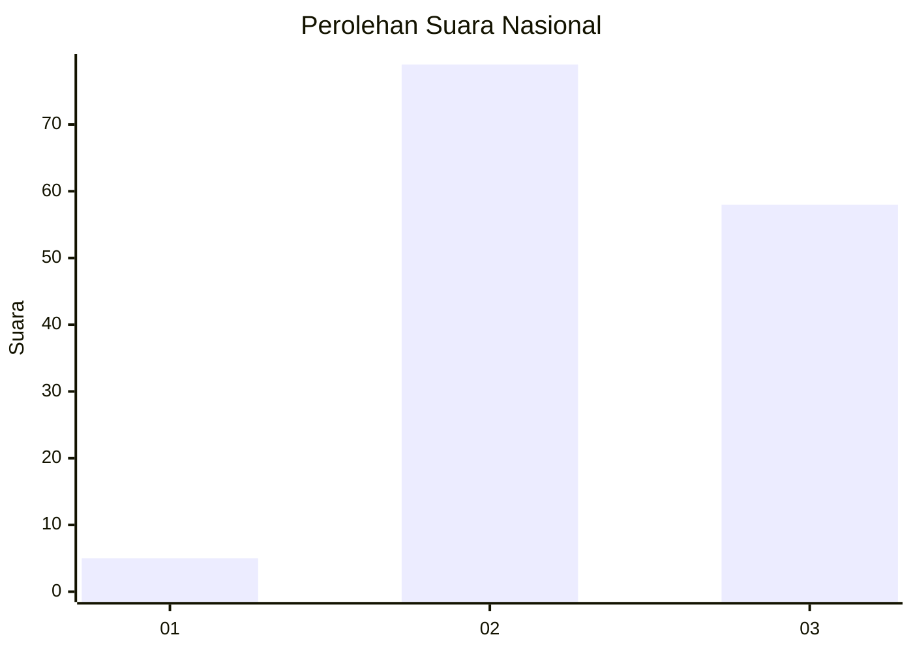
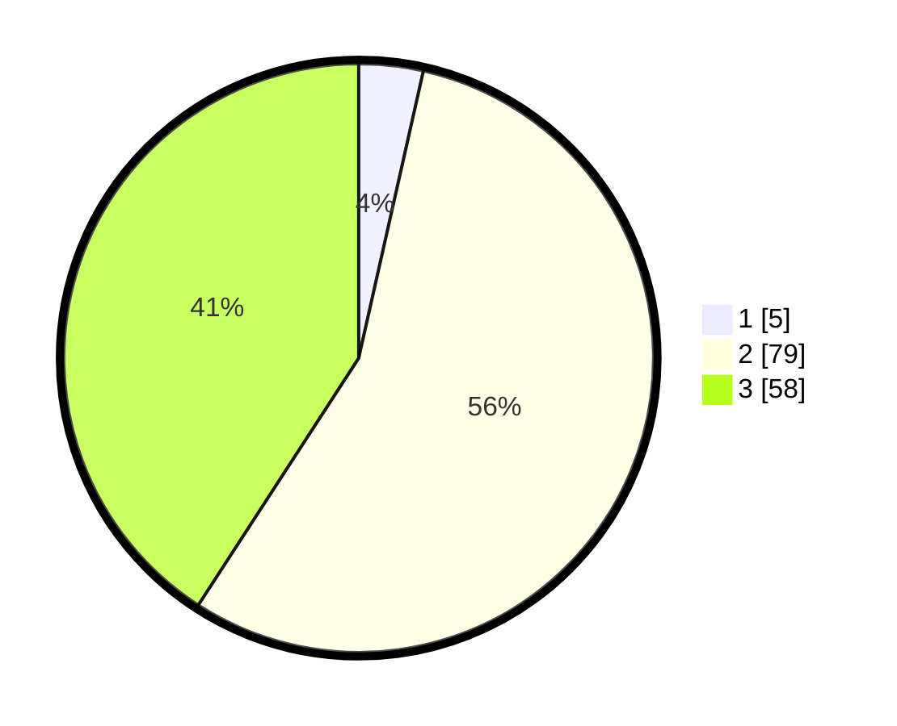

# Hasil

## Grafik

## Tabel

| No. | Nama Paslon    | Suara | Suara (raw) | Persentase |
|:--- |:-------------- | -----:| -----------:| ----------:|
| 1   | ANIES MUHAIMIN | 5     | [5][p-1]    | 3,52       |
| 2   | PRABOWO GIBRAN | 79    | [79][p-2]   | 55,63      |
| 3   | GANJAR MAHFUD  | 58    | [58][p-3]   | 40,85      |

[p-1]: https://github.com/gigit-pemilu/pemilu-2024/blob/main/pilpres/hitung-suara/sub/16-sumatera-selatan/sub/09-ogan-komering-ulu-selatan/sub/09-buay-pemaca/sub/2018-mekar-jaya/sub/006-tps/sub/paslon-1.txt
[p-2]: https://github.com/gigit-pemilu/pemilu-2024/blob/main/pilpres/hitung-suara/sub/16-sumatera-selatan/sub/09-ogan-komering-ulu-selatan/sub/09-buay-pemaca/sub/2018-mekar-jaya/sub/006-tps/sub/paslon-2.txt
[p-3]: https://github.com/gigit-pemilu/pemilu-2024/blob/main/pilpres/hitung-suara/sub/16-sumatera-selatan/sub/09-ogan-komering-ulu-selatan/sub/09-buay-pemaca/sub/2018-mekar-jaya/sub/006-tps/sub/paslon-3.txt

## Foto C Plano

https://sirekap-obj-formc.kpu.go.id/9e53/pemilu/ppwp/16/09/09/20/18/1609092018006-20240214-203934--709dec09-78df-4918-98d1-cb5dca903bd8.jpg

https://sirekap-obj-formc.kpu.go.id/9e53/pemilu/ppwp/16/09/09/20/18/1609092018006-20240216-093434--510c9be4-c375-44f7-9297-b42346a65447.jpg

https://sirekap-obj-formc.kpu.go.id/9e53/pemilu/ppwp/16/09/09/20/18/1609092018006-20240216-093430--9ffb2947-1312-4e31-aff8-afcee63c18ff.jpg

## Metadata

| Key        | Value               |
| ---------- | ------------------- |
| Time Stamp | 2024-02-16 14:00:34 |

