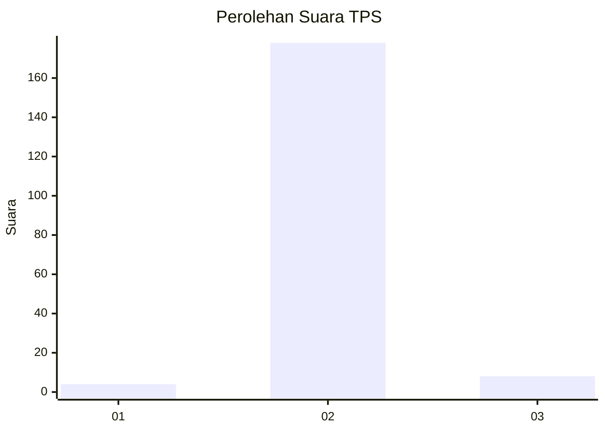
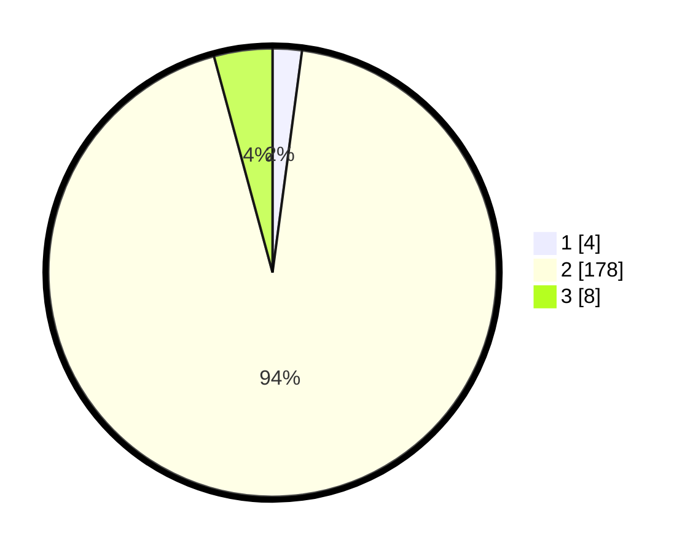

# Hasil

## Grafik

## Tabel

| No. | Nama Paslon    | Suara | Suara (raw) | Persentase |
|:--- |:-------------- | -----:| -----------:| ----------:|
| 1   | ANIES MUHAIMIN | 4     | [4][p-1]    | 2,11       |
| 2   | PRABOWO GIBRAN | 178   | [178][p-2]  | 93,68      |
| 3   | GANJAR MAHFUD  | 8     | [8][p-3]    | 4,21       |

[p-1]: https://github.com/gigit-pemilu/pemilu-2024-16-sumatera-selatan/blob/main/pilpres/hitung-suara/sub/16-sumatera-selatan/sub/09-ogan-komering-ulu-selatan/sub/10-kisam-tinggi/sub/2002-berasang/sub/001-tps/sub/paslon-1.txt
[p-2]: https://github.com/gigit-pemilu/pemilu-2024-16-sumatera-selatan/blob/main/pilpres/hitung-suara/sub/16-sumatera-selatan/sub/09-ogan-komering-ulu-selatan/sub/10-kisam-tinggi/sub/2002-berasang/sub/001-tps/sub/paslon-2.txt
[p-3]: https://github.com/gigit-pemilu/pemilu-2024-16-sumatera-selatan/blob/main/pilpres/hitung-suara/sub/16-sumatera-selatan/sub/09-ogan-komering-ulu-selatan/sub/10-kisam-tinggi/sub/2002-berasang/sub/001-tps/sub/paslon-3.txt

## Foto C Plano

https://sirekap-obj-formc.kpu.go.id/9d27/pemilu/ppwp/16/09/10/20/02/1609102002001-20240215-093325--9d18a618-113c-4755-a220-b4f70a8873df.jpg

https://sirekap-obj-formc.kpu.go.id/9d27/pemilu/ppwp/16/09/10/20/02/1609102002001-20240215-093913--04b0419a-d796-45f3-a0f6-58f083d77ddd.jpg

https://sirekap-obj-formc.kpu.go.id/9d27/pemilu/ppwp/16/09/10/20/02/1609102002001-20240215-094602--7295d223-438f-41d6-a279-3fec5eaf9df0.jpg

## Metadata

| Key        | Value               |
| ---------- | ------------------- |
| Time Stamp | 2024-02-15 21:01:18 |

