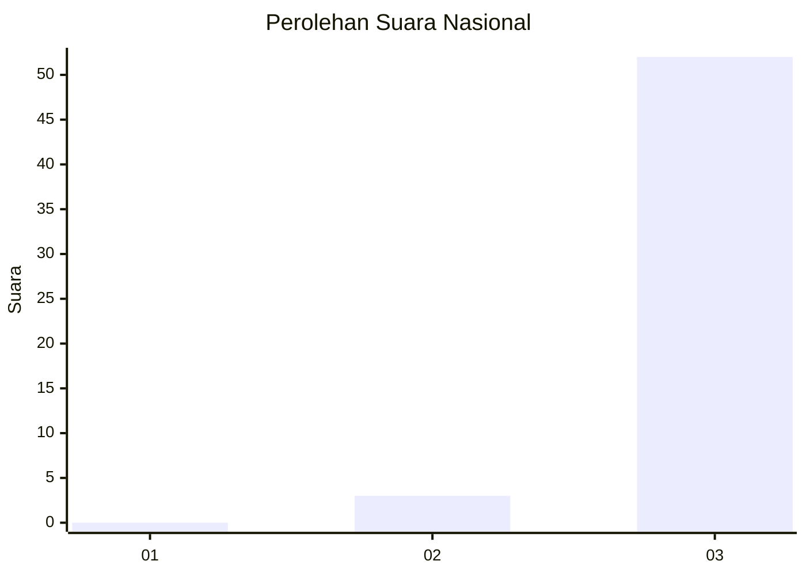
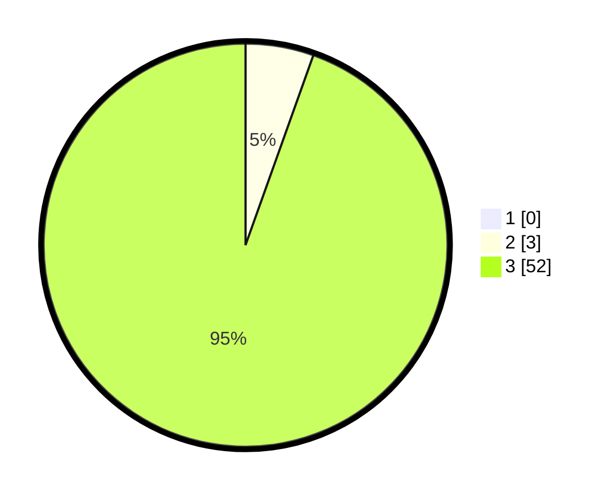

# Hasil

## Grafik

## Tabel

| No. | Nama Paslon    | Suara | Suara (raw) | Persentase |
|:--- |:-------------- | -----:| -----------:| ----------:|
| 1   | ANIES MUHAIMIN | 0     | [0][p-1]    | 0,00       |
| 2   | PRABOWO GIBRAN | 3     | [3][p-2]    | 5,45       |
| 3   | GANJAR MAHFUD  | 52    | [52][p-3]   | 94,55      |

[p-1]: https://github.com/gigit-pemilu/pemilu-2024/blob/main/pilpres/hitung-suara/sub/16-sumatera-selatan/sub/09-ogan-komering-ulu-selatan/sub/10-kisam-tinggi/sub/2003-tebat-gabus/sub/005-tps/sub/paslon-1.txt
[p-2]: https://github.com/gigit-pemilu/pemilu-2024/blob/main/pilpres/hitung-suara/sub/16-sumatera-selatan/sub/09-ogan-komering-ulu-selatan/sub/10-kisam-tinggi/sub/2003-tebat-gabus/sub/005-tps/sub/paslon-2.txt
[p-3]: https://github.com/gigit-pemilu/pemilu-2024/blob/main/pilpres/hitung-suara/sub/16-sumatera-selatan/sub/09-ogan-komering-ulu-selatan/sub/10-kisam-tinggi/sub/2003-tebat-gabus/sub/005-tps/sub/paslon-3.txt

## Foto C Plano

https://sirekap-obj-formc.kpu.go.id/b9ab/pemilu/ppwp/16/09/10/20/03/1609102003005-20240215-195626--a6c7cdd2-31e5-4604-9f8b-4e850cc2e67e.jpg

https://sirekap-obj-formc.kpu.go.id/b9ab/pemilu/ppwp/16/09/10/20/03/1609102003005-20240215-220036--efc76372-4aeb-441a-8bb8-1e6083623f44.jpg

https://sirekap-obj-formc.kpu.go.id/b9ab/pemilu/ppwp/16/09/10/20/03/1609102003005-20240215-195716--f24b6633-efc3-4ece-9d1a-f65aafbcce00.jpg

## Metadata

| Key        | Value               |
| ---------- | ------------------- |
| Time Stamp | 2024-02-15 22:30:27 |

## DATA PEMILIH TETAP

Jumlah pemilih dalam DPT: **55**.
 * L: **33**.
 * P: **22**.

## DATA PENGGUNA HAK PILIH

Jumlah pengguna hak pilih dalam DPT: **55**.
 * L: **33**.
 * P: **22**.

Jumlah pengguna hak pilih dalam DPTb: **0**.
 * L: **0**.
 * P: **0**.

Jumlah pengguna hak pilih dalam DPK: **0**.
 * L: **0**.
 * P: **0**.

Jumlah pengguna hak pilih: **55**.
 * L: **33**.
 * P: **22**.

## JUMLAH SUARA SAH DAN TIDAK SAH

JUMLAH SELURUH SUARA SAH: **55**.

JUMLAH SUARA TIDAK SAH: **0**.

JUMLAH SELURUH SUARA SAH DAN SUARA TIDAK SAH: **55**.

