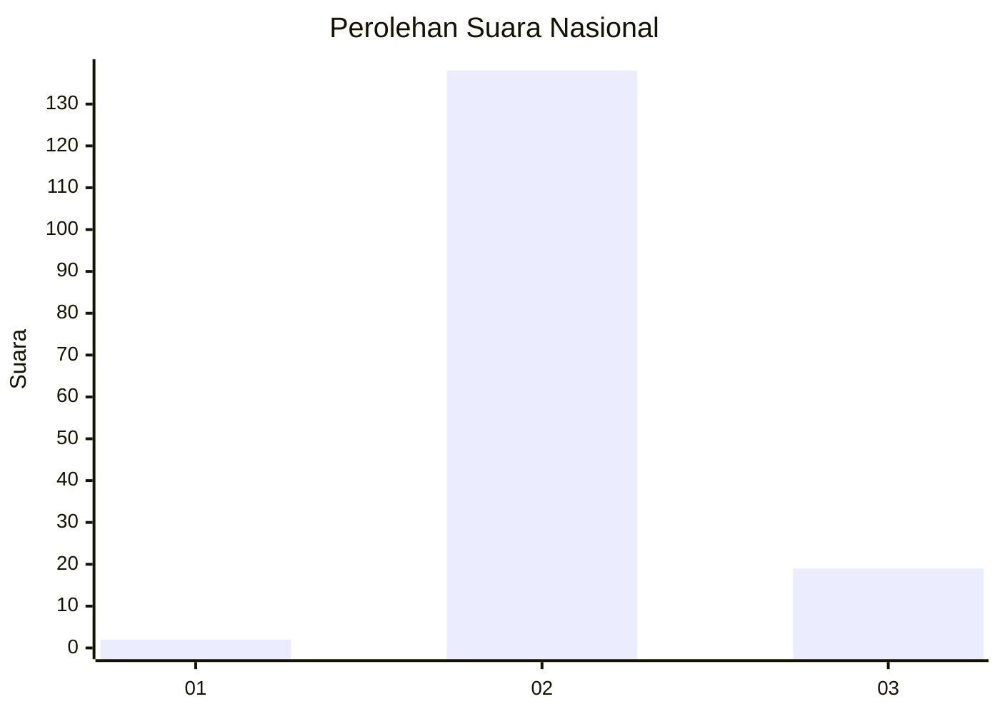
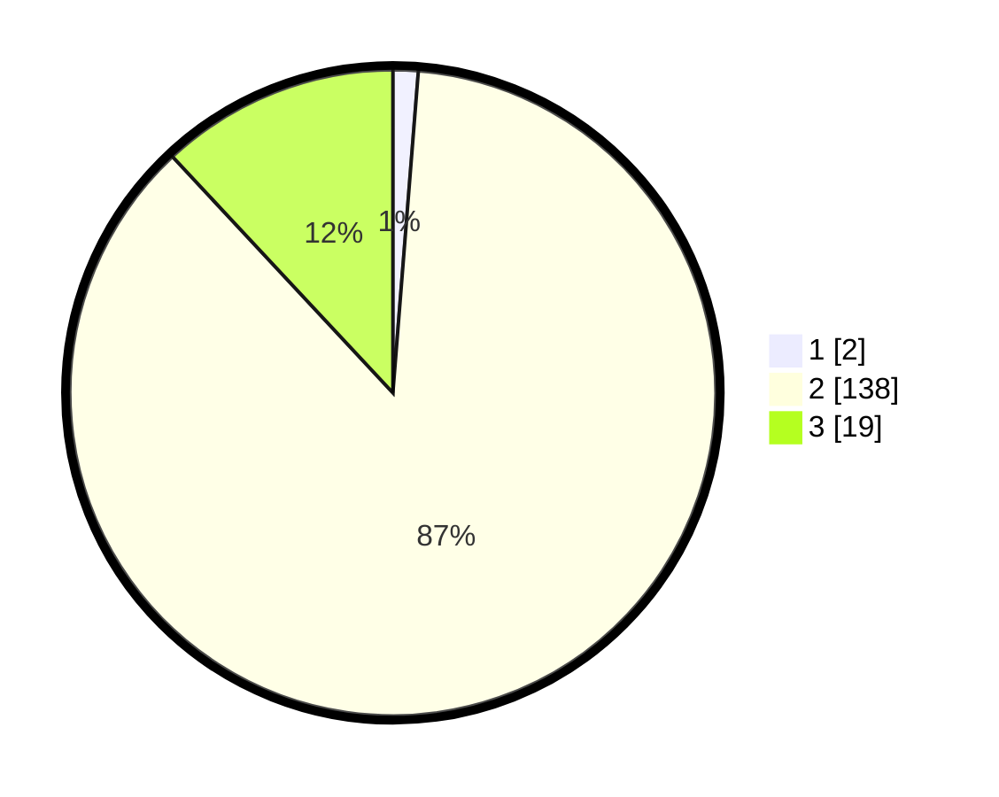

# Hasil

## Grafik

## Tabel

| No. | Nama Paslon    | Suara | Suara (raw) | Persentase |
|:--- |:-------------- | -----:| -----------:| ----------:|
| 1   | ANIES MUHAIMIN | 2     | [2][p-1]    | 1,26       |
| 2   | PRABOWO GIBRAN | 138   | [138][p-2]  | 86,79      |
| 3   | GANJAR MAHFUD  | 19    | [19][p-3]   | 11,95      |

[p-1]: https://github.com/gigit-pemilu/pemilu-2024/blob/main/pilpres/hitung-suara/sub/16-sumatera-selatan/sub/09-ogan-komering-ulu-selatan/sub/10-kisam-tinggi/sub/2004-padang-lay/sub/004-tps/sub/paslon-1.txt
[p-2]: https://github.com/gigit-pemilu/pemilu-2024/blob/main/pilpres/hitung-suara/sub/16-sumatera-selatan/sub/09-ogan-komering-ulu-selatan/sub/10-kisam-tinggi/sub/2004-padang-lay/sub/004-tps/sub/paslon-2.txt
[p-3]: https://github.com/gigit-pemilu/pemilu-2024/blob/main/pilpres/hitung-suara/sub/16-sumatera-selatan/sub/09-ogan-komering-ulu-selatan/sub/10-kisam-tinggi/sub/2004-padang-lay/sub/004-tps/sub/paslon-3.txt

## Foto C Plano

https://sirekap-obj-formc.kpu.go.id/d593/pemilu/ppwp/16/09/10/20/04/1609102004004-20240215-093345--25390970-ad26-459b-926a-b82f7cdcacf1.jpg

https://sirekap-obj-formc.kpu.go.id/d593/pemilu/ppwp/16/09/10/20/04/1609102004004-20240215-093547--7f138012-ea82-45cd-b6c1-93121a2725da.jpg

https://sirekap-obj-formc.kpu.go.id/d593/pemilu/ppwp/16/09/10/20/04/1609102004004-20240215-093813--d0140c64-4e5e-402a-9651-d17dfe0162db.jpg

## Metadata

| Key        | Value               |
| ---------- | ------------------- |
| Time Stamp | 2024-02-19 06:16:00 |

