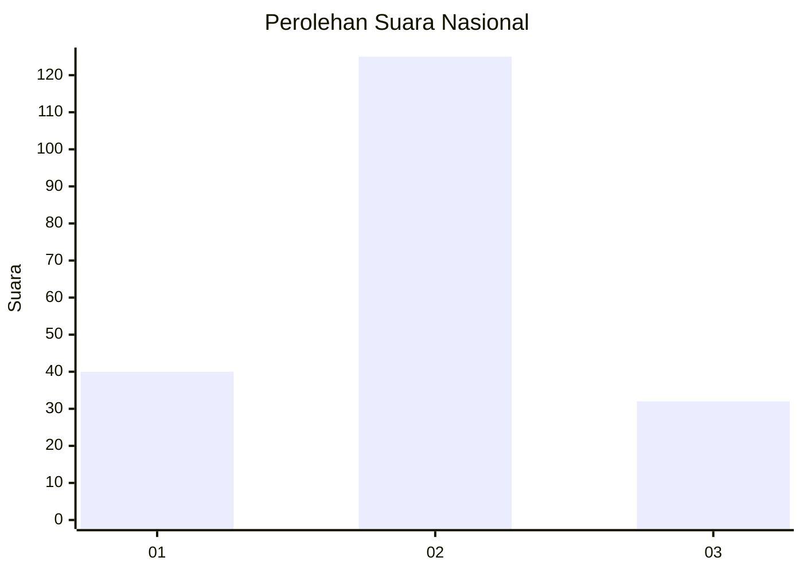

# Hasil

## Grafik

## Tabel

| No. | Nama Paslon    | Suara | Suara (raw) | Persentase |
|:--- |:-------------- | -----:| -----------:| ----------:|
| 1   | ANIES MUHAIMIN | 40    | [40][p-1]   | 20,30      |
| 2   | PRABOWO GIBRAN | 125   | [125][p-2]  | 63,45      |
| 3   | GANJAR MAHFUD  | 32    | [32][p-3]   | 16,24      |

[p-1]: https://github.com/gigit-pemilu/pemilu-2024/blob/main/pilpres/hitung-suara/sub/16-sumatera-selatan/sub/09-ogan-komering-ulu-selatan/sub/12-buay-pematang-ribu-ranau-tengah/sub/1013-simpang-sender/sub/004-tps/sub/paslon-1.txt
[p-2]: https://github.com/gigit-pemilu/pemilu-2024/blob/main/pilpres/hitung-suara/sub/16-sumatera-selatan/sub/09-ogan-komering-ulu-selatan/sub/12-buay-pematang-ribu-ranau-tengah/sub/1013-simpang-sender/sub/004-tps/sub/paslon-2.txt
[p-3]: https://github.com/gigit-pemilu/pemilu-2024/blob/main/pilpres/hitung-suara/sub/16-sumatera-selatan/sub/09-ogan-komering-ulu-selatan/sub/12-buay-pematang-ribu-ranau-tengah/sub/1013-simpang-sender/sub/004-tps/sub/paslon-3.txt

## Foto C Plano

https://sirekap-obj-formc.kpu.go.id/8830/pemilu/ppwp/16/09/12/10/13/1609121013004-20240215-171822--bd652502-4fd3-46b1-848b-531f4853ece7.jpg

https://sirekap-obj-formc.kpu.go.id/8830/pemilu/ppwp/16/09/12/10/13/1609121013004-20240215-172641--49777c04-a6dd-49db-91fb-1b0c52febe0e.jpg

https://sirekap-obj-formc.kpu.go.id/8830/pemilu/ppwp/16/09/12/10/13/1609121013004-20240215-172336--447932f7-7e21-4777-a261-9bbe0cd65e02.jpg

## Metadata

| Key        | Value               |
| ---------- | ------------------- |
| Time Stamp | 2024-02-16 03:00:26 |

