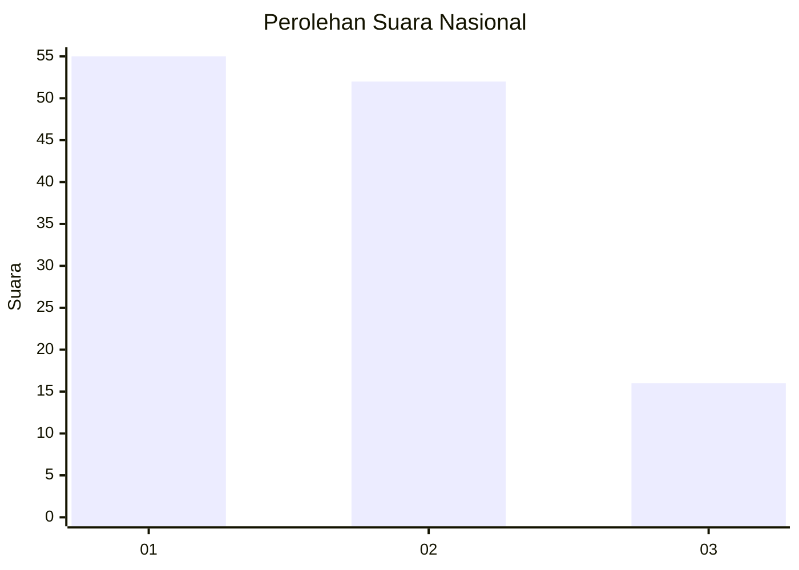
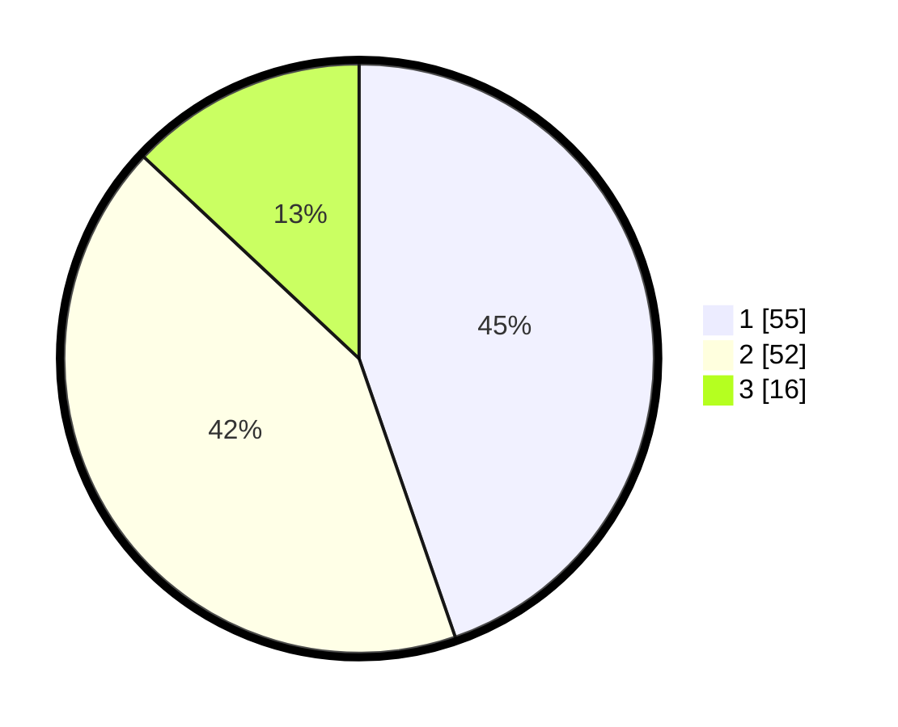

# Hasil

## Grafik

## Tabel

| No. | Nama Paslon    | Suara | Suara (raw) | Persentase |
|:--- |:-------------- | -----:| -----------:| ----------:|
| 1   | ANIES MUHAIMIN | 55    | [55][p-1]   | 44,72      |
| 2   | PRABOWO GIBRAN | 52    | [52][p-2]   | 42,28      |
| 3   | GANJAR MAHFUD  | 16    | [16][p-3]   | 13,01      |

[p-1]: https://github.com/gigit-pemilu/pemilu-2024/blob/main/pilpres/hitung-suara/sub/16-sumatera-selatan/sub/09-ogan-komering-ulu-selatan/sub/12-buay-pematang-ribu-ranau-tengah/sub/2009-gedung-baru/sub/002-tps/sub/paslon-1.txt
[p-2]: https://github.com/gigit-pemilu/pemilu-2024/blob/main/pilpres/hitung-suara/sub/16-sumatera-selatan/sub/09-ogan-komering-ulu-selatan/sub/12-buay-pematang-ribu-ranau-tengah/sub/2009-gedung-baru/sub/002-tps/sub/paslon-2.txt
[p-3]: https://github.com/gigit-pemilu/pemilu-2024/blob/main/pilpres/hitung-suara/sub/16-sumatera-selatan/sub/09-ogan-komering-ulu-selatan/sub/12-buay-pematang-ribu-ranau-tengah/sub/2009-gedung-baru/sub/002-tps/sub/paslon-3.txt

## Foto C Plano

https://sirekap-obj-formc.kpu.go.id/d26a/pemilu/ppwp/16/09/12/20/09/1609122009002-20240214-155110--2e8ee73f-fda5-4240-95e0-82c03e68b2c1.jpg

https://sirekap-obj-formc.kpu.go.id/d26a/pemilu/ppwp/16/09/12/20/09/1609122009002-20240215-044634--2c4c046e-5855-4eb8-816f-8704cc5bc4c9.jpg

https://sirekap-obj-formc.kpu.go.id/d26a/pemilu/ppwp/16/09/12/20/09/1609122009002-20240214-155119--932ccdb5-f321-4b44-92dc-e5c6789e2124.jpg

## Metadata

| Key        | Value               |
| ---------- | ------------------- |
| Time Stamp | 2024-02-16 13:30:32 |

