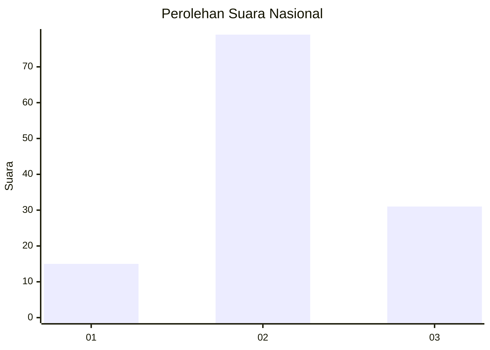
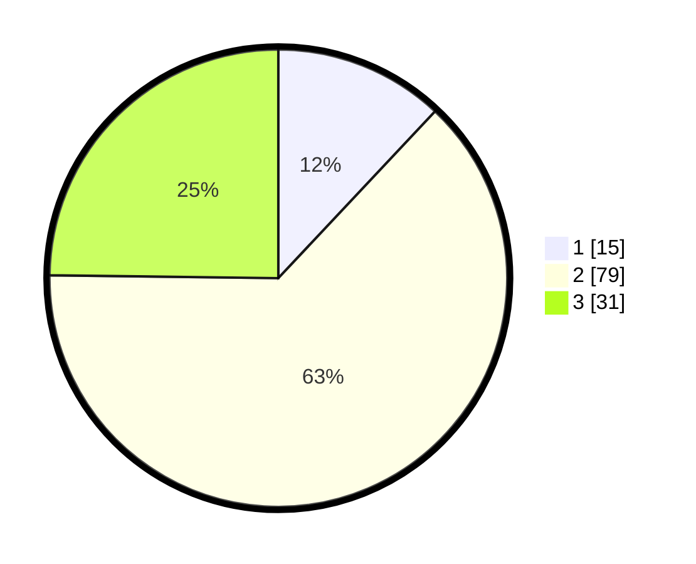

# Hasil

## Grafik

## Tabel

| No. | Nama Paslon    | Suara | Suara (raw) | Persentase |
|:--- |:-------------- | -----:| -----------:| ----------:|
| 1   | ANIES MUHAIMIN | 15    | [15][p-1]   | 12,00      |
| 2   | PRABOWO GIBRAN | 79    | [79][p-2]   | 63,20      |
| 3   | GANJAR MAHFUD  | 31    | [31][p-3]   | 24,80      |

[p-1]: https://github.com/gigit-pemilu/pemilu-2024/blob/main/pilpres/hitung-suara/sub/16-sumatera-selatan/sub/09-ogan-komering-ulu-selatan/sub/12-buay-pematang-ribu-ranau-tengah/sub/2010-tanjung-sari/sub/001-tps/sub/paslon-1.txt
[p-2]: https://github.com/gigit-pemilu/pemilu-2024/blob/main/pilpres/hitung-suara/sub/16-sumatera-selatan/sub/09-ogan-komering-ulu-selatan/sub/12-buay-pematang-ribu-ranau-tengah/sub/2010-tanjung-sari/sub/001-tps/sub/paslon-2.txt
[p-3]: https://github.com/gigit-pemilu/pemilu-2024/blob/main/pilpres/hitung-suara/sub/16-sumatera-selatan/sub/09-ogan-komering-ulu-selatan/sub/12-buay-pematang-ribu-ranau-tengah/sub/2010-tanjung-sari/sub/001-tps/sub/paslon-3.txt

## Foto C Plano

https://sirekap-obj-formc.kpu.go.id/c20f/pemilu/ppwp/16/09/12/20/10/1609122010001-20240215-065800--6de020c9-38d5-4d78-9191-0054d1f5e32d.jpg

https://sirekap-obj-formc.kpu.go.id/c20f/pemilu/ppwp/16/09/12/20/10/1609122010001-20240215-045318--5fc03522-dbd8-474a-a425-d0664d12ebf0.jpg

https://sirekap-obj-formc.kpu.go.id/c20f/pemilu/ppwp/16/09/12/20/10/1609122010001-20240215-045448--46530fe7-67f3-4111-9e6c-7eb7c9acaada.jpg

## Metadata

| Key        | Value               |
| ---------- | ------------------- |
| Time Stamp | 2024-02-16 13:30:32 |

